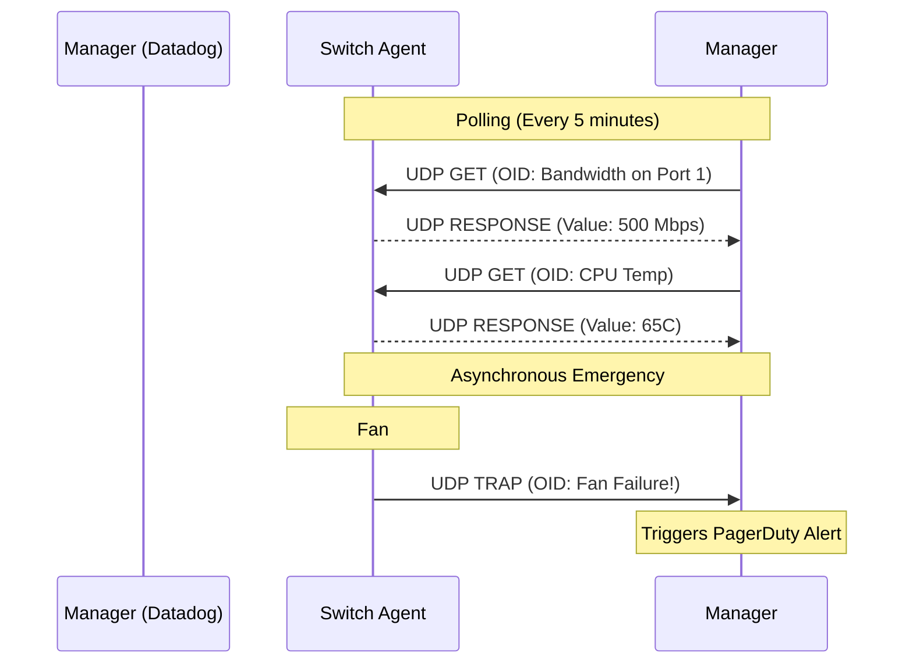

import { ConceptTemplate } from '@/features/kb/components/templates/ConceptTemplate'
import { Callout } from '@/features/kb/components/mdx/Callout'

export default function Layout({ children }) {
  return (
    <ConceptTemplate title="SNMP (Simple Network Management Protocol)">
      {children}
    </ConceptTemplate>
  )
}

**SNMP (Simple Network Management Protocol)** is the ubiquitous nervous system of enterprise IT monitoring. Invented in 1988 (RFC 1065), it was designed to solve a fundamental problem: how do you centrally monitor the health of 10,000 different devices (routers, switches, printers, UPS battery backups) made by 50 different vendors?

SNMP provides a standardized mathematical language over UDP (Ports 161 and 162). A central **SNMP Manager** (like SolarWinds or Datadog) periodically polls an **SNMP Agent** (a tiny piece of software running on a Cisco router). The Manager asks, *"What is your CPU usage?"* and the Agent replies.

## 1. Deep Dive & Mechanics

SNMP organizes data into a highly structured mathematical hierarchy called the **MIB (Management Information Base)**. 

The MIB is essentially a massive tree database. Every specific data point (like "CPU Temperature" or "Fan Speed") is assigned an **OID (Object Identifier)**. 
An OID looks like an IP address on steroids: `1.3.6.1.4.1.9.9.109.1.1.1.1.3`. 
- `1.3.6.1`: Represents the "Internet".
- `.4.1`: Represents "Private Enterprises".
- `.9`: Represents the vendor "Cisco".
- Everything after mathematically navigates down Cisco's specific tree to find the exact CPU usage metric.

There are three primary SNMP commands:
1. **GET:** The Manager polls the Agent for a specific OID.
2. **SET:** The Manager tells the Agent to change a configuration (e.g., mathematically shutting down a switch port remotely).
3. **TRAP:** Instead of waiting to be polled, the Agent actively fires an alert to the Manager if an emergency happens (e.g., "A physical cable was just unplugged!").

## 2. Mathematical / Theoretical Foundation

The mathematical complexity of SNMP lies in its data encoding. SNMP does not use JSON, XML, or plain text. 

It uses **ASN.1 (Abstract Syntax Notation One)** combined with **BER (Basic Encoding Rules)**. This is a binary mathematical serialization format. If an SNMP agent wants to transmit the integer `5`, it doesn't send the ASCII character `5`. It sends a sequence of Type, Length, and Value (TLV) bytes. For example: `02 01 05` (Type 02 = Integer, Length 01 = 1 byte, Value = 05). This makes SNMP incredibly bandwidth-efficient but famously difficult for humans to debug with a raw packet sniffer.

## 3. Real-World Implementation

Network engineers interact with SNMP daily using the `snmpwalk` and `snmpget` command-line utilities.

```bash
# Querying a router using SNMPv2c.
# -v2c specifies the version. -c specifies the "community string" (password).
# We are asking for the OID that represents the System Description.
snmpget -v2c -c public 192.168.1.1 1.3.6.1.2.1.1.1.0

# Output:
# SNMPv2-MIB::sysDescr.0 = STRING: Cisco IOS Software, C2960X Software...

# Using snmpwalk to mathematically crawl an entire sub-tree
# This prints EVERY interface (port) on the router and its current status
snmpwalk -v2c -c public 192.168.1.1 1.3.6.1.2.1.2.2.1.2
```

## 4. Visualizations



## 5. Interview Prep

**Q: What are the differences between SNMPv1, v2c, and v3?**
**A:** 
- **v1:** The original 1988 spec. Extremely limited.
- **v2c:** The most widely used version today. It introduced the `GetBulk` command to mathematically fetch massive tables of data at once. However, its security is abysmal: the password (called the "Community String") is sent in **plain text**.
- **v3:** The modern secure standard. It adds mathematical cryptographic security. It requires a username, hashes the password (SHA), and encrypts the entire UDP payload (AES) to prevent MITM attacks.

**Q: Why do network engineers prefer SNMP TRAPs over standard polling?**
**A:** Polling has inherent latency. If you poll a router every 5 minutes, and the router catches fire at minute 1, you won't know for 4 minutes. A TRAP is an asynchronous, event-driven push notification. The moment the router detects a thermal threshold breach, it instantly blasts a TRAP packet to the manager, reducing time-to-resolution to milliseconds.

**Q: Can you manage Linux servers with SNMP?**
**A:** Yes. While Linux admins traditionally use SSH or modern agents (like the Datadog Agent or Prometheus Exporters), you can install the `snmpd` daemon on any Linux box. It exposes CPU, RAM, and Disk metrics via standard MIBs, allowing legacy Network Operations Centers (NOCs) to monitor Linux servers on the exact same dashboard they use for Cisco routers.

## 6. Production Use Cases

- **Capacity Planning:** ISPs use SNMP to mathematically monitor the bandwidth utilized on their core fiber-optic links. By polling the `ifOutOctets` OID every 60 seconds and plotting it on a Grafana graph, engineers can visually see when a 10Gbps link is hitting 80% capacity and proactively order new hardware before the network congests.
- **Data Center Power Management:** APC UPS (Uninterruptible Power Supply) batteries use SNMP. If utility power is lost to the building, the UPS fires an SNMP TRAP to the virtualization cluster, triggering a script that gracefully shuts down all 500 Virtual Machines before the batteries drain completely.

<Callout icon="danger" title="SNMP Reflection Attacks">
Because SNMP uses connectionless UDP and SNMPv2c has virtually no security, it is a prime vector for DDoS Reflection attacks. An attacker sends a tiny, 50-byte `GetBulk` UDP request to an exposed router on the public internet, spoofing the Source IP as the victim's IP. The router responds by dumping its entire routing table (often 5,000+ bytes) directly to the victim. This results in a massive 100x mathematical amplification of malicious traffic. Never expose Port 161 to the public internet!
</Callout>
