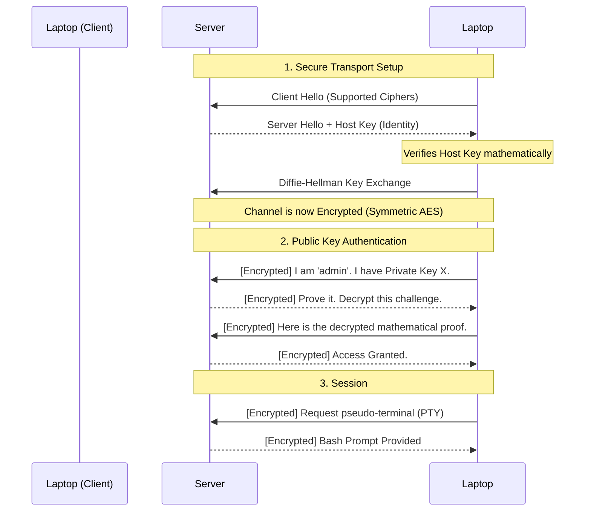

import { ConceptTemplate } from '@/features/kb/components/templates/ConceptTemplate'
import { Callout } from '@/features/kb/components/mdx/Callout'

export default function Layout({ children }) {
  return (
    <ConceptTemplate title="SSH (Secure Shell)">
      {children}
    </ConceptTemplate>
  )
}

**SSH (Secure Shell)** is the absolute backbone of modern systems administration. Invented in 1995 by Tatu Ylönen in response to a password-sniffing attack on his university's network, SSH was designed to permanently replace unencrypted legacy protocols like `telnet` and `rlogin`.

Operating on TCP Port 22, SSH provides a mathematically impenetrable, encrypted tunnel between a client and a server. It allows a developer sitting in a coffee shop in London to securely open a root bash terminal on a Linux server sitting in an AWS data center in Tokyo, confidently knowing that nobody on the internet can read their keystrokes.

## 1. Deep Dive & Mechanics

The SSH protocol (currently SSH-2) operates in three distinct, mathematical layers:

1. **The Transport Layer:** This happens first. The client and server agree on cryptographic algorithms, verify the server's identity using a Host Key, and use Diffie-Hellman to mathematically establish a shared symmetric encryption key.
2. **The Authentication Layer:** Once the tunnel is completely encrypted, the server asks the client to prove who they are. This is typically done via a Password or, much more securely, via Asymmetric Public Key Cryptography.
3. **The Connection Layer:** Once authenticated, the protocol mathematically multiplexes the single encrypted tunnel into multiple logical channels. This allows you to run a terminal session (shell), transfer files (SFTP), and forward local ports (Tunneling)—all simultaneously over the same Port 22 TCP connection.

## 2. Mathematical / Theoretical Foundation

The true power of SSH lies in **Public Key Authentication**. 

Passwords can be brute-forced. Instead, a developer mathematically generates an Asymmetric Key Pair (e.g., using the Ed25519 elliptic curve algorithm). The key pair consists of a **Public Key** (which you can share with anyone) and a **Private Key** (which you keep mathematically guarded on your laptop, often protected by a local passphrase).

You copy the Public Key to the server's `~/.ssh/authorized_keys` file.
When you attempt to log in:
1. The server generates a random mathematical string (a challenge).
2. The server encrypts the challenge using your Public Key and sends it to you.
3. Your SSH client uses your Private Key to decrypt the challenge.
4. You send the decrypted challenge back to the server.
5. The server mathematically verifies you successfully decrypted it, proving you possess the Private Key, and grants you access. (Zero passwords transmitted over the network).

## 3. Real-World Implementation

SSH is a command-line utility built into almost every OS today (Linux, macOS, and Windows 10+).

```bash
# Generate a modern, highly secure Ed25519 SSH Key Pair
ssh-keygen -t ed25519 -C "my_laptop_key"

# Copy the public key to a remote server (requires password one last time)
ssh-copy-id username@192.168.1.50

# Log in securely without a password
ssh username@192.168.1.50

# Run a single command remotely and immediately disconnect
ssh username@192.168.1.50 "df -h"
```

## 4. Visualizations



## 5. Interview Prep

**Q: What is SSH Port Forwarding (Tunneling)?**
**A:** This is a killer feature of the SSH Connection Layer. If a database on a server only listens on localhost (Port 5432) for security, you cannot connect to it from the outside. However, you can run `ssh -L 9000:localhost:5432 user@server`. SSH mathematically opens Port 9000 on your local laptop. When you connect a database GUI to `localhost:9000`, SSH encrypts the traffic, sends it through the Port 22 tunnel to the server, and the server blindly forwards it to its own internal Port 5432. You have securely bypassed the firewall.

**Q: What is an SSH Agent?**
**A:** If your Private Key is encrypted with a passphrase (which it should be), you have to type the passphrase every single time you type the `ssh` command. An **SSH Agent** (like `ssh-agent`) is a background process that holds your decrypted Private Key in RAM. You type the passphrase once when you log into your laptop, and the Agent mathematically handles all the cryptographic signing for subsequent SSH connections automatically.

**Q: What does the "WARNING: REMOTE HOST IDENTIFICATION HAS CHANGED!" error mean?**
**A:** The first time you connect to a server, SSH saves its cryptographic Host Key in your local `~/.ssh/known_hosts` file. If you connect later and the server presents a *different* Host Key, SSH mathematically assumes a Man-in-the-Middle attacker is trying to intercept your connection and halts instantly. (This also happens legitimately if the server's OS was freshly reinstalled).

## 6. Production Use Cases

- **Git Authentication:** When you run `git push origin main` to GitHub, you are almost always using SSH. GitHub stores your Public Key. When Git pushes the code, it uses the SSH protocol underneath to authenticate you mathematically without ever asking for your GitHub password.
- **Ansible / Automation:** Configuration management tools like Ansible are completely agentless. They do not require custom software running on your servers. They simply use standard SSH to connect to 1,000 servers simultaneously and execute bash commands to configure the systems in parallel.

<Callout icon="danger" title="Securing sshd_config">
By default, SSH on many Linux distributions allows password authentication and allows the `root` user to log in directly. This is a massive security flaw, as botnets constantly scan the internet attempting to brute-force Port 22. Best practice requires editing `/etc/ssh/sshd_config` to set `PermitRootLogin no` and `PasswordAuthentication no`, mathematically forcing all attackers to possess a valid Private Key to even attempt a login.
</Callout>
