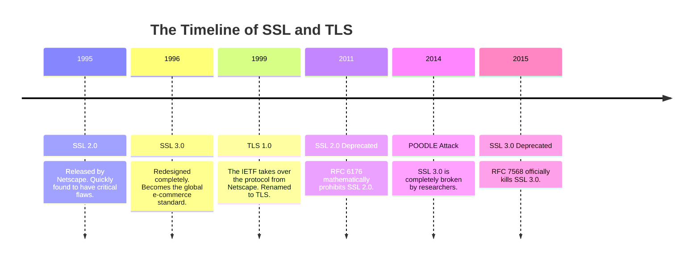

import { ConceptTemplate } from '@/features/kb/components/templates/ConceptTemplate'
import { Callout } from '@/features/kb/components/mdx/Callout'

export default function Layout({ children }) {
  return (
    <ConceptTemplate title="SSL (Secure Sockets Layer)">
      {children}
    </ConceptTemplate>
  )
}

**SSL (Secure Sockets Layer)** is the predecessor to TLS. It is the protocol that originally made e-commerce possible. 

In the mid-1990s, Netscape Communications realized that the World Wide Web would never be commercially viable if people had to transmit their credit card numbers in plain text over HTTP. Netscape invented SSL 1.0 (which was never released due to massive security flaws) and then released SSL 2.0 in 1995.

**Crucial Industry Fact:** SSL is completely, mathematically dead. It has been thoroughly broken by cryptographers. However, the term "SSL" remains deeply ingrained in the IT lexicon. When a modern developer says, *"I need to buy an SSL Certificate,"* they are actually buying a TLS Certificate. The industry simply never bothered to update the colloquial terminology.

## 1. Deep Dive & Mechanics

SSL was designed to sit directly between the Application Layer (HTTP) and the Transport Layer (TCP). 

Its goal was to provide:
1. **Server Authentication:** Ensuring the user is actually talking to `amazon.com`.
2. **Data Confidentiality:** Mathematically encrypting the payload so ISPs cannot read it.
3. **Data Integrity:** Ensuring a hacker didn't alter the payload mid-transit (e.g., changing the price of an item from $100 to $1).

SSL 3.0 (released in 1996) became the gold standard for several years. It introduced the concept of the cryptographic handshake: the client and server agree on a Cipher Suite, authenticate via a Public Key Certificate, and use Diffie-Hellman/RSA to generate a shared symmetric Session Key.

## 2. Mathematical / Theoretical Foundation

The mathematical downfall of SSL was largely due to its reliance on outdated cryptographic primitives and structural flaws in how it handled block ciphers and MACs (Message Authentication Codes).

Specifically, SSL 3.0 used **MAC-then-Encrypt**. It calculated the mathematical hash (MAC) of the plain text, appended the hash to the plain text, and then encrypted the whole bundle. 

Cryptographers later proved this mathematically flawed. An attacker can manipulate the encrypted padding (the **POODLE attack** of 2014) to force the server to decrypt byte by byte, leaking the original plain text (like a session cookie) without ever needing the encryption key. Modern TLS uses **Encrypt-then-MAC**, which is mathematically secure against padding oracle attacks.

## 3. Real-World Implementation

Because SSL 2.0 and SSL 3.0 are considered critically broken, all modern web servers and browsers explicitly disable them. If you attempt to force an SSL 3.0 connection today, the software will mathematically reject it.

```bash
# Testing a server's supported protocols using OpenSSL
# Attempt to connect using the explicitly broken SSLv3 protocol
openssl s_client -connect google.com:443 -ssl3

# The modern server instantly rejects the connection:
# 140026778641664:error:1425F102:SSL routines:ssl_choose_client_version:unsupported protocol
```

## 4. Visualizations



## 5. Interview Prep

**Q: What is an "SSL Certificate"?**
**A:** There is mathematically no such thing as an "SSL Certificate" or a "TLS Certificate." The correct technical term is an **X.509 Certificate**. It is simply a standardized data file containing a domain name, a Public Key, and a mathematical signature from a Certificate Authority (like DigiCert). The exact same X.509 certificate can be used for a legacy SSL 3.0 connection or a cutting-edge TLS 1.3 connection. The protocol used is negotiated by the server and browser; the certificate is just the identity payload.

**Q: If SSL is dead, why do we use OpenSSL?**
**A:** Technical debt. **OpenSSL** is the world's most famous open-source cryptographic library. It was written in the late 1990s when SSL was the standard. Although the library's primary job today is implementing modern TLS 1.3, renaming the entire C library to "OpenTLS" would mathematically break millions of legacy build scripts and dependencies globally, so the name remains.

**Q: What was the Heartbleed bug?**
**A:** A catastrophic bug discovered in 2014 in the OpenSSL library itself, not the SSL/TLS protocol. A mathematical flaw in the "Heartbeat" extension allowed an attacker to send a malformed packet requesting 64KB of server memory. The server would blindly return 64KB of raw RAM, which often contained plain-text passwords and the server's Private Cryptographic Keys, completely destroying the security of the server.

## 6. Production Use Cases

*(Historical Context - Do not use SSL in production)*

- **Legacy Mainframes:** In highly isolated, air-gapped corporate networks, some legacy mainframes or industrial SCADA equipment manufactured in 1998 still strictly speak SSL 3.0. To integrate these with modern systems, engineers must deploy dedicated proxy servers that accept SSL 3.0 on the internal side and translate it to TLS 1.3 for the external internet.

<Callout icon="danger" title="Downgrade Attacks">
In the 2010s, a major security threat was the **Downgrade Attack** (like the FREAK attack). If a modern browser connected to a modern server, an attacker sitting in the middle could intercept the `ClientHello` packet and mathematically strip away the browser's support for modern TLS 1.2. The server would receive the modified packet and say, "Oh, you only support the broken SSL 3.0? Okay, let's use that." The attacker would then use the POODLE exploit to crack the session. Modern TLS implementations now cryptographically sign the entire handshake history to prevent downgrade tampering.
</Callout>
