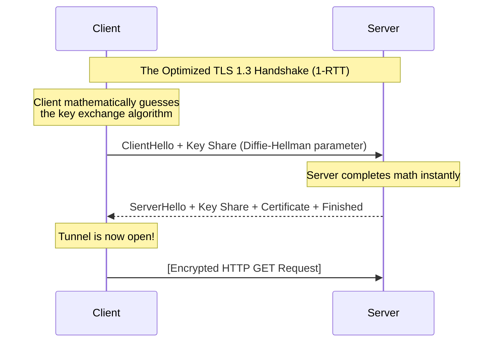

import { ConceptTemplate } from '@/features/kb/components/templates/ConceptTemplate'
import { Callout } from '@/features/kb/components/mdx/Callout'

export default function Layout({ children }) {
  return (
    <ConceptTemplate title="TLS (Transport Layer Security)">
      {children}
    </ConceptTemplate>
  )
}

**TLS (Transport Layer Security)** is the actual protocol that puts the "S" in HTTPS. 

When the IETF (Internet Engineering Task Force) took over the proprietary SSL 3.0 protocol from Netscape in 1999, they standardized it and renamed it TLS 1.0. Today, TLS 1.2 and the cutting-edge **TLS 1.3** are the exclusive mathematical standards for securing data in transit across the globe, protecting everything from web browsing to secure email and VPNs.

## 1. Deep Dive & Mechanics

The primary goal of TLS is to establish a secure, symmetric encryption tunnel (usually using AES-GCM or ChaCha20) over an insecure channel. 

The heavy mathematical lifting happens during the **TLS Handshake**:
1. **Negotiation:** The client and server agree on which cryptographic algorithms to use (the Cipher Suite).
2. **Authentication:** The server proves its identity by providing an X.509 Digital Certificate. (Optionally, via mTLS, the client also provides a certificate).
3. **Key Exchange:** They use Asymmetric math (like Elliptic Curve Diffie-Hellman, ECDHE) to securely establish a shared session key.

**The TLS 1.3 Revolution:** 
Released in 2018, TLS 1.3 was a massive architectural rewrite. Older versions supported dozens of outdated cryptographic algorithms (like RSA Key Exchange or MD5 hashes), leading to severe vulnerabilities. TLS 1.3 mathematically stripped out all legacy cryptography, leaving only a handful of highly secure, mathematically proven algorithms. Furthermore, it reduced the handshake latency from 2 Round Trips (RTT) down to just **1 RTT**.

## 2. Mathematical / Theoretical Foundation

A critical mathematical concept introduced in modern TLS is **Perfect Forward Secrecy (PFS)**.

In older TLS versions (using RSA Key Exchange), the client encrypted the session key using the server's public key. If a government intelligence agency recorded 5 years of your encrypted web traffic, and then eventually stole the server's Private Key, they could mathematically decrypt the *entire 5 years of history*.

Modern TLS enforces Perfect Forward Secrecy using **Ephemeral Diffie-Hellman (ECDHE)**. For *every single connection*, the client and server mathematically generate temporary, unique keys to derive the session key. Once the session ends, those temporary keys are permanently destroyed. Even if the server's main Private Key is stolen tomorrow, it is mathematically impossible to decrypt yesterday's traffic.

## 3. Real-World Implementation

Developers interact with TLS heavily when configuring web servers or analyzing network traffic.

```bash
# Use OpenSSL to debug a TLS connection to a server.
# This prints the entire mathematical handshake, the Cipher Suite chosen, 
# and the full X.509 Certificate chain.
openssl s_client -connect google.com:443 -tls1_3

# Example output snippet showing the negotiated Cipher Suite:
# New, TLSv1.3, Cipher is TLS_AES_256_GCM_SHA384
# Server public key is 256 bit (Elliptic Curve)
# Secure Renegotiation IS NOT supported (TLS 1.3 drops this feature)

# Check the expiration date of a remote TLS certificate mathematically
echo | openssl s_client -servername example.com -connect example.com:443 2>/dev/null | openssl x509 -noout -dates
```

## 4. Visualizations



## 5. Interview Prep

**Q: What is mTLS (Mutual TLS)?**
**A:** In standard TLS (like browsing a website), only the server authenticates itself (proving it is Google). The server has no idea who the client is. In a Zero Trust microservice architecture, you enable mTLS. During the handshake, the server demands a cryptographic certificate from the client. Both sides mathematically prove their identity to each other before the tunnel opens. This is how Kubernetes Service Meshes secure internal traffic.

**Q: What is SNI (Server Name Indication), and what is ESNI/ECH?**
**A:** SNI is an extension where the client sends the domain name (`google.com`) in plain text during the `ClientHello` so the server knows which certificate to load. However, because it is plain text, your ISP can see exactly which websites you are visiting, even if the traffic is encrypted. **Encrypted Client Hello (ECH)** is a cutting-edge TLS 1.3 extension that mathematically encrypts the SNI payload, plugging the last major privacy leak in the protocol.

**Q: How does a browser know if a Certificate has been revoked?**
**A:** If a server's Private Key is stolen, the certificate must be revoked. Browsers check revocation using **OCSP (Online Certificate Status Protocol)**. The browser mathematically halts the handshake, pings the Certificate Authority (like DigiCert), and asks, *"Is this serial number still valid?"* Because this slows down page loads and leaks privacy, modern systems use **OCSP Stapling**, where the server itself periodically fetches a cryptographically signed "proof of validity" from the CA and "staples" it directly into the TLS handshake.

## 6. Production Use Cases

- **Let's Encrypt / ACME Protocol:** Historically, buying and configuring a TLS certificate cost hundreds of dollars and required manual server configuration. The ACME protocol (used by Let's Encrypt) allows a server agent (Certbot) to mathematically prove ownership of a domain to a CA and automatically fetch and renew TLS certificates for free every 90 days.
- **VPNs (OpenVPN / AnyConnect):** While IPsec is heavily used for site-to-site VPNs, most client VPNs (like Cisco AnyConnect) operate by wrapping raw network packets inside a TLS tunnel. Because TLS operates over standard TCP Port 443, it effortlessly bypasses corporate firewalls that might block dedicated VPN protocols.

<Callout icon="info" title="The Cost of Cryptography">
Historically, engineers were terrified of the CPU cost of TLS. In 2010, Google engineers proved this was a myth. They demonstrated that TLS accounted for less than 1% of the CPU load on their Gmail servers, and less than 10KB of memory per connection. Today, modern CPUs include specific hardware instruction sets (like AES-NI) that perform the cryptographic math directly in silicon, making TLS encryption computationally practically free.
</Callout>
