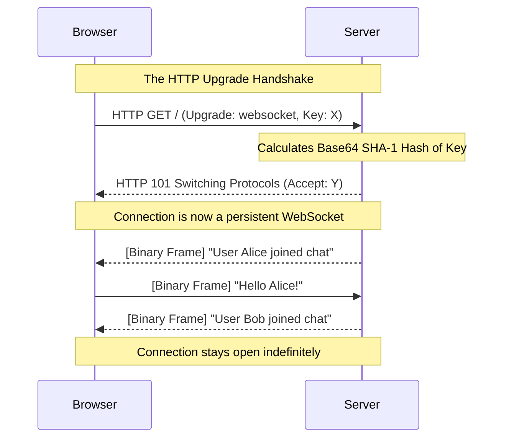

import { ConceptTemplate } from '@/features/kb/components/templates/ConceptTemplate'
import { Callout } from '@/features/kb/components/mdx/Callout'

export default function Layout({ children }) {
  return (
    <ConceptTemplate title="WebSockets">
      {children}
    </ConceptTemplate>
  )
}

**WebSockets** (RFC 6455) solved the greatest architectural limitation of the World Wide Web: HTTP is strictly unidirectional. 

In HTTP, a client must explicitly request data. A server mathematically *cannot* push data to a browser unprompted. For years, developers hacked around this using **Long Polling** (the browser opens an HTTP request, the server hangs the request open until data is ready, replies, and the browser immediately opens another request). This was incredibly abusive to server CPU and memory.

WebSockets introduced true **Full-Duplex** communication to the browser. A WebSocket connection stays open permanently. Both the client and the server can blast messages at each other simultaneously, at any time, with virtually zero latency.

## 1. Deep Dive & Mechanics

WebSockets are brilliant because they piggyback on standard HTTP infrastructure to bypass corporate firewalls.

Every WebSocket mathematically begins its life as a standard HTTP/1.1 GET request. The client sends a special set of headers asking to **Upgrade** the connection:
```text
GET /chat HTTP/1.1
Host: server.example.com
Upgrade: websocket
Connection: Upgrade
Sec-WebSocket-Key: dGhlIHNhbXBsZSBub25jZQ==
```

If the server agrees, it responds with an `HTTP 101 Switching Protocols` status code.
At that exact millisecond, the HTTP protocol is entirely abandoned. The existing TCP socket remains open, but the data flowing through it instantly switches to the binary WebSocket framing protocol.

## 2. Mathematical / Theoretical Foundation

The mathematical superiority of WebSockets lies in its **Framing Overhead**.

Every standard HTTP request carries roughly 500 to 1,000 bytes of plain-text headers (Cookies, User-Agent, Accept). If a multiplayer browser game needs to send the player's X/Y coordinates 60 times a second, HTTP would waste 60KB per second just transmitting redundant headers.

Once a WebSocket is upgraded, the HTTP headers are discarded forever. WebSocket data frames have a microscopic mathematical overhead of just **2 to 10 bytes** per message. The client simply wraps a tiny JSON payload (`{"x":10, "y":20}`) in a 2-byte header and fires it over the open TCP socket. This allows real-time games and financial trading tickers to operate at wire-speed.

## 3. Real-World Implementation

Interacting with WebSockets is built natively into every modern web browser via the global `WebSocket` object.

```javascript
// Client-side JavaScript (Browser)
// Note the 'wss://' scheme, which means WebSocket Secure (over TLS)
const socket = new WebSocket('wss://api.example.com/livestream');

// Event fired when the HTTP Upgrade succeeds
socket.addEventListener('open', (event) => {
    console.log('TCP/WebSocket Tunnel Established!');
    
    // We can now push data to the server at any time
    socket.send(JSON.stringify({ action: 'subscribe_ticker', symbol: 'AAPL' }));
});

// Event fired when the server pushes data to us unprompted
socket.addEventListener('message', (event) => {
    const data = JSON.parse(event.data);
    console.log('Stock Price Update:', data.price);
});

// Handling connection drops
socket.addEventListener('close', () => {
    console.log('Connection lost. Initiating reconnect logic...');
});
```

## 4. Visualizations



## 5. Interview Prep

**Q: What is Socket.IO? Is it the same as WebSockets?**
**A:** No. WebSockets are the raw, underlying TCP protocol. **Socket.IO** is a higher-level JavaScript library. Socket.IO *uses* WebSockets under the hood if available, but it provides massive architectural benefits: it automatically handles reconnection logic if the Wi-Fi drops, it supports "Rooms" (broadcasting messages to specific groups of users), and crucially, it automatically falls back to HTTP Long-Polling if it detects the user is on an ancient network proxy that blocks WebSocket traffic.

**Q: Can you load-balance WebSockets easily?**
**A:** No, this is a major architectural challenge. Standard HTTP load balancers (like AWS ALB) route Request A to Server 1, and Request B to Server 2. WebSockets are stateful, persistent TCP connections. If a client connects to Server 1, they are locked to Server 1. If Server 1 needs to broadcast a message to a user connected to Server 2, the servers must communicate with each other internally using a mathematical Pub/Sub backplane (usually **Redis**).

**Q: How do you authenticate a WebSocket connection since it doesn't use HTTP headers after the upgrade?**
**A:** Authentication must happen *during* the initial HTTP GET Upgrade request. The client includes their JWT or Session Cookie in the HTTP headers of the upgrade request. The server mathematically verifies the token, and only if valid, returns the `101 Switching Protocols` response. Once upgraded, the server links that specific TCP socket to the authenticated user ID in RAM.

## 6. Production Use Cases

- **Collaborative Applications:** Figma, Google Docs, and Miro rely entirely on WebSockets. When you move your mouse, the browser fires a tiny WebSocket frame containing your cursor's X/Y coordinates. The server instantly blasts that frame to the 10 other users viewing the document, rendering your cursor movement on their screens in real-time.
- **Financial Trading Platforms:** Cryptocurrency exchanges (like Binance or Coinbase) provide public WebSocket feeds. Algorithms open a single WebSocket connection and ingest thousands of live trade executions and order-book updates per second with absolute minimal network overhead.

<Callout icon="warning" title="Connection Limits and the C10k Problem">
Because a WebSocket holds a TCP connection open permanently, a chat server with 100,000 active users must hold 100,000 File Descriptors open simultaneously in the OS Kernel. If written in a synchronous language (where one connection = one OS thread), this will instantly crash the server (The C10k Problem). WebSocket servers MUST be written using asynchronous, non-blocking architectures (like Node.js, Go, or Python Asyncio) where a single thread can mathematically juggle thousands of idle sockets simultaneously.
</Callout>
