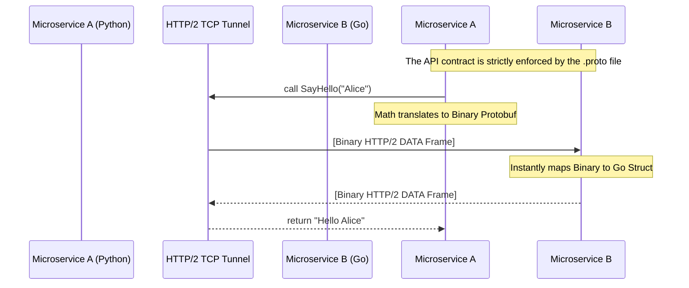

import { ConceptTemplate } from '@/features/kb/components/templates/ConceptTemplate'
import { Callout } from '@/features/kb/components/mdx/Callout'

export default function Layout({ children }) {
  return (
    <ConceptTemplate title="gRPC over HTTP/2">
      {children}
    </ConceptTemplate>
  )
}

**gRPC (gRPC Remote Procedure Calls)** was developed by Google in 2015 to connect their massive internal microservice architecture. 

In a traditional REST API, Server A sends a JSON text string over HTTP/1.1 to Server B. Server B must parse the JSON string, execute the function, serialize the response back into a JSON string, and return it. This string manipulation is mathematically slow and CPU-intensive.

gRPC abandons REST and JSON entirely. It allows Server A to mathematically execute a function directly on Server B as if it were a local function call. To achieve wire-speed performance, gRPC strictly requires two modern technologies: **Protocol Buffers (Protobuf)** for binary data serialization, and **HTTP/2** for transport.

## 1. Deep Dive & Mechanics

The secret to gRPC's performance is how tightly it integrates with the binary framing of **HTTP/2**. 

Because HTTP/2 supports multiplexing, gRPC can send 10,000 independent function calls across a *single* TCP connection simultaneously without Head-of-Line blocking. 

Furthermore, gRPC leverages HTTP/2 Streams to provide four distinct communication models:
1. **Unary RPC:** A standard Request/Response (like REST).
2. **Server Streaming:** The client sends one request, and the server pushes a continuous stream of responses back (e.g., live stock prices).
3. **Client Streaming:** The client streams a massive amount of data to the server (e.g., uploading a file chunk by chunk), and the server replies once at the end.
4. **Bidirectional Streaming:** Both sides read and write to the HTTP/2 stream simultaneously, creating a full-duplex conversational channel (like WebSockets).

## 2. Mathematical / Theoretical Foundation

gRPC relies on **Protocol Buffers (Protobuf)** to define the API contract mathematically.

Instead of writing API documentation in Swagger, a developer writes a `.proto` file defining the exact mathematical types of the data (e.g., `int32`, `string`).

```protobuf
// example.proto
syntax = "proto3";

service Greeter {
  rpc SayHello (HelloRequest) returns (HelloReply) {}
}

message HelloRequest {
  string name = 1;
}

message HelloReply {
  string message = 1;
}
```

The gRPC compiler mathematically generates native client and server code in 11 different languages (Go, Java, Python, Node, etc.). When a Node.js client calls `SayHello("Alice")`, the generated code doesn't send the string `{"name": "Alice"}`. It mathematically compiles it into a highly compressed, typed binary payload. The Go server receives the binary payload and instantly casts it into a Go struct. There is zero parsing overhead.

## 3. Real-World Implementation

Interacting with gRPC requires the generated stub libraries; you cannot easily use `curl` because the payload is binary.

```javascript
// A simple Node.js gRPC Client
const grpc = require('@grpc/grpc-js');
const protoLoader = require('@grpc/proto-loader');

// Load the .proto file
const packageDefinition = protoLoader.loadSync('example.proto');
const hello_proto = grpc.loadPackageDefinition(packageDefinition).Greeter;

// Connect to the gRPC server over HTTP/2
const client = new hello_proto('localhost:50051', grpc.credentials.createInsecure());

// Execute the Remote Procedure Call
client.SayHello({ name: 'Alice' }, function(err, response) {
  if (err) console.error(err);
  console.log('Greeting:', response.message);
});
```

*Note: For debugging from the CLI, engineers use tools like `grpcurl`, which mathematically decodes the binary stream back into human-readable JSON on the fly.*

## 4. Visualizations



## 5. Interview Prep

**Q: Can a web browser (like Chrome) connect directly to a gRPC server?**
**A:** No, not natively. Standard web browsers do not expose the raw, low-level HTTP/2 framing APIs required by the gRPC spec to JavaScript. To use gRPC in a React frontend, you must use **gRPC-Web**, a specialized proxy (usually Envoy) that sits in front of your backend. It takes standard HTTP/1.1 or HTTP/2 requests from the browser, mathematically translates them into true gRPC calls, and forwards them to the backend server.

**Q: Why is gRPC mathematically faster than REST with JSON?**
**A:** JSON is text-based. If you send the number `12345`, JSON sends 5 bytes of ASCII text. The server CPU must parse that string and convert it into a 32-bit integer. Protobuf sends the number `12345` mathematically encoded as raw binary integers. Furthermore, Protobuf drops field names. Instead of sending `"firstName": "Alice"`, it just sends `Field #1: "Alice"`. The server knows Field #1 is `firstName` because it has the `.proto` file. This makes the payload massively smaller and computationally frictionless to deserialize.

**Q: Does gRPC support Load Balancing?**
**A:** Yes, but it is notoriously difficult compared to REST. Because gRPC holds a single HTTP/2 TCP connection open permanently to multiplex thousands of calls, a traditional Layer 4 load balancer (which balances based on TCP IP/Port) will send *all* traffic to a single server. You must use a **Layer 7 Load Balancer** (like Envoy or Nginx) that actually terminates the HTTP/2 connection, reads the internal gRPC Stream IDs, and intelligently balances individual RPC function calls across the backend fleet.

## 6. Production Use Cases

- **Kubernetes and Service Meshes:** Internally, Kubernetes control plane components communicate almost entirely via gRPC. Service meshes like Istio use gRPC exclusively to route traffic between microservices because of its extreme efficiency and native support for bidirectional streaming telemetry.
- **Polyglot Microservices:** If an enterprise has a Machine Learning team writing Python, a Backend team writing Go, and a Frontend team writing Node.js, gRPC acts as the universal translator. They agree on a single `.proto` file, compile it, and the Python, Go, and Node servers can mathematically call each other's functions seamlessly without writing any custom JSON parsing logic.

<Callout icon="danger" title="The Trade-off of Binary">
The greatest strength of gRPC is also its greatest weakness: it is unreadable by humans. If a REST API fails in production, you can open Chrome Developer Tools, click the Network tab, and read the JSON payload to see exactly what broke. If gRPC fails, the network tab just shows a wall of meaningless binary gibberish. Debugging gRPC in production requires dedicated, specialized tooling (like Wireshark with Protobuf dissectors or distributed tracing systems like Jaeger).
</Callout>
