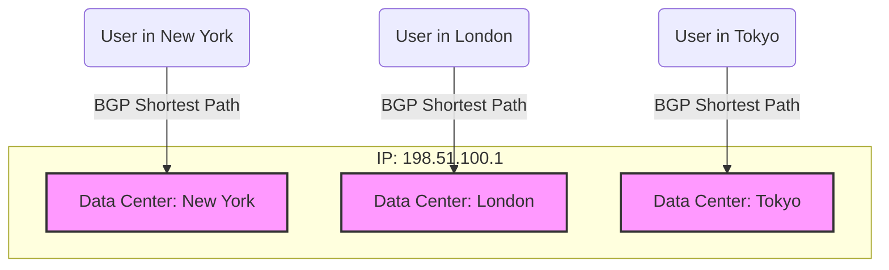

import { ConceptTemplate } from '@/features/kb/components/templates/ConceptTemplate'
import { Callout } from '@/features/kb/components/mdx/Callout'

export default function Layout({ children }) {
  return (
    <ConceptTemplate title="Anycast">
      {children}
    </ConceptTemplate>
  )
}

In traditional internet routing (**Unicast**), a single IP address maps mathematically to exactly one physical server in the world. If that server is in London, a user in Tokyo must endure the 250ms speed-of-light latency to communicate with it.

**Anycast** breaks this rule. In an Anycast network, a single IP address (e.g., `8.8.8.8`) is mathematically assigned to hundreds of different servers scattered across the globe. When a user in Tokyo requests `8.8.8.8`, the global BGP (Border Gateway Protocol) routing algorithms automatically calculate the shortest topological path and route the user to the server in Tokyo. A user in London requesting the exact same IP address is routed to the server in London.

## 1. Deep Dive & Mechanics

Anycast is not a feature of your web application; it is a feature of core internet routing via **BGP (Border Gateway Protocol)**.

A massive company (like Cloudflare) operates data centers in 200 cities. In every single data center, they configure their routers to mathematically advertise the exact same IP address (`1.1.1.1`) to the global internet. 

The internet's BGP routers receive these advertisements. BGP's core mathematical function is to calculate the "Shortest Path" (fewest network hops). 
- To the BGP router in New York, the New York data center is 1 hop away, and the Paris data center is 15 hops away. It updates its routing table: *"Send 1.1.1.1 traffic to New York."*
- To the BGP router in Berlin, the Paris data center is 2 hops away, and the New York data center is 14 hops away. It updates its routing table: *"Send 1.1.1.1 traffic to Paris."*

## 2. Mathematical / Theoretical Foundation

Anycast fundamentally alters the physics of **DDoS (Distributed Denial of Service) Attacks**.

In a Unicast network, an attacker with a 100 Gbps botnet points all their infected IoT devices at the victim's single server in London. The 100 Gbps of traffic converges on London, mathematically overwhelming the server's 10 Gbps network card, taking it offline.

In an Anycast network, the 100 Gbps botnet points at the Anycast IP address. Because BGP routes traffic to the nearest topological location, the bots in Asia attack the Tokyo data center, the bots in Europe attack the Paris data center, and the bots in the US attack the New York data center. The Anycast network mathematically **absorbs and dissipates** the attack across 200 data centers globally. A 100 Gbps attack distributed across 200 data centers is only 0.5 Gbps per data center—easily handled by modern hardware.

## 3. Real-World Implementation

You cannot configure Anycast in AWS by clicking a button in EC2. True Anycast requires owning your own public ASN (Autonomous System Number) and establishing peering sessions with major ISPs. However, cloud providers offer managed Anycast services (like AWS Global Accelerator).

```bash
# You can visualize Anycast in action using 'traceroute'
# Run this from a server in New York:
traceroute 8.8.8.8
# The trace will finish in ~5ms, showing the packet hitting a local NYC Google router.

# Run the exact same command from a server in Singapore:
traceroute 8.8.8.8
# The trace will finish in ~2ms, showing the packet hitting a local Singapore Google router.
# Same IP address, completely different physical destination.
```

## 4. Visualizations



## 5. Interview Prep

**Q: What happens if an Anycast data center goes offline?**
**A:** If the Tokyo data center loses power, the Tokyo router stops mathematically advertising the Anycast IP address to the BGP network. The global BGP network detects this failure within seconds and recalculates the shortest path. It realizes the *next* closest advertisement for that IP is in Singapore, and automatically reroutes all Japanese users to Singapore. This provides massive, invisible high availability.

**Q: Why is Anycast traditionally considered bad for TCP (Stateful) connections?**
**A:** BGP routes can mathematically fluctuate. If a user in Chicago starts a TCP download from the Chicago Anycast server, and mid-download the BGP route recalculates and sends their next packet to the Dallas Anycast server, the Dallas server has no knowledge of the TCP session state and will reply with a TCP RST (Reset), dropping the download. This is why Anycast was historically only used for stateless UDP protocols (like DNS). Modern CDNs solve this by synchronizing TCP state across data centers or pinning TCP connections via internal encapsulation.

**Q: What is the difference between Anycast and Geo-DNS?**
**A:** 
- **Geo-DNS:** Uses a smart DNS server. If a Japanese user requests `google.com`, the DNS server looks at their IP, realizes they are in Japan, and returns a Unicast IP specifically for a Japanese server.
- **Anycast:** The DNS server simply returns `8.8.8.8` to every user on earth. The physical routing hardware on the internet (routers and switches) mathematically handles pushing the packet to the correct location.

## 6. Production Use Cases

- **Root DNS Servers:** The entire foundation of the internet (the 13 Root DNS Servers) relies entirely on Anycast. While there are only 13 mathematical root IPs (A through M), they are backed by over 1,500 physical servers globally. This ensures DNS resolution is instantly fast everywhere on earth and mathematically immune to localized DDoS attacks.
- **Content Delivery Networks (CDNs):** Cloudflare, Fastly, and Akamai heavily utilize Anycast. When you place your website behind Cloudflare, they give you an Anycast IP. All your users connect to the Cloudflare Edge node physically closest to them to fetch cached images and CSS, slashing page load times.

<Callout icon="info" title="AWS Global Accelerator">
For standard developers who don't want to manage BGP routes, AWS offers **Global Accelerator**. AWS gives you two static Anycast IP addresses. When a user in India connects to your Anycast IP, their traffic enters the AWS network at the edge node in Mumbai. AWS then uses its private, mathematically optimized fiber-optic backbone to route the traffic directly to your EC2 instance in Virginia, completely bypassing the chaotic, high-latency public internet.
</Callout>
