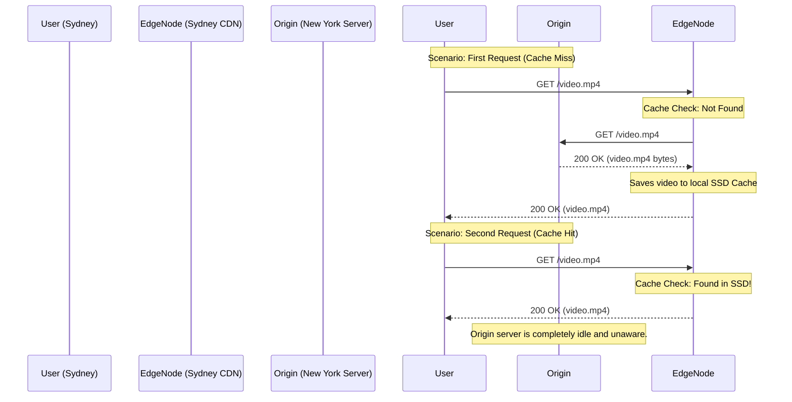

import { ConceptTemplate } from '@/features/kb/components/templates/ConceptTemplate'
import { Callout } from '@/features/kb/components/mdx/Callout'

export default function Layout({ children }) {
  return (
    <ConceptTemplate title="CDNs (Content Delivery Networks)">
      {children}
    </ConceptTemplate>
  )
}

A **Content Delivery Network (CDN)** is a globally distributed network of reverse proxy servers. Its singular mathematical goal is to defeat the speed of light.

If your web server (the **Origin**) is located in a data center in New York, a user in Sydney, Australia, faces an unavoidable physical physics limitation. Light through fiber-optic cables takes roughly 250 milliseconds to make the round trip. A web page that requires 10 sequential assets (HTML, CSS, JS, Images) will take mathematically 2.5 seconds just in network latency before a single byte of data is even processed.

A CDN solves this by placing thousands of caching servers (Edge Nodes) in nearly every major city on earth.

## 1. Deep Dive & Mechanics

When a user in Sydney requests `https://example.com/logo.png`, the DNS resolution points them to the CDN's Edge Node located right in Sydney.

1. **Cache Miss:** The Sydney Edge Node checks its local SSDs. If it doesn't have the image, it makes a high-speed connection back to the Origin server in New York, fetches the image, mathematically stores a copy on its local drive, and serves it to the user.
2. **Cache Hit:** When a second user in Sydney requests the exact same image 5 seconds later, the Sydney Edge Node intercepts the request. It mathematically serves the image directly from its local SSD in 5 milliseconds. The Origin server in New York never even knows the request happened.

## 2. Mathematical / Theoretical Foundation

CDNs fundamentally shift the mathematical cost of scaling.

Without a CDN, if a website goes viral on Reddit, 100,000 users hit the Origin server simultaneously. The Origin's CPU maxes out trying to serve 100,000 copies of a 5MB image, the network bandwidth becomes fully saturated, and the server crashes.

With a CDN, the CDN edge nodes mathematically absorb 99% of the traffic (the **Cache Hit Ratio**). The Origin server might only receive 5 requests per second (from CDN nodes experiencing Cache Misses), while the CDN fleet effortlessly serves 99,995 requests per second from RAM/SSD across the globe. You are mathematically offloading your compute and bandwidth costs to the CDN provider.

## 3. Real-World Implementation

Configuring a CDN (like Cloudflare, AWS CloudFront, or Fastly) is entirely done via DNS and HTTP Cache-Control headers.

```bash
# To verify a CDN is working, inspect the HTTP Response Headers
curl -I https://example.com/image.jpg

# Look for specific CDN headers:
# HTTP/2 200 
# cache-control: public, max-age=86400  <-- You telling the CDN to cache for 24 hrs
# cf-cache-status: HIT                  <-- Cloudflare confirming it served from cache
# x-cache: Hit from cloudfront          <-- AWS CloudFront confirming a cache hit
```

## 4. Visualizations



## 5. Interview Prep

**Q: What is Cache Invalidation (Cache Purging)?**
**A:** The hardest mathematical problem in computer science. If you update your website's logo on the Origin server, the CDNs around the world will still blindly serve the old cached logo for 24 hours (depending on your `max-age` header). To fix this, you must issue an API call to the CDN provider to **Purge** or **Invalidate** the cache. The CDN forces all edge nodes to mathematically delete the old file and fetch the new one from the Origin.

**Q: What is Cache Busting?**
**A:** Because CDN Purge API calls can take several minutes to propagate globally, frontend developers use a technique called **Cache Busting**. When they compile the application (via Webpack), a cryptographic hash of the file's contents is mathematically appended to the filename (e.g., `main.a8f3b2.js`). When the code changes, the hash changes (`main.c9x1z4.js`). Because the URL is technically brand new, the CDN instantly treats it as a Cache Miss and fetches the new file, guaranteeing the user never sees stale JavaScript.

**Q: Can a CDN cache dynamic APIs, or just static images?**
**A:** Historically, only static assets (Images, CSS, JS). Today, modern CDNs can heavily cache dynamic APIs. If you have an endpoint `/api/products?id=5` that queries a database, but the product details only change once a week, you can instruct the CDN to cache the JSON response for 5 minutes. The CDN treats the exact URL (including the query parameters) as a mathematical cache key.

## 6. Production Use Cases

- **Video Streaming:** Netflix operates the largest private CDN in the world (Open Connect). They physically install custom red servers heavily loaded with massive hard drives directly inside the data centers of local ISPs (like Comcast or AT&T). When you watch a movie, you are mathematically streaming it from a CDN box sitting a few miles from your house, saving the public internet from collapsing under the bandwidth.
- **Edge Computing (Serverless at the Edge):** Modern CDNs (like Cloudflare Workers or Fastly Compute@Edge) now allow you to upload V8 JavaScript or WebAssembly code directly to the Edge Node. When a user in Sydney makes a request, the code executes directly on the Sydney server in 1 millisecond, allowing for highly personalized, ultra-fast dynamic responses without ever talking to the Origin server.

<Callout icon="warning" title="The TTL Double-Edged Sword">
The `Cache-Control` header relies on a TTL (Time to Live). If you accidentally set `Cache-Control: public, max-age=31536000` (1 year) on your main `index.html` file, the CDN will permanently lock that version of your website into cache globally. When you try to push a critical bug fix, no user on earth will see it until you log into the CDN dashboard and forcefully run an emergency global Cache Purge. Best practice: heavily cache assets (CSS/JS) with cache-busted filenames, but never cache the root `index.html`.
</Callout>
