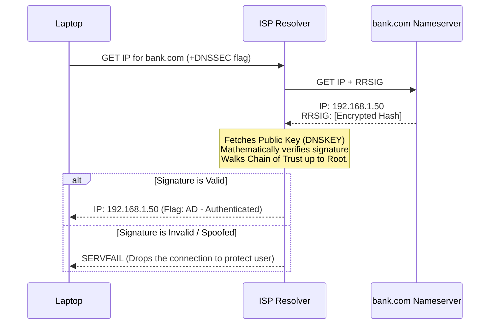

import { ConceptTemplate } from '@/features/kb/components/templates/ConceptTemplate'
import { Callout } from '@/features/kb/components/mdx/Callout'

export default function Layout({ children }) {
  return (
    <ConceptTemplate title="DNSSEC (Domain Name System Security Extensions)">
      {children}
    </ConceptTemplate>
  )
}

The original DNS protocol (invented in 1983) is mathematically devoid of security. When your laptop asks a DNS server, *"What is the IP address for bank.com?"*, the server responds with `192.168.1.50` in plain text. Your laptop blindly trusts this answer.

If a hacker intercepts your UDP packet (or compromises the local coffee shop router) and replies with a fake IP address (`6.6.6.6`), your laptop will unknowingly route you to the hacker's fake banking website. This is called **DNS Spoofing** or **Cache Poisoning**.

**DNSSEC (DNS Security Extensions)** was designed to fix this by introducing Asymmetric Cryptography to the DNS resolution process.

## 1. Deep Dive & Mechanics

DNSSEC does **not** encrypt the DNS request. The queries and answers are still transmitted in plain text. 
Instead, DNSSEC provides **Mathematical Authentication and Integrity**. 

It achieves this by cryptographically signing every single DNS record (A, AAAA, MX, CNAME) using Public-Key Cryptography. 
When a DNSSEC-enabled client queries `bank.com`, the DNS server returns two things:
1. The actual IP address (e.g., `192.168.1.50`).
2. An **RRSIG (Resource Record Signature)**: A mathematical signature generated using the domain owner's Private Key.

The client's OS then fetches the domain's Public Key (stored in a **DNSKEY** record) and mathematically verifies the signature. If the signature matches, the client knows with 100% mathematical certainty that the IP address truly came from the owner of `bank.com` and wasn't altered in transit.

## 2. Mathematical / Theoretical Foundation

The greatest mathematical challenge of DNSSEC is **Trust Verification**. How do you know the Public Key for `bank.com` isn't a fake key uploaded by the hacker?

DNSSEC solves this using the **Chain of Trust**, mirroring the hierarchical structure of DNS itself.
1. `bank.com` cryptographically signs its own DNS records.
2. The parent `.com` TLD (Top-Level Domain) signs a mathematical hash of `bank.com`'s public key (stored in a **DS - Delegation Signer** record).
3. The global `.` Root Zone signs the `.com` TLD's public key.
4. The Public Key of the global Root Zone (the KSK - Key Signing Key) is hardcoded into every operating system and DNS resolver on earth.

When your computer verifies `bank.com`, it mathematically walks up the tree: verifying the signature against `.com`, and then verifying `.com` against the hardcoded Root Key.

## 3. Real-World Implementation

Deploying DNSSEC requires coordination between your DNS Hosting Provider (e.g., AWS Route53) and your Domain Registrar (e.g., Namecheap).

```bash
# You can test if a domain has DNSSEC enabled using 'dig'
# The +dnssec flag tells dig to request the cryptographic signatures
dig bank.com +dnssec

# Output snippet:
# bank.com.   300 IN A 192.168.1.50
# bank.com.   300 IN RRSIG A 8 2 300 20250101000000 20241201000000 12345 bank.com.
#             [Massive Base64 Cryptographic Signature String...]

# Look at the "Flags" in the dig output. 
# If you see "ad" (Authenticated Data), your local DNS resolver 
# has successfully verified the mathematical cryptography!
```

## 4. Visualizations



## 5. Interview Prep

**Q: If a hacker tries to resolve a non-existent subdomain (e.g., `fake.bank.com`), standard DNS returns NXDOMAIN (Does Not Exist). How does DNSSEC securely prove something *doesn't* exist?**
**A:** This was a massive mathematical problem. You cannot cryptographically sign a response for an infinite number of fake subdomains on the fly (it would melt the server's CPU). DNSSEC created **NSEC (Next Secure)** records. The server mathematically sorts all valid subdomains alphabetically. If you ask for `C.bank.com`, the server returns a pre-signed NSEC record stating: *"The only valid subdomains between B.bank.com and D.bank.com do not include C."* This cryptographically proves non-existence without dynamic signing.

**Q: Why isn't DNSSEC used on every website today?**
**A:** Mathematical fragility and operational complexity. If a system administrator makes a tiny mistake rotating the cryptographic keys, or forgets to update the DS record at the registrar, the global Chain of Trust breaks. When DNSSEC breaks, ISPs treat the domain as mathematically compromised and return `SERVFAIL`, completely deleting the website from the internet for millions of users until the TTL expires.

**Q: Does DNSSEC encrypt my DNS traffic so my ISP can't see what websites I visit?**
**A:** No! DNSSEC only provides *Authentication*. The payload is completely visible in plain text. To achieve *Privacy* (encryption), you must use entirely different protocols like **DoH (DNS over HTTPS)** or **DoT (DNS over TLS)**, which wrap standard DNS packets inside a TLS encrypted tunnel.

## 6. Production Use Cases

- **High-Security Industries:** Financial institutions, government agencies (`.gov` requires DNSSEC by law), and cryptocurrency exchanges rely heavily on DNSSEC to ensure that highly sophisticated state-sponsored hackers cannot hijack BGP routes and poison DNS caches to redirect users to phishing sites.
- **DANE (DNS-based Authentication of Named Entities):** A cutting-edge protocol that relies entirely on DNSSEC. Instead of buying a TLS certificate from a centralized Certificate Authority (like DigiCert), a server mathematically publishes its own TLS public key directly into its DNSSEC-secured DNS records. A browser uses the DNSSEC Chain of Trust to verify the TLS key, completely bypassing the massive, vulnerable Certificate Authority industry.

<Callout icon="warning" title="DNSSEC Amplification Attacks">
Because DNSSEC appends massive cryptographic signatures (RRSIG) and Public Keys (DNSKEY) to standard DNS responses, a 50-byte UDP query can result in a 3,000-byte UDP response. Hackers exploit this mathematically. They send a tiny request to an open DNS resolver, spoof the Source IP to be their victim's IP, and request the DNSSEC records for a massive domain. The resolver blasts the 3,000-byte cryptographic response at the victim, creating a catastrophic 60x Amplification DDoS attack.
</Callout>
