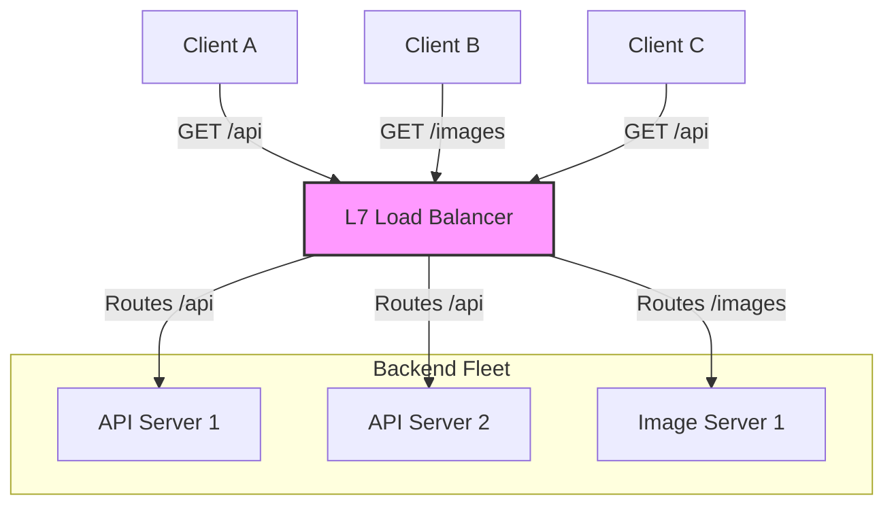

import { ConceptTemplate } from '@/features/kb/components/templates/ConceptTemplate'
import { Callout } from '@/features/kb/components/mdx/Callout'

export default function Layout({ children }) {
  return (
    <ConceptTemplate title="Load Balancing (L4-L7)">
      {children}
    </ConceptTemplate>
  )
}

**Load Balancing** is the architectural prerequisite for horizontal scaling. If a single web server can handle 1,000 requests per second, and you receive 5,000 requests per second, you must deploy 5 servers. A Load Balancer sits mathematically in front of those 5 servers, acts as the single public IP address, and seamlessly distributes the incoming traffic among them so no single server is overwhelmed.

Modern Load Balancers operate primarily at two distinct layers of the OSI model: **Layer 4 (Transport)** and **Layer 7 (Application)**.

## 1. Deep Dive & Mechanics

**Layer 4 (L4) Load Balancing:**
Operates entirely at the TCP/UDP level. The load balancer does *not* look inside the payload (it doesn't know if the traffic is HTTP, SSH, or Redis). It simply looks at the Source IP and Destination Port. 
- **Pros:** Blazingly fast, mathematically simple, low CPU overhead.
- **Cons:** Blind. It cannot route traffic based on URL paths or cookies.

**Layer 7 (L7) Load Balancing:**
Operates at the Application level. The load balancer fully terminates the TCP connection, decrypts the TLS/SSL mathematically, and parses the actual HTTP request. 
- **Pros:** Highly intelligent. It can route `/images/*` to a cluster of image servers, and `/api/*` to a cluster of database microservices. It can manipulate headers and enforce Web Application Firewalls (WAF).
- **Cons:** High CPU overhead due to TLS decryption and HTTP parsing.

## 2. Mathematical / Theoretical Foundation

Load balancers distribute traffic using specific mathematical **Scheduling Algorithms**:

1. **Round Robin:** The simplest algorithm. Request 1 goes to Server A, Request 2 to Server B, Request 3 to Server C, and Request 4 loops back to Server A. Mathematically $O(1)$, but assumes all servers have identical CPU capacity and all requests take the same amount of time to process.
2. **Least Connections:** Mathematically tracks the number of active TCP connections on every backend server. It routes the next request to the server with the fewest active connections, preventing a server from getting bogged down by a slow database query.
3. **IP Hash (Consistent Hashing):** The load balancer mathematically hashes the Client's IP address (e.g., `hash(192.168.1.50) % N_SERVERS`). This guarantees that a specific user will *always* be routed to the exact same backend server, which is critical for stateful applications storing session data in local RAM.

## 3. Real-World Implementation

**HAProxy** and **Nginx** are the industry standards for software load balancing.

```nginx
# An example Nginx Layer 7 Load Balancer configuration
upstream backend_api {
    # Using the Least Connections algorithm
    least_conn;
    
    server 10.0.0.11:8080 weight=3; # This server is 3x more powerful
    server 10.0.0.12:8080;
    server 10.0.0.13:8080 backup;   # Only use if 11 and 12 crash
}

server {
    listen 80;
    server_name api.example.com;

    location / {
        proxy_pass http://backend_api;
        proxy_set_header X-Forwarded-For $proxy_add_x_forwarded_for;
    }
}
```

## 4. Visualizations



## 5. Interview Prep

**Q: What is a Health Check?**
**A:** If Server B crashes, the Load Balancer needs to know instantly so it doesn't send users to a dead server. The Load Balancer mathematically polls every backend server (e.g., sending an HTTP GET to `/health` every 5 seconds). If Server B returns a `500 Internal Error` or times out, the LB mathematically removes Server B from the Round Robin pool until it recovers.

**Q: In Layer 7 load balancing, how does the backend server know the original Client's IP address?**
**A:** Because the L7 LB terminates the TCP connection, the backend server mathematically sees the *Load Balancer's* IP address as the Source IP, not the user's. To fix this, the L7 LB injects the user's real IP into a special HTTP header called `X-Forwarded-For` before passing the request to the backend.

**Q: How does AWS ALB differ from AWS NLB?**
**A:** 
- **ALB (Application Load Balancer):** A Layer 7 load balancer. It terminates HTTP/HTTPS, supports routing by URL path (`/api`), and integrates heavily with AWS WAF.
- **NLB (Network Load Balancer):** A Layer 4 load balancer. It mathematically operates at the TCP/UDP level, capable of handling millions of requests per second at ultra-low latency. It is often used for non-HTTP traffic like database routing or massive multiplayer game servers.

## 6. Production Use Cases

- **Microservice Architectures (Kubernetes):** Inside a K8s cluster, the `kube-proxy` acts as an internal L4 load balancer. When Microservice A wants to talk to Microservice B, it sends traffic to a single virtual "Service" IP. The internal load balancer mathematically distributes that traffic across the 50 dynamically scaling Pods running Microservice B.
- **Global Traffic Management (GSLB):** Global Server Load Balancing operates at the DNS level. When a user requests `google.com`, the GSLB looks at the user's location and mathematically returns the IP address of the closest regional Load Balancer (e.g., returning the Tokyo LB for a Japanese user, and the London LB for a UK user).

<Callout icon="danger" title="The Single Point of Failure">
A Load Balancer mathematically creates a massive Single Point of Failure (SPOF). If you have 100 perfectly healthy backend servers, but the Load Balancer in front of them crashes, your entire website goes offline. In production, Load Balancers are NEVER deployed alone. They are deployed in High Availability (HA) pairs (Active/Passive) using protocols like VRRP or Keepalived. If the Active LB loses power, the Passive LB mathematically steals the public IP address in milliseconds and takes over routing.
</Callout>
