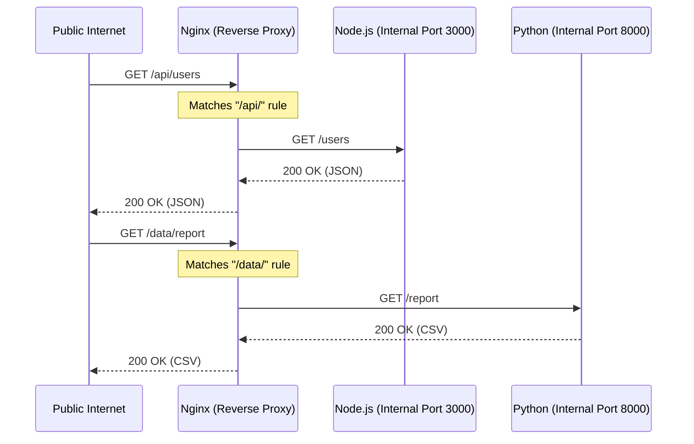

import { ConceptTemplate } from '@/features/kb/components/templates/ConceptTemplate'
import { Callout } from '@/features/kb/components/mdx/Callout'

export default function Layout({ children }) {
  return (
    <ConceptTemplate title="Reverse Proxies">
      {children}
    </ConceptTemplate>
  )
}

While a Forward Proxy sits in front of *clients* to protect them from the internet, a **Reverse Proxy** sits in front of *servers* to protect them from the internet.

When a user types `amazon.com` into their browser, they are mathematically connecting to a Reverse Proxy. The Reverse Proxy terminates the connection, inspects the request, and then silently establishes a second internal connection to one of thousands of hidden backend application servers. The user has absolutely no mathematical knowledge of the internal servers' existence or IP addresses.

## 1. Deep Dive & Mechanics

A Reverse Proxy operates primarily at Layer 7 (Application) and is the absolute foundation of modern web architecture. You almost never expose a Node.js, Python Django, or Java Tomcat server directly to the public internet on Port 80. You place a reverse proxy (like Nginx, HAProxy, or Envoy) in front of them.

**Why use a Reverse Proxy?**
1. **Load Balancing:** It can mathematically distribute 10,000 inbound requests across 50 hidden backend servers.
2. **TLS/SSL Termination:** Cryptographic math is CPU intensive. The reverse proxy handles the complex TLS handshakes, decrypts the HTTPS traffic, and forwards plain-text HTTP to the backend servers over a secure private network, saving immense backend CPU cycles.
3. **Static Asset Caching:** If 5,000 users request `logo.png`, the reverse proxy serves it instantly from its local RAM or SSD. It never bothers the backend Python server with requests for static images.

## 2. Mathematical / Theoretical Foundation

The mathematical power of a Reverse Proxy lies in **Path-Based Routing (URL Multiplexing)**.

Before reverse proxies, if a company wanted to run a WordPress blog and a Java web application, they had to host them on two completely different IP addresses or ports (e.g., `example.com` and `example.com:8080`).

A Reverse Proxy allows a single IP address on a single port (443) to mathematically route traffic to an infinite number of different internal microservices based on the HTTP Request URI or Host header.
- If URI starts with `/blog/*` $\rightarrow$ Route to internal IP 10.0.0.5 (PHP)
- If URI starts with `/api/*` $\rightarrow$ Route to internal IP 10.0.0.6 (Go)
- If URI is exactly `/` $\rightarrow$ Route to internal IP 10.0.0.7 (React SSR)

## 3. Real-World Implementation

**Nginx** is the most widely deployed open-source reverse proxy in the world.

```nginx
# A classic Nginx Reverse Proxy configuration block
server {
    listen 443 ssl http2;
    server_name myapp.example.com;

    # SSL Termination happens here
    ssl_certificate /path/to/cert.pem;
    ssl_certificate_key /path/to/key.pem;

    # Route 1: Serve static files directly from the hard drive (bypassing backend)
    location /static/ {
        alias /var/www/static/;
        expires 30d; # Cache headers
    }

    # Route 2: Reverse Proxy all API requests to a hidden Node.js backend
    location /api/ {
        # The internal IP address of the Node server
        proxy_pass http://10.0.0.50:3000/;
        
        # Pass mathematical metadata to the backend
        proxy_set_header Host $host;
        proxy_set_header X-Real-IP $remote_addr;
        proxy_set_header X-Forwarded-For $proxy_add_x_forwarded_for;
    }
}
```

## 4. Visualizations



## 5. Interview Prep

**Q: What is an API Gateway, and how is it different from a Reverse Proxy?**
**A:** An API Gateway (like AWS API Gateway, Kong, or Apigee) is essentially a highly intelligent, specialized Reverse Proxy. While a reverse proxy focuses on routing and TLS termination, an API Gateway focuses on mathematical business logic. It handles Rate Limiting (blocking users who make >100 requests/sec), API Key validation, JWT token authentication, and Request Transformation (converting an XML payload to JSON before hitting the backend).

**Q: How does an Ingress Controller work in Kubernetes?**
**A:** An Ingress Controller is simply a Reverse Proxy (usually Nginx or Envoy) running inside the Kubernetes cluster. It mathematically reads standard K8s YAML files (Ingress Resources) and dynamically reconfigures its internal proxy rules on the fly to route external public internet traffic into the correct internal K8s Pods based on the URL path.

**Q: Why do backend applications sometimes generate redirect URLs containing `http://localhost:3000` in production when placed behind a reverse proxy?**
**A:** Because the backend application mathematically believes it is running on `localhost:3000`. When it generates a redirect, it uses its own local environment data. The Reverse Proxy must be configured to pass the original host (`proxy_set_header Host $host;`) so the backend knows the user actually requested `https://example.com`.

## 6. Production Use Cases

- **Zero-Downtime Deployments (Blue/Green):** If you are running Backend Version 1 and want to deploy Version 2, you start Version 2 on a hidden internal IP. You then alter the Reverse Proxy configuration mathematically to say: *"Route 10% of traffic to Version 2."* If it crashes, you instantly route traffic back to Version 1. If it succeeds, you switch it to 100%. The user never experiences a dropped connection or downtime.
- **Service Meshes (Envoy):** In modern architectures, a lightweight Reverse Proxy (like Envoy) is deployed as a "Sidecar" alongside every single microservice. When Service A wants to talk to Service B, it actually talks to its local Envoy proxy. The proxy handles the complex mTLS encryption, circuit breaking, and retries automatically, freeing the developer from writing mathematical networking logic in their application code.

<Callout icon="danger" title="The Buffer Overflow Protection">
Another critical role of a reverse proxy is mathematically shielding backend servers from Slowloris attacks. A backend Python server (like Gunicorn) often has a strict limit on active connections (e.g., 4 threads). If a hacker sends an HTTP request but transmits the payload at a mathematically agonizing rate of 1 byte per second, the Python thread hangs waiting for the data, crashing the app. A reverse proxy like Nginx handles 100,000 asynchronous connections effortlessly. It buffers the entire slow payload in its own RAM, and only forwards the complete, assembled request to the backend Python server in a single, instant burst.
</Callout>
