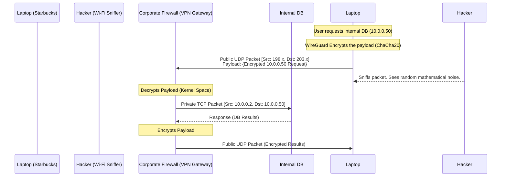

import { ConceptTemplate } from '@/features/kb/components/templates/ConceptTemplate'
import { Callout } from '@/features/kb/components/mdx/Callout'

export default function Layout({ children }) {
  return (
    <ConceptTemplate title="VPN (IPsec, OpenVPN, WireGuard)">
      {children}
    </ConceptTemplate>
  )
}

A **Virtual Private Network (VPN)** solves a fundamental routing problem: If you are sitting in a Starbucks (IP: 198.51.100.5), how do you securely access a corporate database that strictly only accepts connections from the internal corporate LAN (IP: 10.0.0.50)?

A VPN achieves this via **Encapsulation (Tunneling)**. 
Your laptop generates a standard IP packet destined for `10.0.0.50`. Because `10.x.x.x` is unroutable on the public internet, the VPN client software mathematically encrypts this packet and wraps it inside a *second*, public IP packet destined for the corporate VPN Gateway. The Gateway receives it, unwraps it, and pushes the internal packet onto the private LAN. To the database, it mathematically appears as if your laptop is physically plugged into the office switch.

## 1. Deep Dive: The Big Three Protocols

**1. IPsec (Internet Protocol Security):**
The grandfather of enterprise VPNs. Operating at Layer 3, it is mathematically built directly into the operating system kernel. It is notoriously difficult to configure (requiring IKE phases, Diffie-Hellman, and precise cipher matching). It is primarily used for **Site-to-Site VPNs** (e.g., permanently linking the New York office router to the London office router).

**2. OpenVPN:**
The open-source champion for two decades. It operates in User Space (Layer 4/7) and heavily utilizes standard TLS (the same math as HTTPS) for key exchange. 
- **Pros:** Extremely flexible. It can run over TCP Port 443, mathematically bypassing almost any corporate firewall by masquerading as standard web traffic.
- **Cons:** It is a massive, bloated codebase (100,000+ lines of C code). Because it runs in User Space, encrypting and moving packets back and forth into the Kernel space induces massive mathematical latency, capping its raw throughput.

**3. WireGuard:**
The modern revolution. Created by Jason A. Donenfeld, WireGuard was built from scratch to be mathematically perfect.
- It is only ~4,000 lines of code (making it mathematically trivial to audit for security).
- It runs directly inside the Linux Kernel, offering blazing-fast speeds that max out gigabit connections.
- It ruthlessly dropped all legacy cryptography. It strictly uses state-of-the-art math: **Curve25519** for key exchange, **ChaCha20** for symmetric encryption, and **Poly1305** for MAC authentication.

## 2. Mathematical / Theoretical Foundation

WireGuard completely redesigned VPN authentication by adopting the **SSH paradigm**.

In OpenVPN or IPsec, you often need complex usernames, passwords, and X.509 Certificate Authorities. 

In WireGuard, authentication is mathematically identical to SSH Keys (Cryptographic Routing). 
Your laptop generates a Private/Public key pair. You give your Public Key to the VPN server. The VPN server maps your Public Key to a specific internal IP address (e.g., `10.0.0.2`). When a packet arrives, WireGuard mathematically verifies the cryptographic signature. If the signature is valid, it guarantees the packet came from `10.0.0.2`. If a hacker sends a packet, the math fails, and WireGuard silently drops the packet into a black hole (it doesn't even send an error response).

## 3. Real-World Implementation

Configuring WireGuard is shockingly simple compared to legacy IPsec.

```ini
# Example WireGuard Client Configuration (/etc/wireguard/wg0.conf)

[Interface]
# The laptop's Private Key
PrivateKey = aBcDeFgHiJkLmNoPqRsTuVwXyZ123456=
# The internal IP the laptop will use on the VPN
Address = 10.0.0.2/32

[Peer]
# The Corporate VPN Server's Public Key
PublicKey = zYxWvUtSrQpOnMlKjIhGfEdCbA654321=
# The public IP of the Corporate VPN Server
Endpoint = 198.51.100.99:51820
# AllowedIPs: The mathematical routing table. 
# 10.0.0.0/24 means "Only send corporate traffic over the VPN."
# 0.0.0.0/0 means "Tunnel ALL my internet traffic through the VPN."
AllowedIPs = 10.0.0.0/24
```

## 4. Visualizations



## 5. Interview Prep

**Q: What is Split Tunneling?**
**A:** A critical network configuration. 
- **Full Tunnel:** *All* of your laptop's traffic (including Netflix and YouTube) is mathematically routed through the corporate VPN. This is secure but crushes the corporate firewall's bandwidth.
- **Split Tunnel:** The routing table is mathematically split. Traffic destined for `10.0.0.0/8` (Internal servers) goes through the encrypted VPN. Traffic destined for Netflix goes directly out the local Starbucks Wi-Fi, completely bypassing the VPN.

**Q: Why does WireGuard use UDP exclusively instead of TCP?**
**A:** The **TCP Meltdown Problem**. If you run a VPN over TCP (like OpenVPN often does), and you transfer a file over TCP inside the VPN, you have TCP encapsulated inside TCP. If a packet drops on the Wi-Fi, the inner TCP layer triggers a retransmission, and the outer TCP layer *also* triggers a retransmission. They mathematically cascade, causing exponential delays and grinding the connection to a halt. UDP is stateless and avoids this entirely.

**Q: How does WireGuard handle roaming (e.g., switching from Wi-Fi to 5G)?**
**A:** Brilliantly. Because WireGuard authenticates mathematically via Public Keys rather than relying on a static IP address, if you walk out of Starbucks and your phone switches to 5G (getting a brand new IP address), WireGuard instantly updates its internal routing table the moment it receives a valid cryptographically signed packet from the new IP. The VPN connection never drops.

## 6. Production Use Cases

- **Site-to-Site AWS Connectivity:** Enterprises use IPsec (via AWS Site-to-Site VPN) to mathematically link their on-premise physical Cisco routers directly to an AWS Virtual Private Cloud (VPC). The AWS servers and the physical office servers can communicate securely over the public internet as if they were in the exact same building.
- **Modern Remote Work (Tailscale / ZeroTier):** Tailscale is a massive commercial success built directly on top of the WireGuard protocol. It uses a centralized control plane to automatically distribute WireGuard Public Keys to all your devices (laptop, phone, Raspberry Pi). It creates a seamless, mathematically secure Peer-to-Peer mesh VPN where all your devices can talk directly to each other, completely bypassing the need for a centralized corporate firewall.

<Callout icon="danger" title="Commercial 'Privacy' VPNs">
When consumers buy NordVPN or ExpressVPN, they are buying an OpenVPN/WireGuard tunnel to a server owned by that company. While it mathematically encrypts traffic at the local coffee shop, the VPN provider can see 100% of the DNS requests and IP destinations once the traffic leaves their server. You are simply shifting your trust from your local ISP directly to the VPN company. If the VPN company keeps logs (despite marketing claims), your privacy is entirely compromised.
</Callout>
