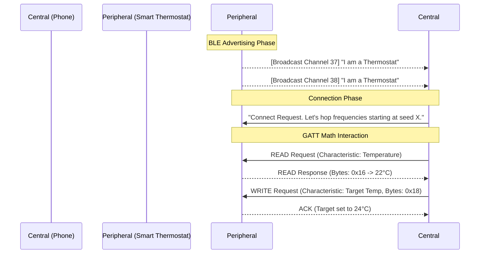

import { ConceptTemplate } from '@/features/kb/components/templates/ConceptTemplate'
import { Callout } from '@/features/kb/components/mdx/Callout'

export default function Layout({ children }) {
  return (
    <ConceptTemplate title="Bluetooth">
      {children}
    </ConceptTemplate>
  )
}

**Bluetooth** (IEEE 802.15.1) was invented in 1994 by Ericsson to replace the chaotic physical RS-232 serial cables used to connect accessories. 

Named after a 10th-century Viking king who united Denmark, Bluetooth mathematically unites disparate devices. It operates in the globally unlicensed **2.4 GHz ISM band** (the exact same frequency used by Wi-Fi and Microwave ovens). 

Because it shares this crowded airspace, Bluetooth relies on a mathematical survival technique called **Frequency-Hopping Spread Spectrum (FHSS)**. The devices mathematically slice the 2.4 GHz band into 79 distinct channels. A paired phone and headphone will rapidly hop between these channels 1,600 times per second in a synchronized, pseudo-random sequence. If Wi-Fi is interfering on Channel 10, the Bluetooth packet is mathematically guaranteed to succeed a millisecond later when they hop to Channel 45.

## 1. Deep Dive: Bluetooth Classic vs. BLE

Modern Bluetooth is actually two completely different, mathematically incompatible protocols hiding under the same brand name.

**1. Bluetooth Classic (BR/EDR):**
Designed for continuous, high-bandwidth streaming. It holds a persistent radio connection open. This is what your car stereo and wireless headphones use to stream high-quality A2DP audio. It consumes significant battery power.

**2. Bluetooth Low Energy (BLE - Bluetooth 4.0+):**
Designed for the Internet of Things (IoT). It is mathematically engineered to sleep 99% of the time. A BLE heart rate monitor wakes up, blasts 20 bytes of data over the radio in 3 milliseconds, and instantly goes back to sleep. A single coin-cell battery can power a BLE device for 3 years, but it mathematically cannot stream audio.

## 2. Mathematical / Theoretical Foundation

The core architecture of a Bluetooth network is called a **Piconet**.

A Piconet is a strict mathematical Master/Slave topology (recently rebranded as Central/Peripheral). 
- One device is the Central (e.g., your iPhone).
- Up to 7 active devices are the Peripherals (e.g., Apple Watch, AirPods, Keyboard).

The Central device acts as the absolute mathematical dictator of the radio airspace. It dictates the frequency-hopping sequence and strictly schedules time-slots. A Peripheral is mathematically forbidden from transmitting data unless the Central device explicitly grants it a microsecond time-slot. This prevents radio collisions in the air.

## 3. Real-World Implementation

Developers interact with BLE heavily when building mobile apps that connect to IoT devices using the **GATT (Generic Attribute Profile)**.

In GATT, data is mathematically organized into Services and Characteristics (identified by 16-bit or 128-bit UUIDs).

```javascript
// Conceptual Web Bluetooth API (interacting with a BLE Heart Rate Monitor from Chrome)
navigator.bluetooth.requestDevice({ filters: [{ services: ['heart_rate'] }] })
  .then(device => device.gatt.connect())
  .then(server => {
    // We connect to the mathematical 'heart_rate' Service (UUID 0x180D)
    return server.getPrimaryService('heart_rate');
  })
  .then(service => {
    // We read the 'heart_rate_measurement' Characteristic (UUID 0x2A37)
    return service.getCharacteristic('heart_rate_measurement');
  })
  .then(characteristic => {
    // We subscribe to mathematically pushed notifications
    characteristic.startNotifications();
    characteristic.addEventListener('characteristicvaluechanged', (e) => {
      const heartRate = e.target.value.getUint8(1); // Read binary byte
      console.log('Heart Rate: ', heartRate);
    });
  });
```

## 4. Visualizations



## 5. Interview Prep

**Q: What is BLE Advertising (Beacons)?**
**A:** In BLE, a device does not need to pair to transmit data. A Beacon (like an Apple AirTag or a store's location beacon) simply wakes up and broadcasts a tiny, 31-byte mathematical payload into the open air on three specific radio channels (37, 38, and 39). Any phone walking nearby can read this broadcast packet without ever establishing a connection.

**Q: How does Apple's "Find My" network mathematically locate lost items using Bluetooth?**
**A:** If you lose your keys with an AirTag in the park, the AirTag constantly broadcasts a rotating, cryptographically secure BLE beacon. Every single iPhone on earth silently listens for these beacons in the background. If a stranger walks past your keys, their iPhone detects the BLE beacon, mathematically tags it with the phone's current GPS location, and silently uploads the encrypted GPS coordinates to Apple's servers.

**Q: What is Bluetooth Mesh?**
**A:** Traditional Bluetooth is a Piconet (Star topology). The iPhone must be within 30 feet of the smart lightbulb. **Bluetooth Mesh** (introduced in Bluetooth 5) changes the math. If you have 50 smart lightbulbs throughout a massive office, your phone sends the "Turn Off" command to Bulb 1. Bulb 1 mathematically relays the command over the radio to Bulb 2, which relays it to Bulb 3, propagating the signal across the entire building without relying on Wi-Fi.

## 6. Production Use Cases

- **Continuous Glucose Monitors (CGM):** Medical devices implanted in the arm use BLE to continuously push real-time glucose readings to a smartphone. They rely heavily on the mathematical efficiency of BLE; the tiny transmitter battery must last for exactly 14 days without failing.
- **Wireless Audio (Bluetooth 5.2 LE Audio):** For 20 years, Bluetooth Classic was required for audio. The recent LE Audio specification introduced a revolutionary new mathematical codec called **LC3**. It allows high-fidelity audio to be streamed over the low-power BLE protocol. Crucially, it allows **Auracast** (Audio Sharing), where a single TV in an airport can mathematically broadcast its audio to 500 different pairs of headphones simultaneously without pairing.

<Callout icon="danger" title="Bluetooth Security (BlueBorne)">
Because the Bluetooth radio stack runs deep within the operating system kernel (often executing C code to parse complex GATT profiles before user authentication even occurs), it is highly vulnerable to mathematical buffer overflows. Vulnerabilities like **BlueBorne** allowed hackers to physically walk near an unpatched Android or Windows device, blast malformed Bluetooth packets at it, and achieve complete Remote Code Execution (RCE) without the user ever clicking a link or pairing a device.
</Callout>
