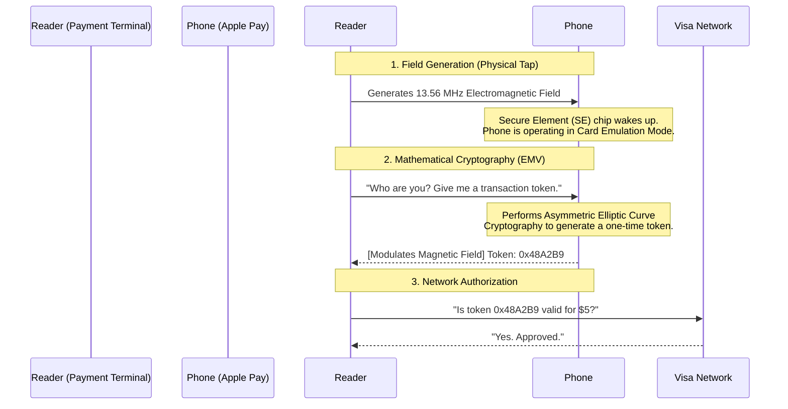

import { ConceptTemplate } from '@/features/kb/components/templates/ConceptTemplate'
import { Callout } from '@/features/kb/components/mdx/Callout'

export default function Layout({ children }) {
  return (
    <ConceptTemplate title="NFC (Near Field Communication)">
      {children}
    </ConceptTemplate>
  )
}

**NFC (Near Field Communication)** is a specialized subset of RFID (Radio Frequency Identification) technology. 

Operating at exactly **13.56 MHz**, NFC was mathematically engineered with a strict physical limitation: it only works within 4 centimeters (~1.5 inches). This limitation is not a flaw; it is its greatest security feature. Unlike Bluetooth or Wi-Fi, which can be sniffed by a hacker sitting in a parked car across the street, intercepting an NFC transmission physically requires the attacker to be standing intimately close to the victim.

## 1. Deep Dive & Mechanics

The most fascinating aspect of NFC is **Magnetic Induction**.

An NFC system involves an **Active Device** (your smartphone or a credit card reader) and a **Passive Device** (an NFC sticker or a plastic credit card).
The plastic credit card has no battery. When you tap it against the reader, the active reader generates an oscillating mathematical electromagnetic field. The copper coil hidden inside the plastic credit card catches this magnetic field and mathematically converts it into electricity (induction). 

This tiny burst of harvested electricity powers up the microscopic silicon chip inside the credit card. The chip instantly performs cryptographic math, modulates the magnetic field to send data back to the reader, and then immediately powers off as you pull it away.

## 2. Mathematical / Theoretical Foundation

NFC operates in three distinct, mathematically defined modes:

1. **Reader/Writer Mode:** Your active smartphone powers up a passive NFC tag (like a smart poster in a museum) and reads the URL encoded on it.
2. **Peer-to-Peer (P2P) Mode:** Two active smartphones tap together to mathematically exchange data (e.g., Android Beam for sharing photos or contacts). Both devices take turns generating the electromagnetic field.
3. **Card Emulation Mode:** Your active smartphone mathematically pretends to be a passive, dumb plastic credit card or a hotel room key. When you tap your phone against a payment terminal, the terminal treats your phone exactly as if it were a Visa card.

## 3. Real-World Implementation

Mobile developers interact with NFC hardware using the CoreNFC framework (iOS) or the NFC API (Android) to read NDEF (NFC Data Exchange Format) messages.

```javascript
// Conceptual Android/Web NFC API (Supported in Chrome for Android)
// This code allows a web app to read an NFC tag when the user taps it.

if ('NDEFReader' in window) {
  try {
    const ndef = new NDEFReader();
    
    // Prompt the user to tap an NFC tag
    await ndef.scan();
    console.log("Scan started successfully. Please tap an NFC tag.");

    ndef.onreading = event => {
      const message = event.message;
      for (const record of message.records) {
        if (record.recordType === "text") {
          const textDecoder = new TextDecoder(record.encoding);
          console.log(`Text Data read from Tag: ${textDecoder.decode(record.data)}`);
        } else if (record.recordType === "url") {
          const textDecoder = new TextDecoder();
          console.log(`URL read from Tag: ${textDecoder.decode(record.data)}`);
        }
      }
    };
  } catch (error) {
    console.log(`Error: ${error.message}`);
  }
}
```

## 4. Visualizations



## 5. Interview Prep

**Q: Can a hacker bump into me on the subway with a hidden card reader in their pocket and steal money from my NFC credit card?**
**A:** Theoretically, yes (called "RFID Skimming"). The thief's reader acts as the Active device, powers up the plastic credit card in your wallet through your pants, and mathematically forces it to execute a contactless payment. However, it is practically difficult because they must get within 4 centimeters of the exact location of your wallet. Furthermore, banks mathematically cap contactless transactions without a PIN (usually around $50-$100) to mitigate this exact fraud.

**Q: Why is Apple Pay / Google Pay mathematically more secure than tapping a physical plastic credit card?**
**A:** **Tokenization.** When you tap a physical plastic card, it mathematically transmits your actual 16-digit credit card number and expiration date in plain text to the reader. A compromised reader could store those details. When you tap Apple Pay, it uses the **Secure Element (SE)** chip in your phone. It never transmits your real card number. It mathematically generates a dynamic, one-time-use cryptographic Token (a fake card number). Even if the reader is compromised, the Token is mathematically useless for future purchases.

**Q: What is NDEF?**
**A:** **NFC Data Exchange Format**. It is a standardized mathematical payload structure (like JSON, but binary) dictated by the NFC Forum. If you buy a blank NFC sticker from Amazon, you write an NDEF message onto it (e.g., a URL record pointing to your website). Because it is NDEF formatted, both iOS and Android know exactly how to mathematically parse it natively without requiring the user to download a specific app.

## 6. Production Use Cases

- **Access Control (YubiKey / Smart Locks):** Modern Multi-Factor Authentication (MFA) relies on FIDO2/WebAuthn hardware keys like the YubiKey. Instead of plugging the USB key into your phone, you simply tap the YubiKey against the back of your phone. The phone powers the key via NFC, the key mathematically signs the cryptographic login challenge, and transmits the signature back, completing a highly secure, phishing-resistant login in 1 second.
- **Supply Chain Authentication:** High-end luxury brands (like Gucci or fine wine producers) embed microscopic cryptographic NFC tags directly into the fabric of a purse or the cork of a bottle. A consumer taps their phone to the purse. The phone mathematically challenges the tag, verifying a cryptographic signature that proves the purse is a genuine product and not a counterfeit, while simultaneously loading the product's origin story on the phone's browser.

<Callout icon="info" title="The Secure Element (SE)">
In Card Emulation mode (Apple Pay), the smartphone's main CPU (which runs your apps and is vulnerable to malware) is mathematically forbidden from handling the credit card data. The NFC antenna is physically hardwired directly to a tiny, dedicated, mathematically isolated cryptographic co-processor chip called the Secure Element (SE). Even if your Android phone is completely rooted and infected with a virus, the virus physically cannot extract the credit card keys from the SE hardware.
</Callout>
