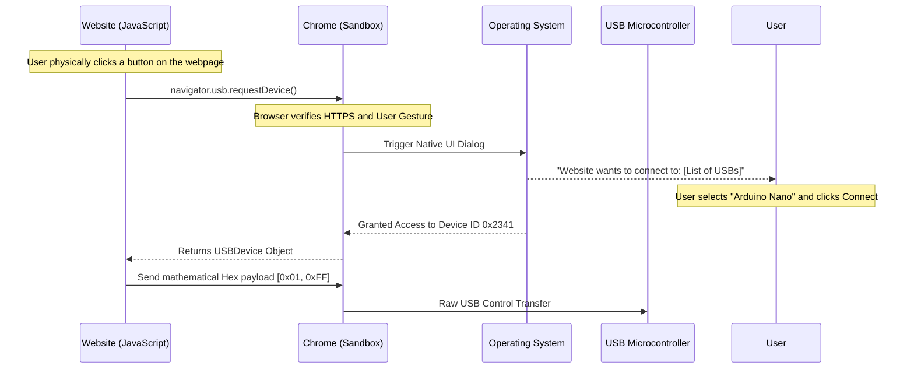

import { ConceptTemplate } from '@/features/kb/components/templates/ConceptTemplate'
import { Callout } from '@/features/kb/components/mdx/Callout'

export default function Layout({ children }) {
  return (
    <ConceptTemplate title="Hardware APIs (Web Bluetooth, WebUSB)">
      {children}
    </ConceptTemplate>
  )
}

For two decades, the web browser was a strict, mathematical prison. JavaScript was sandboxed. It could manipulate the DOM, but it could absolutely not touch the user's physical hardware. If you wanted an app that talked to a specialized USB heart rate monitor or a Bluetooth smart lightbulb, you were forced to build a native Windows `.exe` or an iOS Swift app.

The **Project Fugu** initiative (driven largely by Google) shattered this paradigm. By exposing rigorous, permission-gated Hardware APIs, a standard website (URL) can now replace native applications, communicating mathematically directly with external hardware peripherals.

## 1. Deep Dive: The Big Three

**1. Web Bluetooth API:**
Allows JavaScript to connect to Bluetooth Low Energy (BLE) devices. It mathematically parses the GATT (Generic Attribute Profile) protocol. A website can discover nearby BLE sensors, connect to them, and read/write binary bytes to their Services and Characteristics.

**2. WebUSB API:**
Allows a website to open a direct, raw data pipe to a physical USB device plugged into the computer. It bypasses the operating system's standard USB drivers, allowing the website to send raw hexadecimal control packets directly to the silicon of custom hardware (like flashing a microcontroller or configuring a mechanical keyboard).

**3. Web Serial API:**
The modern bridge to legacy hardware. Industrial machinery, 3D printers, and Arduino boards often communicate using the ancient RS-232 Serial protocol (COM ports on Windows). Web Serial allows a website to mathematically open that COM port and stream text/binary data back and forth.

## 2. Mathematical / Theoretical Foundation

The terrifying mathematical reality of Hardware APIs is **Security**. 

If a malicious website could arbitrarily open a USB connection, it could flash malicious firmware onto your webcam or extract private keys from your YubiKey. The W3C mathematically engineered a strict security architecture to prevent this:

1. **Secure Context Only:** Hardware APIs will instantly throw an exception if the website is not loaded over HTTPS (or localhost).
2. **Transient User Activation:** A website cannot randomly scan for Bluetooth devices on page load. The JavaScript function `navigator.bluetooth.requestDevice()` mathematically *must* be triggered by a physical user gesture (a mouse click or a keystroke). 
3. **OS-Level Gatekeeping:** The browser intercepts the API call and throws up a native, un-spoofable OS dialog box forcing the human user to explicitly select the specific hardware device they want to grant the website access to. The website has no knowledge of any other devices in the room.

## 3. Real-World Implementation

Interacting with Web Serial involves handling asynchronous, mathematically chunked data streams using the modern Streams API.

```javascript
// Connecting to an Arduino via Web Serial in Chrome

document.getElementById('connectButton').addEventListener('click', async () => {
  try {
    // 1. Triggers the OS dialog prompting the user to select the COM port
    const port = await navigator.serial.requestPort();
    
    // 2. Open the port with the mathematical baud rate matching the Arduino
    await port.open({ baudRate: 9600 });

    const textDecoder = new TextDecoderStream();
    const readableStreamClosed = port.readable.pipeTo(textDecoder.writable);
    const reader = textDecoder.readable.getReader();

    console.log("Listening to Arduino...");

    // 3. Infinite loop to mathematically parse incoming serial data chunks
    while (true) {
      const { value, done } = await reader.read();
      if (done) break;
      console.log("Arduino says:", value);
    }
  } catch (error) {
    console.error("User cancelled or port failed:", error);
  }
});
```

## 4. Visualizations



## 5. Interview Prep

**Q: Are Hardware APIs supported across all browsers?**
**A:** **NO.** This is the biggest caveat in modern web development. Google Chrome, Edge, and Opera (Blink-based browsers) strongly support them. **Apple (Safari) and Mozilla (Firefox) completely refuse to implement them.** Apple and Mozilla argue that exposing raw USB and Bluetooth to the web creates a mathematical security risk that cannot be mitigated by permission dialogs, as users blindly click "Allow" without understanding the consequences. 

**Q: What is the WebHID API?**
**A:** HID (Human Interface Device) is a specific class of USB devices (Mice, Keyboards, Gamepads). Historically, the OS "swallows" HID devices and only passes standard mouse clicks to the browser. WebHID allows a web application to mathematically bypass the OS and talk directly to the controller. This is how web-based Cloud Gaming platforms (like Xbox Cloud Gaming) can read the analog triggers on a specialized flight joystick or change the RGB LED colors on a DualShock controller directly from the browser.

**Q: How does a website know the specific mathematical binary format a custom USB device expects?**
**A:** It doesn't. WebUSB only provides the raw pipeline. The frontend developer must read the hardware manufacturer's physical datasheet (or reverse-engineer the protocol). If the hardware expects a 64-byte Little-Endian control packet to turn on an LED, the web developer must manually construct an `ArrayBuffer` in JavaScript, use a `DataView` to mathematically align the bits precisely, and transmit the raw buffer via WebUSB.

## 6. Production Use Cases

- **Drone & 3D Printer Configuration:** Companies like Betaflight (racing drones) or various 3D printer manufacturers used to force users to download massive, buggy native desktop applications to update firmware. Today, they provide a simple Web App. You plug your drone into your laptop via USB, navigate to the URL in Chrome, and the WebUSB API mathematically flashes the new firmware directly onto the drone's silicon from the browser.
- **Medical and Fitness Devices:** Specialized medical sensors (like EKG monitors or smart stationary bikes) use the Web Bluetooth API to connect directly to web-based coaching dashboards. The website reads the raw BLE GATT characteristics to plot real-time heart rate graphs mathematically on an HTML Canvas without requiring the gym-goer to download an iOS app.

<Callout icon="warning" title="The Windows USB Driver Nightmare">
While WebUSB allows the browser to bypass generic drivers, Windows enforces a strict mathematical rule: if the OS has already bound a proprietary driver (like a custom Logitech driver) to a USB device, Windows will aggressively block Chrome from accessing it via WebUSB for security reasons. To make WebUSB work on Windows, the user often has to manually use a tool like `Zadig` to forcibly replace the device's native driver with the generic `WinUSB` driver before the browser is mathematically allowed to touch it.
</Callout>
