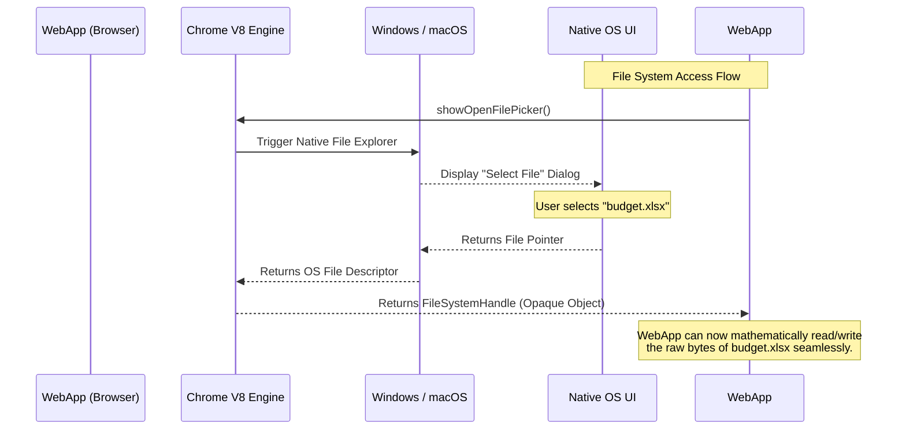

import { ConceptTemplate } from '@/features/kb/components/templates/ConceptTemplate'
import { Callout } from '@/features/kb/components/mdx/Callout'

export default function Layout({ children }) {
  return (
    <ConceptTemplate title="OS Integration APIs (Web Share, File System, Badging)">
      {children}
    </ConceptTemplate>
  )
}

Historically, you could instantly spot a web application because it felt "trapped" inside the browser tab. It couldn't put a notification badge on its taskbar icon. It couldn't trigger the phone's native Share Sheet (Instagram, WhatsApp). And most crucially, it could not save a file directly to your hard drive without forcing you through a clunky "Downloads" folder flow.

The **OS Integration APIs** (part of the Fugu initiative) provide mathematical hooks into the underlying operating system (Windows, macOS, Android, iOS). When combined into a PWA (Progressive Web App), these APIs allow a website to mathematically masquerade as a native installed application.

## 1. Deep Dive: The Core APIs

**1. File System Access API:**
Historically, web apps could only read files if the user dragged and dropped them, and could only "save" files by triggering a download. This API changes the math. A web-based text editor (like VS Code for Web) can mathematically ask the OS for a "File Handle" to a specific file on your desktop. The web app can continuously read and overwrite that physical file on your hard drive in real-time as you type, just like native MS Word.

**2. Web Share API:**
Mobile operating systems have deeply integrated mathematical routing for sharing content (the "Share Sheet"). The Web Share API allows a website to trigger this native OS dialog. If a user clicks "Share Article" on a website, the OS pops up the native UI asking if they want to send it via iMessage, Twitter, or Email, passing the mathematical payload seamlessly from the browser to the native app.

**3. Badging API:**
A mathematically simple but crucial UX feature. It allows an installed Web App to display a red dot or a number (e.g., "3 Unread Messages") directly on the application's icon in the Windows Taskbar or macOS Dock, hooking into the OS's native notification event loop.

## 2. Mathematical / Theoretical Foundation

The File System Access API represents a massive mathematical pivot in browser security philosophy. 

Allowing a website to read and write directly to a user's local C:\ drive is terrifying. The browser enforces this via a mathematical **Handle-Based Sandbox**.
When a website requests to open a file, it does not get a string path (`C:\secrets.txt`). It gets a cryptographically opaque **FileSystemHandle**. 
1. The handle mathematically expires when the browser tab is closed. 
2. If the user returns tomorrow, the web app can request the handle again from IndexedDB, but the OS forces the user to re-authorize the mathematical write permission via a native UI prompt. 
3. The browser actively blocks access to sensitive OS directories (like `/System` or `C:\Windows`), mathematically returning an exception if the web app tries to navigate there.

## 3. Real-World Implementation

Here is how a web application uses the Web Share API to trigger the native iOS/Android sharing ecosystem.

```javascript
// Using the Web Share API

document.getElementById('shareButton').addEventListener('click', async () => {
  const shareData = {
    title: 'Check out this awesome article',
    text: 'I found a great Deep Dive on OS Integration APIs!',
    url: 'https://algo-viz.com/deep-dives'
  };

  // 1. Mathematically check if the OS actually supports native sharing
  if (navigator.share) {
    try {
      // 2. This pauses JS execution and triggers the native OS Share Sheet
      await navigator.share(shareData);
      console.log('Mathematical payload successfully handed off to the OS.');
    } catch (err) {
      // 3. User might have cancelled the native dialog
      console.error('Share was cancelled or failed:', err);
    }
  } else {
    // 4. Fallback for older browsers or desktop environments without share sheets
    console.log('Web Share API not supported on this OS. Copying to clipboard instead.');
    navigator.clipboard.writeText(shareData.url);
  }
});
```

## 4. Visualizations



## 5. Interview Prep

**Q: Can the Web Share API receive files, or only send them?**
**A:** It can do both, but receiving is handled by the **Web Share Target API**. If you build a web-based photo editor and install it as a PWA, you can mathematically register your web app in the OS manifest as a "Share Target for .JPG files." If a user opens their native Android Camera app, takes a photo, and clicks "Share", your Web App will appear in the native list next to Instagram. Clicking it mathematically boots your web app and passes the image file directly into your JavaScript.

**Q: How do you handle users refreshing the page with the File System Access API?**
**A:** This is a major mathematical UX challenge. If the user refreshes, the JavaScript context is destroyed, and the FileSystemHandle is lost. You must mathematically serialize the `FileSystemHandle` and store it persistently in **IndexedDB**. On page reload, you retrieve the handle from IndexedDB and call `handle.requestPermission({ mode: 'readwrite' })` to ask the OS to re-validate the connection.

**Q: What is the Web App Manifest?**
**A:** A simple JSON file (`manifest.json`) that serves as the mathematical blueprint for OS integration. It tells the OS the name of the app, the background colors, the icon files, and whether the app should launch in `standalone` mode (mathematically stripping away the browser URL bar and back buttons to perfectly mimic a native window). Without a valid manifest, none of the deep OS integration features (like Badging or Installation) will function.

## 6. Production Use Cases

- **Web-Based IDEs and Design Tools:** Figma, Photopea, and VS Code for the Web heavily rely on the File System Access API. A developer can navigate to `vscode.dev`, select their local `C:\Projects\my-website` folder, and the web browser mathematically gains direct write access to that entire directory structure, allowing the web app to function identically to a natively installed C++ code editor.
- **Media and Streaming PWAs:** Apps like Twitter (X), Spotify, and YouTube Music utilize the Badging API and Web Share API heavily. When you install the Twitter PWA on macOS, it sits in your Dock. When a background push notification arrives via a Service Worker, the Service Worker executes a mathematical call to the Badging API to instantly render a red notification dot on the Dock icon, proving that web apps can achieve parity with native app engagement loops.

<Callout icon="danger" title="Apple's Resistance to PWAs">
While Google Chrome and Microsoft Edge aggressively push these APIs to make Web Apps mathematically indistinguishable from Native Apps, Apple (Safari) has historically dragged its feet. Because highly capable Web Apps bypass the lucrative iOS App Store (where Apple takes a 30% cut), Apple routinely refuses to implement deep OS APIs like the File System Access API or robust Push Notifications on iOS, citing "security concerns," effectively crippling the PWA mathematical feature set for 50% of the US mobile market.
</Callout>
