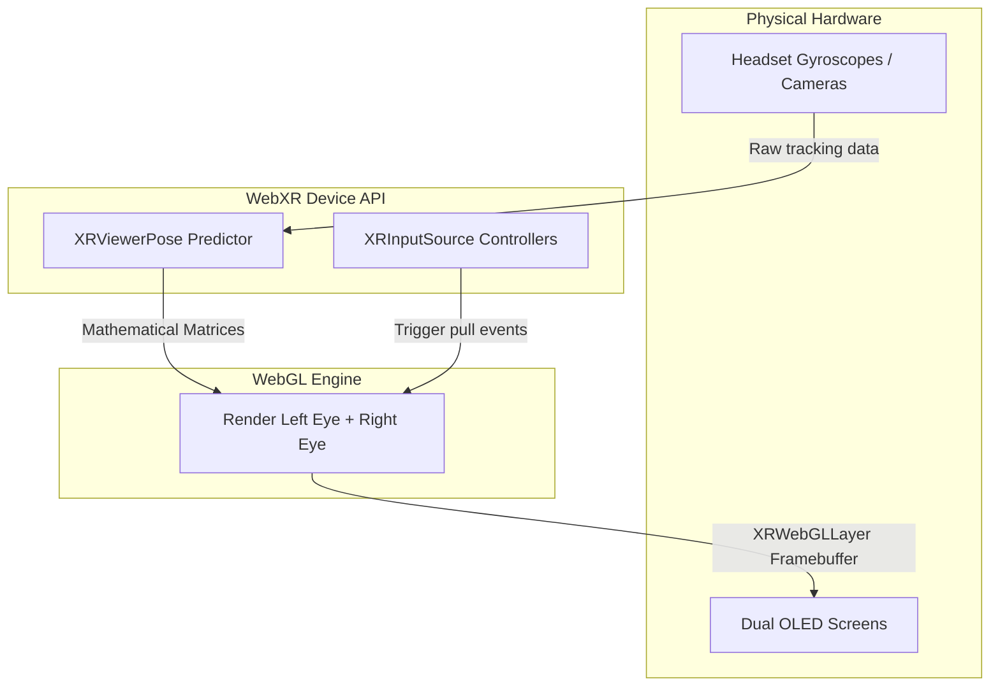

import { ConceptTemplate } from '@/features/kb/components/templates/ConceptTemplate'
import { Callout } from '@/features/kb/components/mdx/Callout'

export default function Layout({ children }) {
  return (
    <ConceptTemplate title="WebXR Device API">
      {children}
    </ConceptTemplate>
  )
}

Historically, Virtual Reality (VR) and Augmented Reality (AR) required massive, 50GB native application downloads via platforms like SteamVR or the Meta Quest Store. 

The **WebXR Device API** (the evolution of the older WebVR API) brings the metaverse directly to the URL. It provides a mathematical bridge between the web browser and the user's physical XR hardware (headsets, AR glasses, or even a smartphone camera). It reads the physical gyroscope, accelerometer, and 6-DoF (Degrees of Freedom) tracking data, and synchronizes it with the browser's WebGL rendering engine to paint immersive 3D scenes at 90 frames per second.

## 1. Deep Dive & Mechanics

WebXR is fundamentally a synchronization API. It does not actually draw 3D graphics (that is WebGL/WebGPU's job). WebXR's mathematical purpose is to capture physical space and time.

1. **Sessions:** A WebXR experience begins by requesting an `XRSession`. You mathematically specify the mode: `'immersive-vr'` (completely blocks out the real world, like a Meta Quest) or `'immersive-ar'` (overlays graphics onto a camera feed, like Pokemon Go).
2. **Reference Spaces:** This defines the mathematical origin point (`0,0,0`) of the virtual world.
   - `'local'`: The origin is where the user's head was when they started the session (good for seated experiences).
   - `'bounded-floor'`: The origin is locked to the physical floor of the user's living room (good for room-scale VR where the user walks around).
3. **The XR Frame Loop:** WebXR replaces the standard `requestAnimationFrame` with `session.requestAnimationFrame`. This loop is tightly coupled to the hardware refresh rate of the VR headset (e.g., 90Hz or 120Hz).

## 2. Mathematical / Theoretical Foundation

The terrifying mathematical reality of VR is **Motion to Photon Latency**.

If a user physically turns their head 10 degrees to the left, the screen inside the headset must update the 3D scene to reflect that movement in less than **20 milliseconds**. If the mathematical delay is 30ms or higher, the disconnect between the user's inner ear (vestibular system) and their eyes will induce severe physical nausea (Simulation Sickness).

WebXR achieves this via **Pose Prediction**. 
When the JavaScript loop asks the WebXR API for the `XRViewerPose` (where the head is), the API does not return where the head is *right now*. It executes a complex mathematical physics algorithm to predict exactly where the user's head *will be* 15 milliseconds in the future when the photons actually hit their eyes. The WebGL engine then renders the scene based on that future mathematical prediction.

## 3. Real-World Implementation

Because raw WebXR math (Quaternions and View Matrices) is incredibly complex, developers almost exclusively use **Three.js** or **A-Frame** to build WebXR apps.

Here is the underlying native WebXR boilerplate to hook a WebGL context into a VR headset.

```javascript
// 1. Check if the browser mathematically supports Immersive VR
if (navigator.xr) {
  const isSupported = await navigator.xr.isSessionSupported('immersive-vr');
  if (isSupported) {
    document.getElementById('enter-vr-btn').addEventListener('click', onEnterVR);
  }
}

async function onEnterVR() {
  // 2. Request the VR Session (Requires a user click for security)
  const session = await navigator.xr.requestSession('immersive-vr');
  
  // 3. Create a WebGL context compatible with XR
  const canvas = document.createElement('canvas');
  const gl = canvas.getContext('webgl', { xrCompatible: true });
  
  // 4. Bind the WebGL context to the headset's physical screens
  session.updateRenderState({
    baseLayer: new XRWebGLLayer(session, gl)
  });

  // 5. Get the mathematical Reference Space (Room-scale tracking)
  const refSpace = await session.requestReferenceSpace('local');

  // 6. Start the specialized XR render loop
  session.requestAnimationFrame((time, frame) => {
    // Get the predicted head position and rotation matrix
    const pose = frame.getViewerPose(refSpace);
    if (pose) {
      // Loop through each eye (Left and Right)
      for (const view of pose.views) {
        // Mathematically render the 3D scene twice, 
        // once from the perspective of the left eye, once from the right eye.
        renderSceneForEye(gl, view);
      }
    }
  });
}
```

## 4. Visualizations



## 5. Interview Prep

**Q: Why do you have to render the scene twice in WebXR?**
**A:** Stereoscopic Vision. Humans perceive depth because our eyes are physically separated by a few centimeters (Interpupillary Distance, or IPD). WebXR mathematically tracks the position of the center of the head, and then provides two `XRView` matrices offset by the user's specific IPD. You must execute your WebGL draw calls once for the left eye viewport, and a second time for the right eye viewport.

**Q: What is the WebXR Hit Test API?**
**A:** A crucial feature for Augmented Reality (AR). When looking through a phone camera, the WebXR API mathematically scans the physical world for flat planes (like a physical table). The Hit Test API allows you to cast a mathematical ray from the center of the phone screen, detect exactly where that ray intersects the physical table, and drop a 3D model (like a virtual couch) anchored perfectly to those real-world coordinates.

**Q: Why doesn't WebXR work inside standard `<iframe>` tags?**
**A:** Security and nausea prevention. If an embedded advertisement iframe could hijack your VR headset, it could aggressively flash strobe lights directly into your eyes or ruin the 90fps framerate, causing physical sickness. WebXR mathematically requires the top-level document to explicitly grant the `allow="xr-spatial-tracking"` permission to any child iframes.

## 6. Production Use Cases

- **E-Commerce and Retail:** IKEA and Amazon use WebXR AR on their mobile websites. Without downloading an app, a user can browse to a couch, tap "View in Room," and WebXR will tap into their smartphone camera to mathematically anchor the 3D couch onto their living room floor at true 1:1 physical scale.
- **Educational and Training Simulations:** Medical schools and industrial companies (like oil rig operators) host complex interactive training simulators on the web. Trainees can put on a Meta Quest browser, navigate to a URL, and instantly practice emergency protocols in a fully immersive 6-DoF environment, drastically reducing the friction of deploying enterprise software updates.

<Callout icon="info" title="The Death of WebVR">
You might see older tutorials referencing the **WebVR** API. This API is completely dead and mathematically deprecated. WebVR was designed exclusively for Virtual Reality headsets. As Apple and Google pivoted hard toward Augmented Reality on smartphones, the W3C scrapped WebVR and engineered **WebXR** (X representing the variable for Extended/Mixed Reality) from the ground up to mathematically handle both VR headsets and AR camera passthrough within a single, unified mathematical interface.
</Callout>
