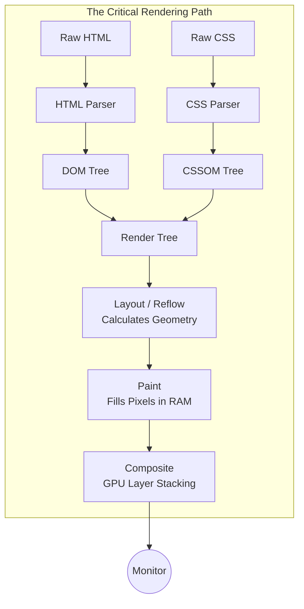

import { ConceptTemplate } from '@/features/kb/components/templates/ConceptTemplate'
import { Callout } from '@/features/kb/components/mdx/Callout'

export default function Layout({ children }) {
  return (
    <ConceptTemplate title="Browser Rendering Engines">
      {children}
    </ConceptTemplate>
  )
}

A web browser is fundamentally an operating system masquerading as an application. While JavaScript engines (like V8) get the glory for execution speed, the **Rendering Engine** (like Blink or WebKit) is the true heavy lifter. 

Its mathematical purpose is staggering: it must consume chaotic, unstructured HTML text over a slow network, parse thousands of cascading CSS rules, calculate the geometric layout of every box, and mathematically paint millions of pixels to the GPU—all while maintaining a fluid 60 frames per second (16.6ms per frame).

## 1. Deep Dive & Mechanics

The Critical Rendering Path is a strict, mathematical pipeline consisting of five primary phases:

1. **Parsing (DOM & CSSOM):** The engine reads the raw HTML bytes, converts them into characters, tokenizes them, and builds a mathematical tree of nodes (The Document Object Model). Simultaneously, it parses the CSS and builds the CSS Object Model (CSSOM).
2. **The Render Tree (Attachment):** The engine mathematically merges the DOM and the CSSOM. It strips out nodes that will not be displayed (like `<head>` or `display: none`) and assigns computed styles to the remaining nodes.
3. **Layout (Reflow):** The engine calculates the exact geometry. It recursively traverses the Render Tree, mathematically determining the exact X, Y coordinates, width, and height of every element based on the viewport size.
4. **Paint:** The engine converts the mathematical boxes into actual pixels. It draws text, colors, borders, and shadows into memory, often separating complex overlapping elements into distinct mathematical **Layers**.
5. **Compositing:** The final step. The engine ships the painted Layers to the GPU. The GPU mathematically stacks the layers together, applies hardware-accelerated transforms (like `translateZ`), and draws the final composite image to the physical monitor.

## 2. Mathematical / Theoretical Foundation

The most computationally expensive phase of the engine is **Layout (Reflow)**.

Layout is mathematically recursive and interdependent. If you change the width of the `<body>`, it mathematically cascades down, forcing the engine to recalculate the width of every paragraph, which changes where words wrap, which changes the height of the paragraph, which mathematically cascades back up to change the height of the `<body>`.

If a developer writes JavaScript that reads a layout property (like `element.offsetHeight`) immediately after changing a style (like `element.style.width = '100px'`), they trigger **Layout Thrashing**. The engine is mathematically forced to pause JavaScript, flush its rendering queue, and execute a synchronous Layout recalculation of the entire page just to answer the JavaScript query, instantly causing the framerate to plummet.

## 3. Real-World Implementation

Modern frontend optimization is entirely about understanding and bypassing phases of this mathematical pipeline.

```css
/* BAD PERFORMANCE: Animating the 'left' property */
.box {
  position: absolute;
  left: 0;
  transition: left 1s;
}
.box.move {
  left: 100px; /* Triggering this forces LAYOUT -> PAINT -> COMPOSITE every frame */
}

/* 
  GOOD PERFORMANCE: Animating 'transform' 
  This mathematically bypasses Layout and Paint entirely.
  The engine paints the box once, puts it on its own GPU Layer, 
  and only runs the Compositor phase during the animation.
*/
.box {
  transform: translateX(0);
  transition: transform 1s;
  will-change: transform; /* mathematically hints the engine to promote this to a GPU layer */
}
.box.move {
  transform: translateX(100px); 
}
```

## 4. Visualizations



## 5. Interview Prep

**Q: What are the major browser rendering engines today?**
**A:** There are effectively only three left in the world due to the immense mathematical complexity of building them:
- **Blink:** Used by Google Chrome, Microsoft Edge, Opera, and Brave. (Originally a fork of WebKit).
- **WebKit:** Used by Apple Safari (and mathematically mandated on *all* iOS browsers, including Chrome for iOS).
- **Gecko:** Used by Mozilla Firefox.

**Q: What is the difference between `display: none` and `visibility: hidden` in the rendering pipeline?**
**A:** `display: none` removes the element from the mathematical Render Tree entirely. It has zero dimensions and triggers a massive Layout reflow. `visibility: hidden` leaves the element in the Render Tree. It retains its physical geometry and takes up space, it just bypasses the Paint phase.

**Q: What is the `requestAnimationFrame` API?**
**A:** The rendering engine updates the screen physically 60 times a second (every 16.6 milliseconds). If you use `setTimeout(fn, 16)`, JavaScript executes blindly, often mathematically colliding with the engine's internal Paint phase, causing dropped frames and screen tearing. `requestAnimationFrame` hooks directly into the C++ engine's internal mathematical heartbeat, ensuring your JavaScript only executes precisely at the start of the next rendering pipeline cycle.

## 6. Production Use Cases

- **Virtual DOM Libraries (React):** The entire mathematical premise of React is that touching the actual DOM (and triggering the Layout engine) is slow. React computes changes in a lightweight JavaScript memory tree (the Virtual DOM), diffs it, and surgically batches updates to the real DOM to minimize expensive Layout thrashing.
- **Infinite Scrolling Lists:** High-performance web apps (like Twitter or Facebook) use "Virtualization" for massive lists. Instead of putting 10,000 tweets in the DOM (which would mathematically crush the Layout engine's memory), they only render the 10 tweets currently visible on screen. As you scroll, they recycle the DOM nodes, updating the text content while keeping the total node count mathematically capped.

<Callout icon="danger" title="The Main Thread Bottleneck">
The Rendering Engine and the JavaScript Engine share the exact same mathematical thread (The Main Thread). This is why computationally heavy JavaScript freezes the UI. If a `while` loop takes 200 milliseconds to execute, the Rendering Engine is physically blocked from starting the Layout and Paint phases. The browser cannot draw a single frame or respond to a button click until the JavaScript yields control back to the event loop.
</Callout>
