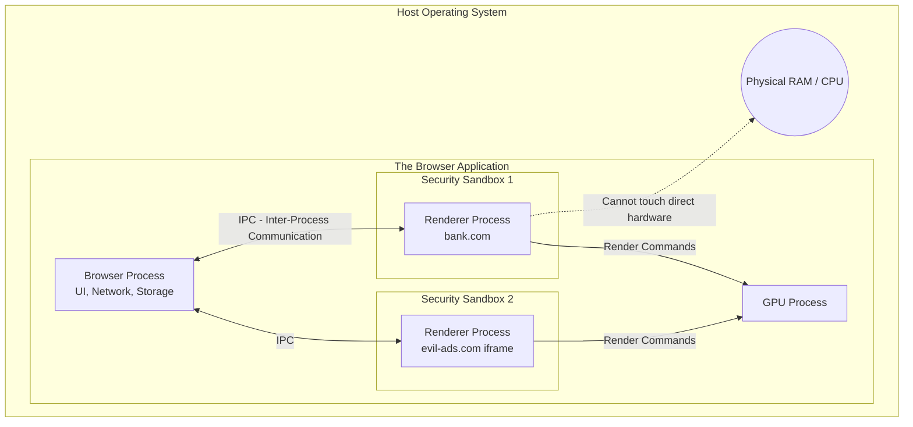

import { ConceptTemplate } from '@/features/kb/components/templates/ConceptTemplate'
import { Callout } from '@/features/kb/components/mdx/Callout'

export default function Layout({ children }) {
  return (
    <ConceptTemplate title="Browsers">
      {children}
    </ConceptTemplate>
  )
}

Modern web browsers (Google Chrome, Mozilla Firefox, Apple Safari, Microsoft Edge) are among the most mathematically and architecturally complex pieces of software ever written. A modern browser codebase (like Chromium) contains over 35 million lines of C++ code, making it physically larger and more complex than the entire Linux operating system kernel.

A browser is no longer a simple "document viewer." It is a heavily sandboxed, highly concurrent Virtual Machine. It mathematically acts as an abstraction layer between web applications (written in high-level HTML/CSS/JS) and the underlying host Operating System (Windows, macOS, Linux).

## 1. Deep Dive & Mechanics

At a high level, the architecture of a modern browser is divided into several highly distinct, deeply isolated processes:

1. **The Browser Process:** The supreme commander. It controls the "chrome" of the application (the address bar, back/forward buttons, bookmarks). More importantly, it handles all raw network requests and file access, because the underlying rendering processes are mathematically banned from touching the host OS directly.
2. **The Renderer Process (Blink / WebKit):** Responsible for parsing HTML, CSS, and executing JavaScript. Because web content is inherently untrusted and potentially malicious, the Renderer Process is mathematically trapped inside an extreme security sandbox. It cannot read local files or open raw network sockets. It must beg the Browser Process via Inter-Process Communication (IPC) for resources.
3. **The GPU Process:** Dedicated exclusively to taking mathematical rendering instructions from the Renderer Process and shipping them to the physical graphics card (GPU) for hardware acceleration.
4. **The Plugin / Extension Processes:** If you install an ad-blocker or a password manager, the browser spins up a completely separate mathematical process for it, ensuring that if the extension crashes, the main browser does not.

## 2. Mathematical / Theoretical Foundation

The most critical architectural shift in browser history was **Site Isolation (Project Fission)**.

Historically, a browser used a single Renderer process for a single tab. If Tab A loaded `bank.com` and Tab B loaded `evil.com`, they ran in separate processes. However, if `bank.com` embedded an iframe from `evil.com`, the browser historically ran that iframe inside `bank.com`'s Renderer process.

In 2018, the **Spectre** CPU vulnerability mathematically broke the internet. Spectre proved that any malicious JavaScript could force the physical CPU to speculatively execute instructions, allowing the JavaScript to read the raw memory of the *entire process it was running inside*.

If `evil.com` was in the same process as `bank.com`, it could mathematically extract your banking session tokens directly from RAM. 

To solve this, Google Chrome engineers implemented **Site Isolation**. Now, every single cross-origin iframe is mathematically ripped out of its parent's process and assigned its own dedicated, sandboxed OS process. If `evil.com` tries to use Spectre, it can only steal data from its own isolated process, mathematically neutralizing the attack.

## 3. Real-World Implementation

Because the browser is an abstraction layer, web developers interact with its subsystems via the **BOM (Browser Object Model)** and specific JavaScript APIs.

```javascript
// 1. The BOM (Window Object)
// The global context mathematically representing the browser window itself
console.log("Current URL:", window.location.href);
console.log("Screen resolution:", window.screen.width, "x", window.screen.height);

// 2. The Navigator Object
// Exposes the underlying hardware and browser capabilities
if (navigator.geolocation) {
  navigator.geolocation.getCurrentPosition(
    (position) => console.log("Latitude:", position.coords.latitude),
    (error) => console.error("Mathematical GPS failure:", error)
  );
}

// 3. Web Workers (Concurrency)
// JavaScript is strictly single-threaded in the main Renderer.
// If you need to do heavy math (like calculating Fibonacci to a billion), 
// you must mathematically spin up a Web Worker, which executes in a totally separate OS thread.
const worker = new Worker('heavy_math_worker.js');
worker.postMessage({ command: 'calculate' }); // Send data to the background thread
worker.onmessage = (event) => console.log("Result:", event.data);

// 4. Client-Side Storage
// The browser provides its own embedded mathematical databases
localStorage.setItem('theme', 'dark'); // Simple key-value (Synchronous, blocking)
const dbReq = indexedDB.open('myDatabase', 1); // Massive NoSQL database (Asynchronous)
```

## 4. Visualizations



## 5. Interview Prep

**Q: What is the event loop in a browser?**
**A:** Because JavaScript is single-threaded, the browser relies on a mathematical queuing system called the Event Loop. When an asynchronous event occurs (like a network fetch completing, or a user clicking a button), the browser pushes a callback function onto the Macrotask or Microtask queue. The Event Loop constantly spins, checking if the main Call Stack is empty. If it is empty, it mathematically pulls the next function off the queue and executes it. 

**Q: What is the difference between a Macrotask and a Microtask?**
**A:** They have distinct mathematical execution priorities. Microtasks (like `Promise.then()` or `MutationObserver`) have absolute priority. The Event Loop will execute *every single* Microtask in the queue before it even looks at the Macrotask queue (which handles `setTimeout` or DOM clicks). If a developer writes a recursive Promise loop, the Microtask queue will mathematically never empty, completely freezing the browser tab.

**Q: How does a browser handle rendering an immensely massive DOM (e.g., 50,000 nodes)?**
**A:** Terribly. Every DOM node consumes memory in the C++ backend. When a layout change occurs, the browser mathematically traverses the entire tree. At 50,000 nodes, the CPU will physically choke, dropping framerates below 10fps. Developers must implement Virtualization (e.g., `react-window`), where they only render the 20 nodes currently visible on the screen, mathematically recycling the DOM elements as the user scrolls.

## 6. Production Use Cases

- **Progressive Web Apps (PWAs):** Utilizing the browser's Service Worker API, companies like Twitter and Starbucks ship web applications that mathematically intercept network requests. If the user is on an airplane with no WiFi, the browser process serves the application directly from the local Cache API, allowing the web app to function perfectly offline like a native iOS/Android app.
- **Headless Browsers:** In CI/CD pipelines, engineers run **Puppeteer** or **Playwright**. These tools boot up a literal Chromium browser process on a Linux server, but mathematically disable the GPU and GUI (Headless mode). They then use IPC commands to script the browser to navigate to the company's website, click buttons, and assert that the UI mathematically works before deploying code to production.

<Callout icon="danger" title="The Memory Cost of Sandboxing">
The mathematical brilliance of Site Isolation and multi-process architecture comes at a severe hardware cost. Because every tab and iframe gets its own dedicated OS process, the browser must duplicate the V8 JavaScript Engine instance and the Blink rendering engine instance in RAM for every single tab. This is precisely why Google Chrome mathematically devours your laptop's RAM (often consuming gigabytes of memory just to keep 10 tabs open).
</Callout>
