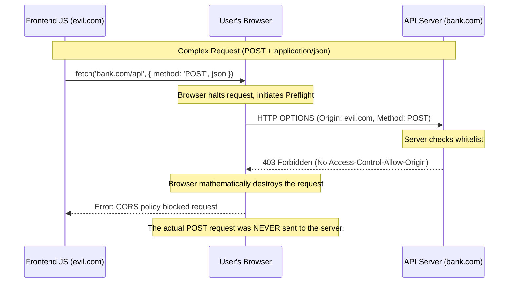

import { ConceptTemplate } from '@/features/kb/components/templates/ConceptTemplate'
import { Callout } from '@/features/kb/components/mdx/Callout'

export default function Layout({ children }) {
  return (
    <ConceptTemplate title="Cross-Origin Resource Sharing (CORS)">
      {children}
    </ConceptTemplate>
  )
}

If you are a web developer, you have undoubtedly encountered the dreaded error: `Access to fetch at 'api.example.com' from origin 'localhost:3000' has been blocked by CORS policy.`

CORS is not a bug. It is a critical mathematical security feature implemented by the web browser to protect users. Without CORS, the modern internet would be an apocalyptic wasteland of stolen data. To understand CORS, you must first understand the foundational law it modifies: the **Same-Origin Policy (SOP)**.

## 1. Deep Dive & Mechanics

**The Same-Origin Policy (SOP):**
This is a mathematical rule hardcoded into every web browser. It states that JavaScript executing on `https://bank.com` is only allowed to read network data from `https://bank.com`. If a user visits `https://evil.com`, and that site executes `fetch('https://bank.com/api/balance')`, the browser will mathematically execute the request, the server will process it (using the user's saved banking cookies!), but the browser will **block the malicious JavaScript from reading the response**.

**CORS (Cross-Origin Resource Sharing):**
SOP is incredibly secure, but mathematically too restrictive. What if `bank.com` *wants* to allow their official mobile-web portal at `https://bank-portal.com` to read data from their API?

CORS is the mathematical loophole. It is a strict negotiation between the browser and the server using HTTP Headers. 

When `bank-portal.com` attempts to fetch data from `api.bank.com`, the browser says, "Wait, these are different origins." The browser intercepts the request and says to the server: "Hey, this request is coming from `bank-portal.com`. Do you allow this?" 

If the server explicitly replies with the HTTP header `Access-Control-Allow-Origin: https://bank-portal.com`, the browser mathematically unlocks the response, allowing the JavaScript to read the data.

## 2. Mathematical / Theoretical Foundation

The most complex mathematical mechanism of CORS is the **Preflight Request (OPTIONS)**.

If a cross-origin request is "Simple" (e.g., a basic GET request with no special headers), the browser fires the request immediately, but mathematically hides the response until the CORS headers are validated.

However, if the request is "Complex"—meaning it could mathematically alter data on the server (e.g., a `DELETE` request, or a `POST` with `Content-Type: application/json`, or passing custom `Authorization` headers)—the browser realizes that firing the request blindly is too dangerous.

Before the actual request is sent, the browser halts the JavaScript thread and fires a covert, automatic HTTP `OPTIONS` request to the server. This is the **Preflight**. The browser mathematically asks: "I want to send a DELETE request with these specific headers. Will you accept this?"

The server must parse this Preflight, run a mathematical regex check on the Origin, and respond with `204 No Content` and the appropriate `Access-Control-Allow-Methods` headers. Only if the Preflight succeeds will the browser physically dispatch the real DELETE request.

## 3. Real-World Implementation

CORS is strictly a server-side configuration. You cannot mathematically "fix" CORS from the frontend JavaScript (unless you use a proxy server to trick the browser).

Here is how you properly implement a highly secure CORS mathematical firewall in a Node.js / Express backend.

```javascript
const express = require('express');
const cors = require('cors');
const app = express();

// 1. Define the mathematical whitelist of allowed Origins
const whitelist = [
  'https://www.my-production-app.com',
  'https://staging.my-production-app.com',
  'http://localhost:3000' // Mathematical exception for local developer testing
];

// 2. Configure the CORS middleware
const corsOptions = {
  origin: function (origin, callback) {
    // If the origin is in the whitelist, or if there is no origin 
    // (e.g., a server-to-server curl request, which bypasses browsers completely)
    if (whitelist.indexOf(origin) !== -1 || !origin) {
      // mathematically approve the request
      callback(null, true); 
    } else {
      // mathematically reject and block the request
      callback(new Error('Not allowed by CORS mathematical policy')); 
    }
  },
  
  // 3. Mathematical capabilities negotiation
  methods: ['GET', 'POST', 'PUT', 'DELETE'], // Allowed HTTP verbs
  allowedHeaders: ['Content-Type', 'Authorization'], // Allowed custom headers
  credentials: true, // Mathematically allow the browser to send secure cookies cross-origin
  maxAge: 86400 // Cache the Preflight OPTIONS response in the browser for 24 hours to save latency
};

// Apply the mathematical firewall to all routes
app.use(cors(corsOptions));

app.post('/api/secure-data', (req, res) => {
  res.json({ message: 'CORS handshake successful. Data delivered.' });
});
```

## 4. Visualizations



## 5. Interview Prep

**Q: How do you bypass CORS?**
**A:** You mathematically cannot bypass it in the browser. It is enforced by the C++ engine. However, CORS only applies to *browsers*. If you spin up a Node.js server, Python script, or use Postman/curl, there is no browser engine to enforce the rule, so the request succeeds instantly. Therefore, to bypass CORS in local development, you spin up a local Proxy Server (like Webpack DevServer). The browser talks to the local Proxy (Same-Origin, no CORS block), and the Proxy talks to the remote API (Server-to-Server, no CORS enforcement).

**Q: Why is using `Access-Control-Allow-Origin: *` dangerous?**
**A:** The asterisk is a mathematical wildcard that allows literally any website on earth to read data from your API. While this is acceptable for completely public APIs (like a public weather API), if you use it on an API that handles user authentication, you have mathematically turned off the browser's security system, allowing attackers to perform CSRF (Cross-Site Request Forgery) attacks easily.

**Q: What is the `Access-Control-Allow-Credentials` header?**
**A:** By default, cross-origin requests strip out all cookies and HTTP authentication tokens. This mathematically prevents an attacker on `evil.com` from using your active session. If you *want* cookies to be sent cross-origin, the client must set `credentials: 'include'`, and the server MUST respond with `Access-Control-Allow-Credentials: true`. Importantly, the server mathematically cannot use the wildcard `*` for the Origin if credentials are allowed; it must explicitly echo the specific domain.

## 6. Production Use Cases

- **Microservice Architectures:** Modern applications separate their architecture (e.g., `app.company.com` for the React frontend, and `api.company.com` for the Node backend). Because the subdomains differ, they are mathematically treated as Cross-Origin. The API must explicitly configure CORS to allow the specific frontend subdomain to read data.
- **Third-Party Integrations:** If you embed a Stripe checkout script on your website, that script is executing on your domain, but fetching data from `api.stripe.com`. Stripe's servers use complex CORS algorithms to mathematically ensure that the request is coming from a registered merchant domain before allowing the transaction to proceed.

<Callout icon="danger" title="The False Sense of Security">
CORS is explicitly **NOT** a backend security mechanism to protect your server. It is a frontend mechanism to protect the user's browser. If you configure CORS properly, it prevents a malicious website from executing JavaScript in the victim's browser to steal their data. It does absolutely nothing to prevent an attacker from opening a terminal and running a raw `curl` command against your API. You must still authenticate and rate-limit every request on the server.
</Callout>
