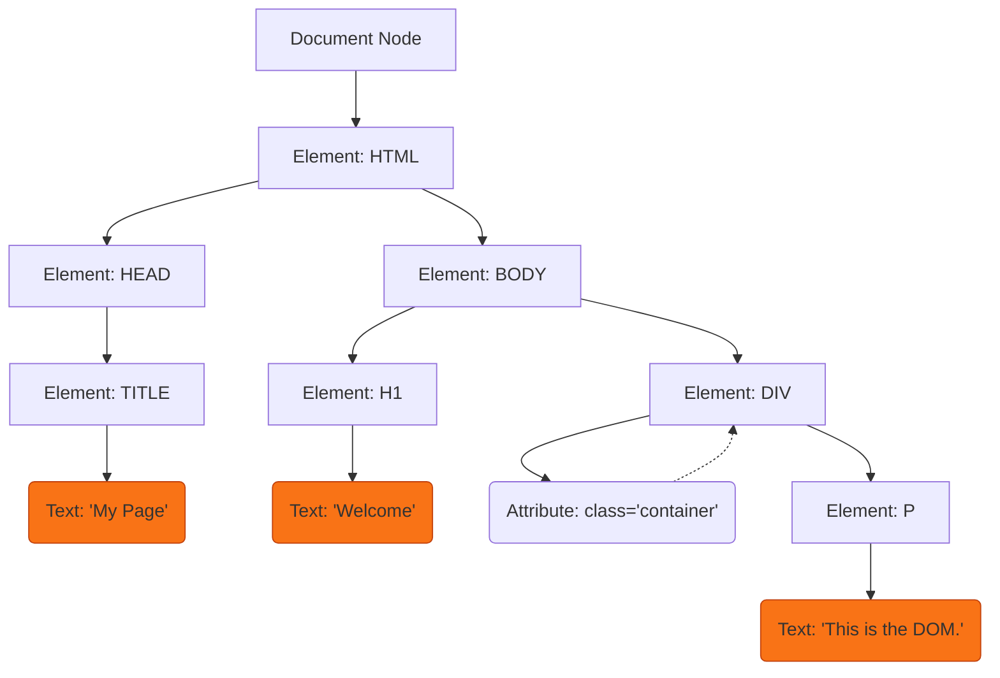

import { ConceptTemplate } from '@/features/kb/components/templates/ConceptTemplate'
import { Callout } from '@/features/kb/components/mdx/Callout'

export default function Layout({ children }) {
  return (
    <ConceptTemplate title="Document Object Model (DOM)">
      {children}
    </ConceptTemplate>
  )
}

When a server sends a web page to a browser, it sends raw, unstructured text strings (`<html><body>Hello</body></html>`). JavaScript physically cannot operate on raw text strings to build complex applications.

The browser's C++ engine intercepts this text and mathematically parses it into a massive, object-oriented data structure called the **Document Object Model (DOM)**. The DOM converts every HTML tag, every piece of text, and every attribute into a distinct Node object in memory. This tree is the absolute mathematical foundation of all frontend engineering.

## 1. Deep Dive & Mechanics

The DOM is not a JavaScript feature. It is a Web API provided by the browser (written in C++ or Rust) that exposes bindings to JavaScript.

The DOM is structured as a mathematically strict tree graph:
1. **Document Node:** The absolute root of the mathematical tree (`window.document`).
2. **Element Nodes:** Represent HTML tags (`<body>`, `<div>`, `<a>`). These nodes contain structural APIs like `appendChild()` or `getAttribute()`.
3. **Text Nodes:** The literal text inside an Element Node. Mathematically, text is not a property of a `<p>` tag; it is an entirely separate child Node of the `<p>` element.
4. **Attribute Nodes:** Deprecated as standalone nodes in modern specs, but historically represented `id` or `class`.

## 2. Mathematical / Theoretical Foundation

The most computationally complex mathematical operation in the DOM is **Traversing and Live Collections**.

Historically, methods like `document.getElementsByTagName('div')` returned an `HTMLCollection`. This is not an array; it is a **Live mathematical binding** to the C++ engine. If you query the DOM for 10 divs, and then you use JavaScript to add an 11th div to the page, the `HTMLCollection` mathematically mutates itself instantly to contain 11 items.

This live binding caused catastrophic infinite loops in early web development:
```javascript
const divs = document.getElementsByTagName('div');
// INFINITE LOOP: The length mathematically increases by 1 every iteration!
for (let i = 0; i < divs.length; i++) {
  document.body.appendChild(document.createElement('div')); 
}
```

Modern specifications introduced `document.querySelectorAll()`, which mathematically returns a **Static NodeList**. It takes a snapshot of the DOM at that exact millisecond. If the DOM changes later, the NodeList mathematically ignores the change, making it immensely safer and faster for functional programming.

## 3. Real-World Implementation

Because crossing the boundary between the V8 JavaScript engine and the Blink C++ DOM engine is mathematically slow, modern frameworks (like React) abstract the DOM away entirely.

However, under the hood, React eventually executes these raw, fundamental DOM manipulation commands:

```javascript
// 1. Mathematically query the DOM tree for a specific node
const container = document.getElementById('app-root');

// 2. Instantiate a raw C++ Element Node in memory (Not yet attached to the tree)
const newDiv = document.createElement('div');
newDiv.className = 'card';

// 3. Instantiate a Text Node and attach it to the Element Node
const text = document.createTextNode('Hello, DOM!');
newDiv.appendChild(text);

// 4. Using DocumentFragments for immense performance
// If we need to add 1,000 items, appending them one by one triggers 1,000 Layout Reflows.
// A DocumentFragment is a mathematical "ghost node" that exists only in RAM.
const fragment = document.createDocumentFragment();
for (let i = 0; i < 1000; i++) {
  const item = document.createElement('li');
  item.textContent = `Item ${i}`; // A safe alternative to text nodes
  fragment.appendChild(item);
}

// 5. Mathematically mutate the live DOM tree exactly ONCE, triggering a single Reflow
container.appendChild(fragment);
```

## 4. Visualizations



## 5. Interview Prep

**Q: What is the Virtual DOM and why do React/Vue use it?**
**A:** Mathematically, updating a property on a JavaScript object takes nanoseconds. Updating a property on a DOM Node requires crossing the IPC boundary into C++, which triggers a Layout engine recalculation, taking milliseconds. React builds a "Virtual DOM" (a massive JSON tree of pure JavaScript objects). When state changes, React updates the Virtual JSON tree instantly, mathematically diffs it against the old JSON tree, and then surgically issues the exact minimum number of real C++ DOM updates required (e.g., `element.textContent = 'new'`).

**Q: What is the difference between `innerHTML` and `textContent`?**
**A:** `textContent` mathematically accesses only the Text Nodes within an element. It is incredibly fast and immune to security vulnerabilities. `innerHTML` invokes the browser's heavy C++ HTML Parser. If you pass `element.innerHTML = '<b>text</b>'`, the browser must tokenize the string, instantiate a new `<b>` Element Node, and attach it. If the string contains `<script>`, you have introduced a catastrophic XSS vulnerability.

## 6. Production Use Cases

- **Web Scraping and Automation:** Tools like Puppeteer or Cheerio exist purely to parse massive HTML strings into a DOM tree in backend memory, allowing engineers to mathematically query it (`document.querySelectorAll('.price')`) to extract data from target websites.
- **Rich Text Editors (WYSIWYG):** Applications like Google Docs or Notion mathematically hijack the DOM. Instead of using standard `<textarea>` elements (which cannot render bold text or images), they use `<div contenteditable="true">`. They then intercept every single keystroke, calculate exactly where the cursor is in the DOM tree, and manually instantiate and inject `<b>` or `<span>` nodes to format the text in real-time.

<Callout icon="warning" title="The Memory Leak Threat">
In Single Page Applications (SPAs), memory leaks are primarily caused by mathematical DOM "Detachment." If you use `document.getElementById('modal')`, save it to a global variable, and then remove the modal from the screen using `modal.remove()`, the C++ engine physically cannot Garbage Collect the memory. Even though the Node is removed from the visible tree, your global JavaScript variable still holds a mathematical pointer to it, permanently burning RAM until the tab is closed.
</Callout>
