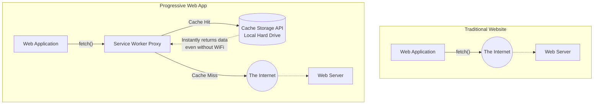

import { ConceptTemplate } from '@/features/kb/components/templates/ConceptTemplate'
import { Callout } from '@/features/kb/components/mdx/Callout'

export default function Layout({ children }) {
  return (
    <ConceptTemplate title="Progressive Web Apps (PWAs)">
      {children}
    </ConceptTemplate>
  )
}

Historically, there was a strict mathematical binary in software engineering. You either built a Website (accessible via URL, requires internet, zero installation) or a Native App (downloaded from an App Store, works offline, has access to the camera and push notifications).

**Progressive Web Apps (PWAs)** destroy this binary. A PWA is a standard web application (HTML/CSS/JS) that uses modern browser APIs to mathematically masquerade as a native application. When a user visits a PWA on their phone, the browser prompts them to "Add to Home Screen." The app installs instantly, operates without an internet connection, and runs in a standalone window without the browser's address bar.

## 1. Deep Dive & Mechanics

A web application only mathematically qualifies as a PWA if it implements three mandatory technical pillars:

1. **HTTPS:** PWAs have deep access to native hardware (camera, geolocation) and can execute background processes. To prevent catastrophic Man-In-The-Middle (MITM) attacks, the browser's C++ engine absolutely refuses to register a PWA over an unencrypted HTTP connection.
2. **Web App Manifest:** A simple JSON file (`manifest.json`) that dictates the mathematical geometry and aesthetics of the installed app. It defines the app's name, the high-resolution icons for the iOS/Android home screen, the theme color, and the `display` mode (`standalone`, `fullscreen`, or `minimal-ui`).
3. **Service Workers:** The mathematical heart of a PWA. A Service Worker is a specialized JavaScript file that runs in the background, completely separate from the web page.

## 2. Mathematical / Theoretical Foundation

The **Service Worker** is mathematically an incredibly powerful **Network Proxy** embedded inside the browser.

In a normal website, when the JS executes `fetch('image.png')`, the request goes directly to the internet. If the internet is down, the request fails, and the user sees the Chrome Dinosaur offline page.

In a PWA, the Service Worker sits mathematically *between* your application and the internet. When your app executes `fetch('image.png')`, the Service Worker intercepts the request. The Service Worker can then mathematically execute custom logic:
1. "Is the user offline? Yes."
2. "Let me check the local Cache API."
3. "I found `image.png` in the cache."
4. "I will return the cached image to the app."

The application itself has absolutely no idea it is offline. It requested an image and mathematically received one.

## 3. Real-World Implementation

Here is how you mathematically register a Service Worker and implement an "Offline-First" caching strategy.

```javascript
// 1. In your main application (app.js)
if ('serviceWorker' in navigator) {
  window.addEventListener('load', async () => {
    try {
      // Mathematically boot up the background thread
      const registration = await navigator.serviceWorker.register('/sw.js');
      console.log('ServiceWorker mathematical registration successful:', registration.scope);
    } catch (err) {
      console.error('ServiceWorker registration mathematically failed:', err);
    }
  });
}
```

```javascript
// 2. In your background Service Worker file (sw.js)
const CACHE_NAME = 'my-pwa-cache-v1';
const URLS_TO_CACHE = [
  '/',
  '/styles/main.css',
  '/script/main.js',
  '/images/logo.png'
];

// The 'install' event fires the very first time the user visits the site.
// We mathematically open a local database (CacheStorage) and download all critical assets.
self.addEventListener('install', (event) => {
  event.waitUntil(
    caches.open(CACHE_NAME).then((cache) => {
      console.log('Mathematically downloading assets to local cache');
      return cache.addAll(URLS_TO_CACHE);
    })
  );
});

// The 'fetch' event mathematically intercepts EVERY single network request made by the app.
self.addEventListener('fetch', (event) => {
  event.respondWith(
    caches.match(event.request).then((response) => {
      // Cache Hit - Return the file from the local hard drive instantly (Offline Support)
      if (response) {
        return response;
      }
      
      // Cache Miss - Forward the mathematical request to the real internet
      return fetch(event.request);
    })
  );
});
```

## 4. Visualizations



## 5. Interview Prep

**Q: What is the difference between Cache Storage API and LocalStorage?**
**A:** LocalStorage is a tiny, synchronous string database. The Cache Storage API is a massive, asynchronous, mathematical storage system designed specifically to store raw HTTP Request and Response objects. When a Service Worker intercepts a network request, it doesn't return a string; it mathematically constructs and returns a raw `Response` object that perfectly mimics a real server response.

**Q: Can PWAs access native device hardware?**
**A:** Yes, increasingly so via Project Fugu (Web Capabilities API). Modern PWAs can mathematically interact with the filesystem (File System Access API), read contacts (Contact Picker API), connect to Bluetooth devices (Web Bluetooth), and read raw accelerometer data. However, Apple (iOS Safari) intentionally limits many of these APIs to protect the profitability of their native App Store.

## 6. Production Use Cases

- **Twitter Lite:** Twitter mathematically replaced their mobile web experience with a PWA. When users on 2G connections in emerging markets install the Twitter PWA, it mathematically caches the application shell. Subsequent loads take milliseconds, and it uses 70% less data than the native Android app.
- **Enterprise Internal Tools:** Corporations building inventory management apps for warehouse workers often use PWAs. If a worker walks into a concrete freezer where Wi-Fi drops, the PWA mathematically continues functioning via the Service Worker. The app saves the barcode scans to `IndexedDB`. When the worker walks back into Wi-Fi range, the Service Worker fires a `BackgroundSync` event, mathematically flushing the offline scans to the central server.

<Callout icon="warning" title="The iOS Limitation">
While PWAs are mathematically flawless on Android (acting exactly like native APKs), Apple has historically crippled PWAs on iOS. Push Notifications were entirely banned on iOS PWAs until 2023, and background sync is still heavily restricted. If your business model mathematically depends on aggressive, reliable push notifications, you may still be forced to build a native iOS app.
</Callout>
