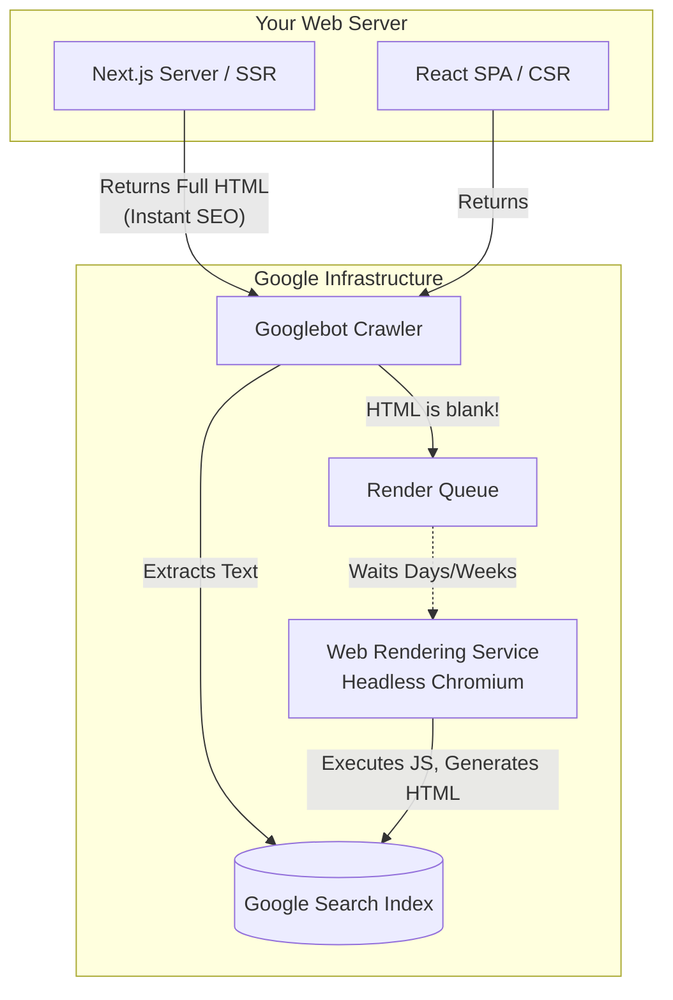

import { ConceptTemplate } from '@/features/kb/components/templates/ConceptTemplate'
import { Callout } from '@/features/kb/components/mdx/Callout'

export default function Layout({ children }) {
  return (
    <ConceptTemplate title="Search Engine Optimization (SEO)">
      {children}
    </ConceptTemplate>
  )
}

Search Engine Optimization (SEO) is often dismissed by software engineers as a marketing concern. This is mathematically incorrect. Modern SEO is a deeply technical discipline. If you architect a React application beautifully but fail to understand how Google's crawling infrastructure operates, your application will mathematically disappear from the internet, resulting in zero traffic and business failure.

Google does not view websites like humans do. Google operates an automated, distributed fleet of web scrapers called **Googlebot**. To achieve SEO success, you must mathematically engineer your HTML and architecture to feed Googlebot exactly what it wants, as efficiently as possible.

## 1. Deep Dive & Mechanics

Googlebot's mathematical workflow operates in three distinct phases:

1. **Crawling:** Googlebot discovers a URL (either from a sitemap or a link on another page) and executes an HTTP GET request. It downloads the raw HTML string.
2. **Indexing (Parsing):** Google extracts the text from the HTML, analyzes the `<title>`, parses the metadata, and adds the mathematical tokens to its immense distributed database.
3. **Rendering (The JavaScript Problem):** If the page requires JavaScript to display its content (like a standard Client-Side React app), the basic HTML is essentially blank (`<div id="root"></div>`). Googlebot must mathematically drop this URL into a separate, highly expensive queue. Days later, a massive headless Chromium instance (Web Rendering Service) will boot up, execute the JavaScript, and finally index the dynamically generated content.

## 2. Mathematical / Theoretical Foundation

The most catastrophic mathematical error in frontend engineering is the **Client-Side Rendering (CSR) SEO Penalty**.

If you build an e-commerce store using raw React (Vite/Create React App), your server responds to Googlebot with 15 lines of HTML and a massive `bundle.js` file.

Because executing JavaScript is computationally expensive (it costs Google millions of dollars in server electricity to spin up headless Chromium for the entire internet), Googlebot mathematically defers JS execution. Your product page might rank as a blank page for a week before Google finally renders it.

To mathematically solve this, engineers created **Server-Side Rendering (SSR)** (via Next.js or Remix) and **Static Site Generation (SSG)**. Instead of sending a blank `<div id="root">`, the Node.js server mathematically executes the React components in backend memory, generating the fully populated HTML string (with all the text and images), and sends *that* to Googlebot. Googlebot instantly indexes the content in milliseconds, bypassing the rendering queue entirely.

## 3. Real-World Implementation

SEO engineering involves mathematically precise HTML semantic tagging and metadata injection. 

```html
<!-- 1. The Title and Description (The mathematical foundation of CTR) -->
<!-- The title must mathematically be under 60 characters to prevent truncation on Google -->
<title>Buy Mechanical Keyboards | TechStore</title>
<!-- The description must be under 160 characters -->
<meta name="description" content="Shop the finest mechanical keyboards with Cherry MX switches. Free shipping on orders over $50.">

<!-- 2. Semantic HTML Architecture -->
<!-- Google mathematically weights the text inside an <h1> far heavier than text in a <p> -->
<body>
  <!-- Mathematically, there should only ever be ONE <h1> tag per page -->
  <h1>Keychron Q1 Pro Wireless</h1>
  
  <!-- Sub-headers create a mathematical hierarchy -->
  <h2>Technical Specifications</h2>
  
  <!-- 3. Canonical Links -->
  <!-- If this product is accessible via /keyboards/q1 and /sale/q1, -->
  <!-- Google will mathematically penalize the site for Duplicate Content. -->
  <!-- The canonical tag tells Google: "This is the single source of truth URL." -->
  <link rel="canonical" href="https://techstore.com/keyboards/q1" />
  
  <!-- 4. OpenGraph and Twitter Cards (Social Media SEO) -->
  <!-- When a user pastes this link in iMessage or Discord, these tags dictate the preview box -->
  <meta property="og:title" content="Keychron Q1 Pro">
  <meta property="og:image" content="https://techstore.com/images/q1-pro.jpg">
  
  <!-- 5. JSON-LD Structured Data (The ultimate mathematical SEO) -->
  <!-- Instead of making Google guess what the page is about, you explicitly inject -->
  <!-- a strict JSON schema mathematically defining the data. -->
  <script type="application/ld+json">
  {
    "@context": "https://schema.org/",
    "@type": "Product",
    "name": "Keychron Q1 Pro",
    "image": "https://techstore.com/images/q1.jpg",
    "description": "Wireless custom mechanical keyboard.",
    "brand": {
      "@type": "Brand",
      "name": "Keychron"
    },
    "offers": {
      "@type": "Offer",
      "priceCurrency": "USD",
      "price": "199.00",
      "availability": "https://schema.org/InStock"
    }
  }
  </script>
</body>
```

## 4. Visualizations



## 5. Interview Prep

**Q: What is Core Web Vitals?**
**A:** Core Web Vitals are mathematical performance metrics that Google officially uses as a ranking factor. If your site is slow, Google will mathematically demote you in the search results, even if your content is perfect. The three primary metrics are:
1. **LCP (Largest Contentful Paint):** How fast does the largest image or text block render? (Must be < 2.5s).
2. **INP (Interaction to Next Paint):** How fast does the site respond to a user click? (Must be < 200ms).
3. **CLS (Cumulative Layout Shift):** How much does the UI mathematically "jump around" while loading images or ads? (Must be < 0.1).

**Q: What is the `robots.txt` file?**
**A:** A literal text file (`https://yourdomain.com/robots.txt`) that mathematically commands automated bots. If you have an internal `/admin` dashboard, you explicitly add `Disallow: /admin` to this file. When Googlebot visits your site, it mathematically reads this file first and will physically refuse to crawl any URL matching the disallowed paths, protecting your internal routes from being exposed on Google Search.

## 6. Production Use Cases

- **Dynamic XML Sitemaps:** Massive production applications (like Zillow or Airbnb) do not rely on Googlebot to manually discover their millions of property pages by clicking links. The backend architecture automatically generates `sitemap.xml` files—massive mathematical arrays of every valid URL in the database—and pings Google's servers via API to mathematically force Google to crawl new properties the second they are published.
- **Image Optimization Architecture:** Because LCP is heavily weighted by Google, production engineering teams implement automated image pipelines. When a user uploads a 5MB `.jpeg` profile picture, the backend mathematically converts it to a 50KB `.webp` file, generates a blurred placeholder hash, and serves it via a CDN, guaranteeing the image renders in under 1 second to maximize SEO scores.

<Callout icon="danger" title="The Lighthouse Trap">
A common engineering mistake is assuming a 100/100 Google Lighthouse score guarantees top SEO rankings. Lighthouse is a synthetic lab test run on your local machine. Google's actual algorithm uses CrUX (Chrome User Experience Report), which is mathematically derived from the actual telemetry data of real Chrome users visiting your site on slow 3G cell phones. You must optimize for the real world, not just the lab.
</Callout>
