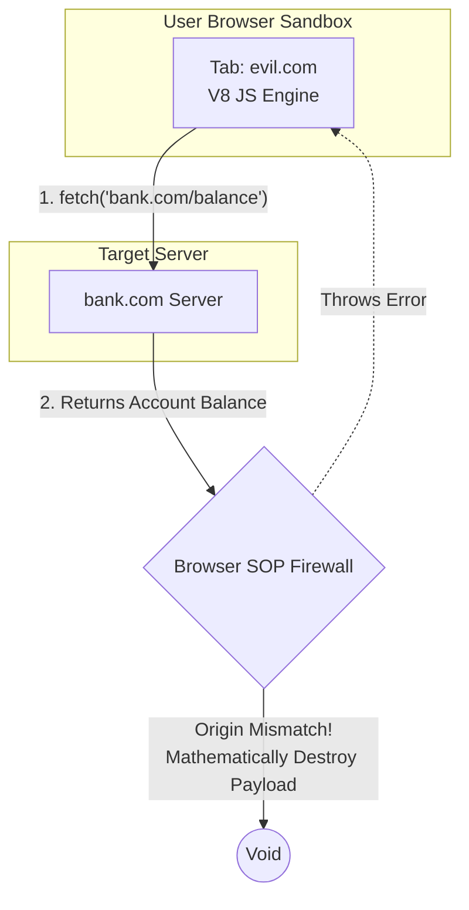

import { ConceptTemplate } from '@/features/kb/components/templates/ConceptTemplate'
import { Callout } from '@/features/kb/components/mdx/Callout'

export default function Layout({ children }) {
  return (
    <ConceptTemplate title="Same-Origin Policy (SOP)">
      {children}
    </ConceptTemplate>
  )
}

If you log into your bank at `https://bank.com`, the server issues an authentication cookie. If you then open a new tab and visit `https://evil.com`, what mathematically prevents `evil.com` from running JavaScript that executes `fetch('https://bank.com/transfer')` and stealing your money?

The answer is the **Same-Origin Policy (SOP)**. 

The SOP is not a suggestion; it is an absolute mathematical firewall hardcoded into the C++ engine of every web browser (Chrome, Firefox, Safari). It dictates that JavaScript executing on one Origin is physically forbidden from reading the data of a completely different Origin. Without the SOP, the modern internet would instantly collapse into a chaotic dystopia of data theft.

## 1. Deep Dive & Mechanics

To understand SOP, you must first mathematically define an **Origin**.

An Origin is the exact mathematical combination of three strings: `(Protocol, Domain, Port)`.

If the user is currently on `https://store.company.com:443/products`:
- **Protocol:** `https://`
- **Domain:** `store.company.com`
- **Port:** `443` (The default for HTTPS)

If JavaScript on this page attempts to communicate with another URL, the browser mathematically compares the three vectors. If *any single vector* does not match perfectly, the interaction is classified as **Cross-Origin** and the SOP firewall engages.

| Target URL | Same Origin? | Reason for Failure |
| :--- | :--- | :--- |
| `https://store.company.com/cart` | ✅ **Yes** | Protocol, Domain, and Port all match. |
| `http://store.company.com/cart` | ❌ **No** | Protocol mismatch (`http` vs `https`). |
| `https://api.company.com/cart` | ❌ **No** | Domain mismatch (`api` subdomain vs `store`). |
| `https://store.company.com:8080/cart` | ❌ **No** | Port mismatch (`8080` vs `443`). |

## 2. Mathematical / Theoretical Foundation

The SOP is highly nuanced. It does not block *everything*. If it blocked everything, the web would be useless (you couldn't load images or scripts from CDNs).

The SOP mathematically distinguishes between **Reads**, **Writes**, and **Embeds**:

1. **Cross-Origin Embeds are ALLOWED:**
   You can freely embed resources from other domains using HTML tags. The browser downloads and executes them, but the SOP mathematically prevents your JavaScript from *reading* the raw data.
   - `` (Allowed)
   - `<script src="https://analytics.com/script.js">` (Allowed)
   - `<iframe src="https://youtube.com">` (Allowed)

2. **Cross-Origin Writes are ALLOWED (mostly):**
   You can send data to other domains. If you submit an HTML `<form action="https://evil.com">`, the browser will gladly execute the POST request and send the data.

3. **Cross-Origin Reads are BANNED:**
   This is the core of the SOP. JavaScript is mathematically banned from reading the HTTP response of a Cross-Origin request. If `evil.com` uses `fetch()` to hit `bank.com`, the browser will send the request, but when the bank's server responds with your account balance, the SOP intercepts the response and mathematically incinerates it, throwing an error to the V8 engine. `evil.com` receives nothing.

## 3. Real-World Implementation

The SOP is so strict that it frequently causes severe pain for legitimate developers. If your React app is hosted on `https://app.startup.com` and your Node.js API is on `https://api.startup.com`, the SOP will mathematically block the React app from reading the API's JSON responses, because the subdomains are different.

To bypass the SOP intentionally, engineers implemented a mathematical loophole known as **CORS (Cross-Origin Resource Sharing)**.

```javascript
// A standard SOP violation in JavaScript
async function stealData() {
  try {
    // We are executing on evil.com
    // We attempt to read data from a different origin (bank.com)
    const response = await fetch('https://bank.com/api/balance');
    
    // MATHEMATICAL FAILURE: 
    // The browser's C++ engine intercepts the request, checks the Origin,
    // and throws a CORS/SOP Exception before this line ever executes.
    const data = await response.json(); 
    console.log("Stolen data:", data);
  } catch (error) {
    // "TypeError: Failed to fetch"
    // "Access to fetch at 'https://bank.com' from origin 'https://evil.com' has been blocked."
    console.error("The SOP firewall successfully stopped the attack.");
  }
}
```

## 4. Visualizations



## 5. Interview Prep

**Q: If SOP prevents cross-origin reads, how do `<iframe>` elements work?**
**A:** You can embed `https://twitter.com` inside an `<iframe>` on your website. However, the SOP mathematically creates an impenetrable glass wall between the parent document and the iframe document. If your JavaScript attempts to execute `document.getElementById('my-iframe').contentWindow.document`, the browser throws a massive security error. You cannot mathematically read or manipulate the DOM inside the iframe if it is from a different origin.

**Q: How do you safely communicate between a parent window and a cross-origin iframe?**
**A:** You must mathematically bypass the SOP using the `window.postMessage()` API. This is a secure, explicit pub/sub mechanism. The parent window sends a string message to the iframe, and the iframe's JavaScript must explicitly add an `addEventListener('message')` to receive it. Both sides must mathematically verify the `event.origin` property before processing the payload to ensure they aren't being fed malicious data.

## 6. Production Use Cases

- **Micro-Frontend Architecture:** Massive enterprise applications often stitch together multiple React applications on a single page using iframes or web components (e.g., the Shopping Cart is built by Team A on `cart.company.com`, the Product view by Team B on `products.company.com`). Because the subdomains trigger the SOP, these distinct micro-frontends mathematically cannot share a Redux store. Engineers must architect complex `window.postMessage()` event buses to allow the independent DOMs to synchronize state.
- **Canvas Tainting:** If you build a web-based photo editor and draw an image from an external CDN (`https://cdn.com/image.jpg`) onto an HTML5 `<canvas>`, the browser's SOP immediately marks the canvas as mathematically "tainted." The browser will permanently disable the `canvas.toDataURL()` API, physically preventing your JavaScript from extracting the pixel data of the cross-origin image to stop you from stealing it.

<Callout icon="danger" title="The SOP applies ONLY to Browsers">
The Same-Origin Policy is enforced entirely by the user's web browser. If you write a Node.js script, a Python script, or use `curl` in the terminal to request `https://bank.com/api`, the request will execute perfectly and you will receive the data. There is no browser engine to enforce the SOP. This is why backend APIs must mathematically authenticate every single request using tokens (JWTs) or IP whitelisting; you cannot rely on the SOP to protect your backend servers.
</Callout>
