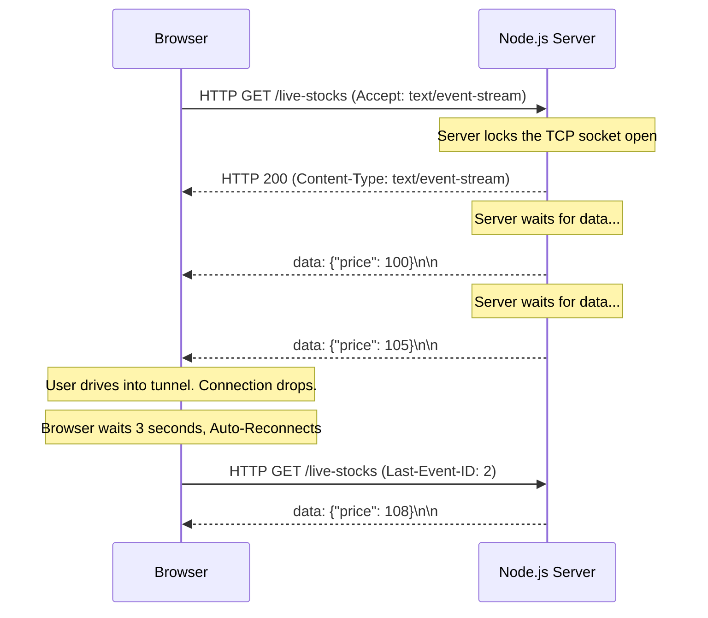

import { ConceptTemplate } from '@/features/kb/components/templates/ConceptTemplate'
import { Callout } from '@/features/kb/components/mdx/Callout'

export default function Layout({ children }) {
  return (
    <ConceptTemplate title="Server-Sent Events (SSE)">
      {children}
    </ConceptTemplate>
  )
}

In traditional HTTP, communication is strictly **Pull-based**. The client mathematically must initiate a request (`fetch`), and the server responds. If the server has new data (like a changing stock price or a live sports score), it mathematically cannot push that data to the client. The client must constantly ask, "Any updates? Any updates?" (Polling).

Polling is catastrophic for performance, burning massive amounts of CPU and bandwidth for empty responses. To solve this, engineers invented **Server-Sent Events (SSE)**. 

SSE is a **Push-based, unidirectional** protocol. The client opens a standard HTTP connection and mathematically holds it open forever. The server can then push an infinite stream of text-based event chunks down that single pipe whenever it wants.

## 1. Deep Dive & Mechanics

SSE operates over standard HTTP/1.1 or HTTP/2. It does not require a complex custom protocol (unlike WebSockets).

The mathematical handshake is incredibly simple:
1. Client sends an HTTP GET request with `Accept: text/event-stream`.
2. Server responds with HTTP 200 OK, `Content-Type: text/event-stream`, and `Transfer-Encoding: chunked`.
3. The connection remains mathematically locked open.
4. The server flushes strings of text formatted as `data: { JSON }\n\n` down the TCP socket.

## 2. Mathematical / Theoretical Foundation

The greatest mathematical advantage of SSE is its **Native Auto-Reconnection and Event IDs**.

If a user is on a mobile phone and drives into a tunnel, the TCP connection drops. If you are using WebSockets, you must write complex JavaScript math to detect the drop, attempt reconnection with exponential backoff, and ask the server what data you missed.

With SSE, the browser's C++ engine handles this mathematically automatically. 
If the connection drops, the browser automatically waits 3 seconds and issues a new HTTP GET request. Furthermore, if the server had been sending `id` fields with each event (e.g., `id: 104`), the browser automatically injects the HTTP Header `Last-Event-ID: 104` into the reconnection request. The server mathematically reads this header and instantly streams events `105` and onwards, ensuring zero data loss without a single line of client-side JavaScript.

## 3. Real-World Implementation

Here is how you mathematically implement a live Stock Ticker using SSE in Node.js and the Browser.

```javascript
// --- BACKEND (Node.js / Express) ---
app.get('/api/live-stocks', (req, res) => {
  // 1. Establish the mathematical SSE Headers
  res.writeHead(200, {
    'Content-Type': 'text/event-stream',
    'Cache-Control': 'no-cache',
    'Connection': 'keep-alive'
  });

  // 2. Mathematically stream data every 2 seconds
  let id = 0;
  const interval = setInterval(() => {
    id++;
    const payload = JSON.stringify({ symbol: 'AAPL', price: Math.random() * 200 });
    
    // The strict mathematical syntax of an SSE chunk:
    // id: <number>\n
    // event: <optional_event_name>\n
    // data: <string>\n\n
    res.write(`id: ${id}\n`);
    res.write(`event: price_update\n`);
    res.write(`data: ${payload}\n\n`); // The double newline mathematically terminates the chunk
  }, 2000);

  // 3. Clean up the mathematical loop if the client closes the tab
  req.on('close', () => clearInterval(interval));
});
```

```javascript
// --- FRONTEND (Browser JS) ---
// 1. Open the mathematical connection
const eventSource = new EventSource('/api/live-stocks');

// 2. Listen to standard unnamed events
eventSource.onmessage = (event) => {
  console.log('Generic data received:', event.data);
};

// 3. Listen to named events (defined by 'event: price_update' on the server)
eventSource.addEventListener('price_update', (event) => {
  const data = JSON.parse(event.data);
  console.log(`Live Update: ${data.symbol} is now $${data.price}`);
  
  // The Last-Event-ID is mathematically tracked by the browser
  console.log('Latest Event ID:', event.lastEventId); 
});

// 4. Handle mathematical reconnection logic (Browser does this automatically!)
eventSource.onerror = (error) => {
  console.warn('Mathematical connection lost. Browser is auto-reconnecting...');
};
```

## 4. Visualizations



## 5. Interview Prep

**Q: Why use Server-Sent Events instead of WebSockets?**
**A:** WebSockets are mathematically **Bidirectional** (Client can push, Server can push). However, they require a complex custom protocol (`ws://`), which often gets blocked by strict enterprise firewalls or load balancers. WebSockets also lack built-in auto-reconnection. SSE is strictly **Unidirectional** (Server to Client only), but it runs over standard HTTP, bypassing firewall issues, and the browser mathematically handles all reconnection and dropped-message logic perfectly. If you are building a real-time dashboard or a live news feed where the client only needs to *receive* data, SSE is vastly superior.

**Q: What is the HTTP/1.1 Connection Limit problem with SSE?**
**A:** Mathematically, HTTP/1.1 limits a browser to 6 simultaneous open connections to a single domain. If a user opens 6 tabs of your application, and each tab opens an SSE connection, the browser is mathematically exhausted. The 7th tab will completely freeze and fail to load *any* HTTP requests (images, CSS, APIs) because the 6 SSE connections are locking up the connection pool permanently. To solve this, you MUST use HTTP/2, which mathematically multiplexes requests over a single TCP connection, allowing thousands of simultaneous SSE streams.

## 6. Production Use Cases

- **ChatGPT / LLM Streaming:** When you ask ChatGPT a question, it doesn't wait 10 seconds to generate the entire response and return one massive JSON payload. It uses Server-Sent Events to stream the mathematical tokens down to your browser one by one, allowing the UI to type out the response in real-time.
- **CI/CD Build Logs:** When you trigger a build on Vercel or GitHub Actions, the browser opens an SSE connection to the server. As the Docker container compiles your code, the server streams the raw terminal logs directly into your browser window using `text/event-stream`.

<Callout icon="warning" title="The Unidirectional Limitation">
SSE is strictly a one-way mathematical street. If the client needs to send data *back* to the server (e.g., in a multiplayer game where the client must constantly send X/Y coordinate updates), SSE is useless. You must use WebSockets for high-frequency, bidirectional mathematical communication.
</Callout>
