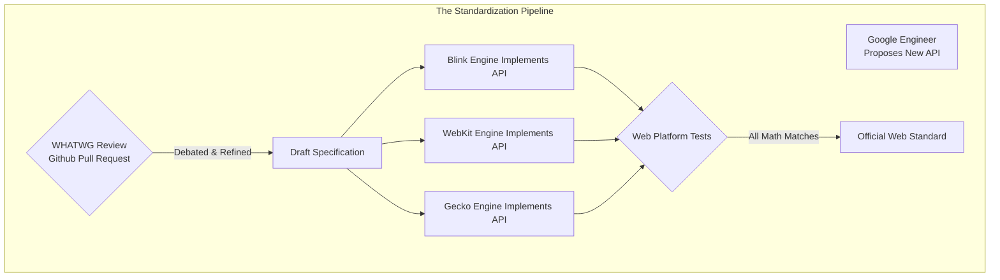

import { ConceptTemplate } from '@/features/kb/components/templates/ConceptTemplate'
import { Callout } from '@/features/kb/components/mdx/Callout'

export default function Layout({ children }) {
  return (
    <ConceptTemplate title="Web Standards (W3C & WHATWG)">
      {children}
    </ConceptTemplate>
  )
}

If a software engineer writes a Node.js script, they mathematically know it will execute identically on any machine because the V8 engine is controlled by a single entity (Google/Node Foundation). 

Frontend engineering is drastically different. A web developer writes HTML, CSS, and JavaScript, and it must mathematically execute perfectly on **Apple Safari (WebKit)**, **Google Chrome (Blink)**, and **Mozilla Firefox (Gecko)**. These are three entirely distinct C++ engines built by three fiercely competitive mega-corporations.

Without mathematical Web Standards, the internet would shatter. Every browser would invent its own proprietary tags and APIs, and developers would be forced to write three different versions of every website.

## 1. Deep Dive & Mechanics

**The W3C (World Wide Web Consortium)** was the original governing body founded by Tim Berners-Lee. For decades, they operated with severe academic bureaucracy, taking years to ratify strict, rigid XML-based mathematical specifications (like XHTML).

In 2004, Apple, Mozilla, and Opera grew frustrated with the W3C's slow pace and focus on academic XML rather than practical web applications. They rebelled and mathematically formed a new, independent coalition: **The WHATWG (Web Hypertext Application Technology Working Group)**.

The WHATWG mathematically engineered the **HTML5** specification. They focused on real-world engineering pragmatism, forgiving error-handling, and powerful JavaScript APIs (like Web Workers and WebSockets). HTML5 was so mathematically superior and dominant that the W3C was ultimately forced to concede. 

Today, the WHATWG explicitly controls the HTML and DOM "Living Standards," while the W3C primarily maintains the CSS mathematical specifications and accessibility guidelines (WCAG).

## 2. Mathematical / Theoretical Foundation

The most critical mathematical paradigm introduced by the WHATWG was the **Living Standard**.

Historically, the W3C released versioned specifications (e.g., HTML 4.01). Once ratified, the mathematical document was frozen in stone. Browsers would spend 5 years implementing it, and bugs in the spec could not be fixed until HTML 5.0 was released years later.

The WHATWG mathematically abolished version numbers. HTML is now a **Living Standard**. It is a single, continuously updated Github repository. If an engineer at Google discovers a mathematical flaw in how the `<canvas>` element handles GPU memory, they submit a pull request to the WHATWG. The spec is updated immediately, and browser engines pull the mathematical changes in real-time. There will never be an "HTML6."

## 3. Real-World Implementation

How does a new JavaScript API mathematically become a Web Standard? It goes through a rigorous, multi-stage pipeline:

1. **Incubation:** An engineer at a company (e.g., Apple) invents a new API (like the WebAuthn fingerprint API) and drafts a preliminary mathematical document explaining how the C++ engine should expose the API to JavaScript.
2. **Implementation Intent:** The proposal is presented to the working groups.
3. **The Multi-Engine Rule:** This is the ultimate mathematical gatekeeper. An API cannot become an official standard unless **at least two independent browser engines** (e.g., Blink and WebKit) agree to implement it. If Google invents a new API, but Apple and Mozilla mathematically refuse to implement it in their C++ engines, the API dies and is discarded.
4. **WPT (Web Platform Tests):** Before the standard is finalized, engineers must write thousands of automated test scripts. Every browser engine must mathematically pass these identical tests to ensure their C++ implementation behaves exactly as the specification dictates.

## 4. Visualizations

## 5. Interview Prep

**Q: What is a Polyfill?**
**A:** When a new mathematical API (like `Promise.allSettled()`) becomes a standard, it takes months for users to update their physical browsers. If a developer uses this new API immediately, older browsers will throw a mathematical `ReferenceError` and crash. A Polyfill is a piece of JavaScript code that mathematically detects if the browser lacks the new API, and if so, explicitly injects a custom-written fallback function into the `window` object that perfectly mimics the mathematical behavior of the new standard.

**Q: What are Vendor Prefixes?**
**A:** Historically, when browser engines were testing experimental CSS standards, they mathematically prefixed the rules to prevent collision (e.g., `-webkit-border-radius`, `-moz-border-radius`). This was a catastrophic failure, as developers hardcoded these prefixes, permanently breaking the web when the final standard (`border-radius`) was released. Today, Vendor Prefixes are mathematically deprecated. Browsers now hide experimental APIs behind internal configuration flags until the final standard is ratified.

## 6. Production Use Cases

- **Babel and Autoprefixer:** Modern frontend compilation pipelines exist almost entirely to manage the mathematical gap between bleeding-edge Web Standards and legacy browser installations. When you write modern ES2024 JavaScript, Babel mathematically transpiles the Abstract Syntax Tree (AST) down to ES5 (2009 standard), guaranteeing the code executes flawlessly on 10-year-old corporate laptops running outdated browsers.
- **MDN Web Docs (Mozilla Developer Network):** Because the WHATWG Living Standards are massive, impenetrable legalistic documents describing C++ implementation algorithms, developers rely entirely on MDN. MDN translates the mathematical standards into human-readable documentation and provides the critical **Browser Compatibility Tables**, which explicitly tell developers exactly which version of Chrome, Safari, and Firefox implemented the standard.

<Callout icon="danger" title="The Safari Bottleneck">
The mathematical requirement that multiple engines must agree on a standard creates immense political friction. Google (Chrome) frequently attempts to push aggressive hardware APIs (like Web Bluetooth or Web USB) to make the web as powerful as native Android apps. Apple (Safari/WebKit) frequently vetoes and mathematically refuses to implement these standards, citing security concerns, but arguably acting to protect the profitability of their native iOS App Store. If Apple refuses to implement a standard, web developers generally cannot use it in production.
</Callout>
