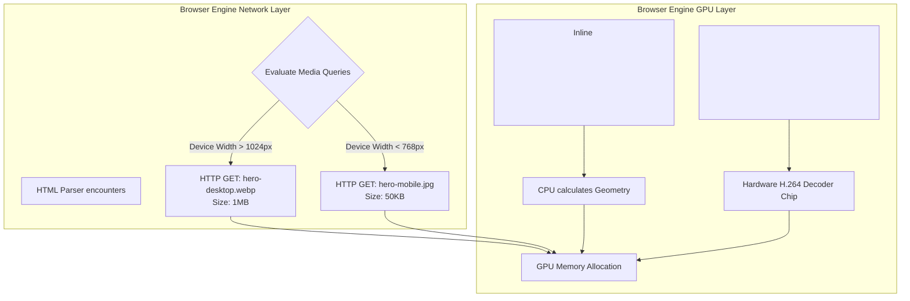

import { ConceptTemplate } from '@/features/kb/components/templates/ConceptTemplate'
import { Callout } from '@/features/kb/components/mdx/Callout'

export default function Layout({ children }) {
  return (
    <ConceptTemplate title="Media & Graphics">
      {children}
    </ConceptTemplate>
  )
}

Historically, the browser engine was a text parser. To render a video, it had to hand the mathematical data off to a catastrophic 3rd-party plugin (Adobe Flash). 

Modern HTML5 eliminated this dependency by engineering native C++ rendering pipelines for **Raster Images**, **Vector Graphics**, and **Hardware-Accelerated Video**. Understanding the mathematical differences between these formats is critical for engineering high-performance, SEO-optimized applications.

## 1. Deep Dive & Mechanics

### Raster Images (``)
Formats like JPEG, PNG, and WebP are mathematically defined by a **Pixel Grid (Raster)**. The file dictates the exact RGB color of every single pixel (e.g., 1920x1080). 
- **Advantage:** Perfect for complex, chaotic data like photographs.
- **Disadvantage:** Mathematically catastrophic to scale. If you stretch a 100x100 PNG to 1000x1000, the browser's C++ engine must guess the colors of the missing pixels, resulting in severe pixelation and blurriness.

### Vector Graphics (`<svg>`)
SVG (Scalable Vector Graphics) is an XML-based mathematical language. Instead of storing pixels, an SVG stores mathematical geometry equations: *"Draw a red circle at X:50, Y:50 with a radius of 20."*
- **Advantage:** Infinite resolution. Because it is pure math, the browser's GPU can render it at 10x10 or 10,000x10,000 pixels with absolute, perfect mathematical sharpness, at a fraction of the file size of a PNG.
- **Disadvantage:** Useless for photographs. Only used for UI icons, logos, and illustrations.

### Video (`<video>`)
HTML5 introduced native hardware acceleration. When the browser encounters a `<video>` tag playing an MP4 (H.264), it bypasses the CPU and mathematically routes the video stream directly to a dedicated silicon chip on the user's Graphics Card (GPU) designed specifically to decode H.264 math, saving massive amounts of battery life.

## 2. Mathematical / Theoretical Foundation

The most advanced architectural concept in HTML5 media is **Responsive Art Direction (The `<picture>` element)**.

In the early days of mobile web, developers would load a massive 5MB 4K desktop banner image (``) on a mobile phone, and simply use CSS to scale it down to 300px wide. This was mathematically disastrous, forcing mobile CPUs to parse 5MB of data over a 3G network just to throw 90% of the pixels away.

HTML5 introduced the `<picture>` tag, allowing developers to mathematically instruct the browser engine to evaluate the physical geometry of the screen *before* executing the network request.

## 3. Real-World Implementation

Here is how you mathematically engineer a production-grade, highly optimized responsive media layout.

```html
<!-- 1. The Responsive Picture Architecture -->
<picture>
  <!-- The browser's C++ engine evaluates these mathematical rules from top to bottom -->
  <!-- If the screen is wider than 1024px, download the massive 4K WebP -->
  <source media="(min-width: 1024px)" srcset="hero-desktop.webp" type="image/webp">
  
  <!-- If the screen is wider than 768px, download the medium iPad WebP -->
  <source media="(min-width: 768px)" srcset="hero-tablet.webp" type="image/webp">
  
  <!-- 2. The Fallback Node (Mandatory) -->
  <!-- If it's a mobile phone, or if the browser doesn't support WebP, -->
  <!-- it mathematically falls back to this tiny 50KB mobile JPEG. -->
  <!-- THIS is the only node that actually creates the DOM element! -->
  
</picture>

<!-- 3. Inline Mathematical Vectors (SVG) -->
<!-- Because SVG is just XML, you can inject the math directly into the DOM, -->
<!-- saving an entire HTTP network request. -->
<svg width="24" height="24" viewBox="0 0 24 24" fill="none" stroke="currentColor">
  <!-- The 'd' attribute is a literal mathematical path matrix -->
  <!-- M = Move to, L = Line to, C = Curve to -->
  <path d="M12 2L2 22h20L12 2z" />
</svg>

<!-- 4. HTML5 Video Integration -->
<video 
  controls 
  muted 
  autoplay 
  playsinline 
  poster="thumbnail.jpg"
>
  <!-- Similar to <picture>, we offer multiple codecs -->
  <!-- Safari will mathematically pick mp4. Chrome will pick the much smaller webm. -->
  <source src="trailer.webm" type="video/webm">
  <source src="trailer.mp4" type="video/mp4">
  <p>Your browser mathematically failed to load the video.</p>
</video>
```

## 4. Visualizations



## 5. Interview Prep

**Q: What is the `loading="lazy"` attribute on an ``?**
**A:** Historically, if you had a blog post with 100 images, the browser would mathematically initiate 100 simultaneous HTTP requests the moment the page loaded, freezing the network and destroying the user's data cap. By adding `loading="lazy"`, you mathematically instruct the C++ engine to defer the HTTP request until the user scrolls down and the image physically enters the viewport geometry (using Intersection Observers under the hood). This saves massive amounts of bandwidth.

**Q: Why MUST mobile background videos include the `muted` attribute?**
**A:** Apple (iOS Safari) and Google (Android Chrome) implemented a strict mathematical policy to protect users from aggressive, loud video ads. A mobile browser engine will absolutely refuse to execute the `autoplay` command on a `<video>` tag unless the tag explicitly includes the `muted` attribute. If it is not muted, the video will mathematically pause and require the user to physically tap it to begin playback.

## 6. Production Use Cases

- **CSS SVG Manipulation:** The true mathematical power of inline `<svg>` is that it becomes part of the DOM. You can use CSS hover states to dynamically alter the math! You can write CSS: `svg:hover path { fill: red; }`. The browser's GPU mathematically repaints the geometry instantly. This is impossible with a PNG or a JPEG.
- **Next.js `<Image>` Component:** Engineering the `<picture>` tag manually for 500 images is tedious. Meta-frameworks like Next.js abstract this away. You write `<Image src="x.jpg" />`. The Next.js Node server intercepts this, mathematically analyzes the image, auto-generates 5 different sizes (mobile to 4K), converts them to highly-compressed WebP formats, and automatically generates the massive `srcset` HTML payload for you on the server.

<Callout icon="danger" title="The Layout Shift Penalty">
If you write `` without explicitly defining the `width` and `height` attributes in the HTML, you will trigger a catastrophic mathematical event called Cumulative Layout Shift (CLS). The browser initially paints the image as 0x0 pixels. When the massive image finally downloads, the browser is mathematically forced to violently shove all the text down the screen to make room for it. Google's SEO algorithms heavily penalize sites that trigger this mathematical UI jumping. Always declare exact width and height ratios in the HTML.
</Callout>
