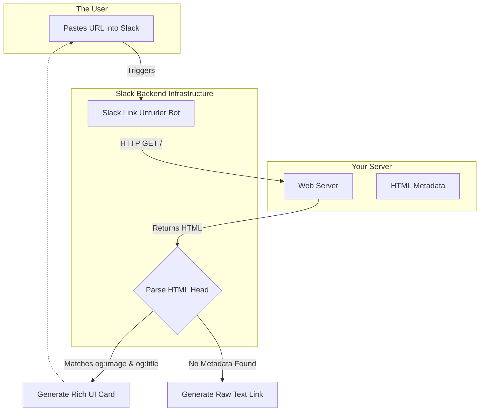

import { ConceptTemplate } from '@/features/kb/components/templates/ConceptTemplate'
import { Callout } from '@/features/kb/components/mdx/Callout'

export default function Layout({ children }) {
  return (
    <ConceptTemplate title="Metadata & SEO Tags">
      {children}
    </ConceptTemplate>
  )
}

An HTML document is mathematically bifurcated. The `<body>` contains the visual rendering instructions for humans. The `<head>` contains the **Metadata**—the mathematical instructions intended strictly for machines (Browsers, Googlebot, Twitter, iMessage).

A beautifully designed React application will completely fail in the marketplace if its `<head>` metadata is missing or mathematically malformed, because search engines will be unable to index it, and social media platforms will be unable to generate preview cards.

## 1. Deep Dive & Mechanics

The `<meta>` tag is mathematically structured as a simple Key-Value pair. 
There are three primary Key attributes used in modern web engineering:
1. `name`: Standardized HTML5 metadata (e.g., `description`, `viewport`).
2. `property`: Custom metadata for the OpenGraph protocol (Facebook, Discord).
3. `http-equiv`: Extremely aggressive metadata that mathematically mimics HTTP Headers, allowing the HTML to override the server's network configuration.

## 2. Mathematical / Theoretical Foundation

The most critical mathematical algorithm interacting with your metadata is the **Social Graph Unfurler**.

When a user pastes a URL (`https://your-startup.com`) into an iMessage or Slack channel, the chat application does not render the whole webpage. Instead, Slack's backend servers instantly execute an HTTP GET request to your URL. They mathematically parse your `<head>`, looking specifically for **OpenGraph (`og:`)** and **Twitter Card (`twitter:`)** tags. 

If they find `<meta property="og:image" content="hero.jpg">`, Slack downloads `hero.jpg` and injects it into the chat window, generating a massive, highly-clickable preview card. If this metadata is mathematically missing, Slack falls back to a raw blue text hyperlink, which mathematically destroys your Click-Through Rate (CTR).

## 3. Real-World Implementation

Here is the mathematically required, production-ready metadata matrix for a modern application.

```html
<head>
  <!-- 1. Fundamental Browser Directives -->
  <meta charset="UTF-8">
  <meta name="viewport" content="width=device-width, initial-scale=1.0">
  
  <!-- 2. Core SEO (The mathematical foundation of Google Search) -->
  <title>Acme Corp | High-Performance Database Analytics</title>
  <meta name="description" content="Acme Corp provides real-time, mathematical analytics for enterprise PostgreSQL clusters. Start your free trial today.">
  
  <!-- The canonical link mathematically prevents Duplicate Content penalties -->
  <!-- if Googlebot accesses the site via http:// vs https:// or /home vs / -->
  <link rel="canonical" href="https://acmecorp.com/">

  <!-- 3. OpenGraph (Facebook, LinkedIn, Discord, Slack) -->
  <!-- The 'property' attribute is mathematically required by the OG protocol -->
  <meta property="og:type" content="website">
  <meta property="og:url" content="https://acmecorp.com/">
  <meta property="og:title" content="Acme Corp Analytics">
  <meta property="og:description" content="Real-time analytics for PostgreSQL.">
  <meta property="og:image" content="https://acmecorp.com/images/social-hero.jpg">

  <!-- 4. Twitter Cards -->
  <!-- Twitter mathematically ignores OpenGraph and requires its own namespace -->
  <meta name="twitter:card" content="summary_large_image">
  <meta name="twitter:site" content="@AcmeCorp">
  <meta name="twitter:title" content="Acme Corp Analytics">
  <meta name="twitter:description" content="Real-time analytics for PostgreSQL.">
  <meta name="twitter:image" content="https://acmecorp.com/images/twitter-hero.jpg">
  
  <!-- 5. Advanced Bot Directives -->
  <!-- Mathematically commands Googlebot: "Index this page, and follow its links." -->
  <meta name="robots" content="index, follow">
  
  <!-- 6. http-equiv (The Network Override) -->
  <!-- Mathematically commands the browser's C++ engine to auto-refresh the page every 30 seconds -->
  <!-- (Commonly used on live sports scoreboards without WebSockets) -->
  <meta http-equiv="refresh" content="30">
</head>
```

## 4. Visualizations



## 5. Interview Prep

**Q: Why do Single Page Applications (SPAs) like pure React struggle mathematically with SEO tags?**
**A:** If you build a React SPA without Server-Side Rendering (SSR), the server responds to Googlebot and Slackbot with a mathematically empty HTML file (`<div id="root"></div>`) and a massive JavaScript bundle. Slackbot does **not** execute JavaScript; it is a simple text parser. Therefore, Slackbot mathematically sees zero metadata and fails to generate a preview card. Googlebot *does* execute JavaScript, but it puts the URL in a massive queue and might take a week to run it. You MUST use SSR (Next.js) to mathematically inject the `<meta>` tags into the raw HTML string on the server.

**Q: What is the `theme-color` meta tag?**
**A:** `<meta name="theme-color" content="#4285f4">` is a mathematical directive aimed specifically at mobile operating systems (Android Chrome / iOS Safari). It instructs the OS to dynamically change the physical color of the phone's system status bar (where the battery and clock live) to perfectly match the brand colors of your website, creating an immersive, app-like experience.

## 6. Production Use Cases

- **Dynamic SSR Metadata Injection:** In an e-commerce Next.js application, the `<head>` must mathematically change for every single product page. When a user requests `/products/iphone`, the Node server queries the database, extracts the iPhone's photo and price, and dynamically injects `<meta property="og:image" content="iphone.jpg">` into the HTML string before sending it to the client. This guarantees that when a user shares the iPhone link, the specific iPhone photo appears in the iMessage preview.
- **CSP (Content Security Policy):** The most mathematically powerful `<meta>` tag is the CSP directive. By injecting `<meta http-equiv="Content-Security-Policy" content="script-src 'self'">`, you mathematically command the browser's V8 engine to instantly crash and block any JavaScript file that does not originate from your own server. This mathematically eradicates 99% of Cross-Site Scripting (XSS) attacks.

<Callout icon="danger" title="The Keywords Fallacy">
Historically, developers stuffed the `<meta name="keywords">` tag with hundreds of words to trick search engines (e.g., `content="buy, cheap, software, best"`). Google officially and mathematically deprecated the `keywords` tag in 2009. Googlebot entirely ignores it. Including a massive `keywords` tag today does nothing but waste bandwidth and mathematically expose your SEO strategy to your competitors.
</Callout>
