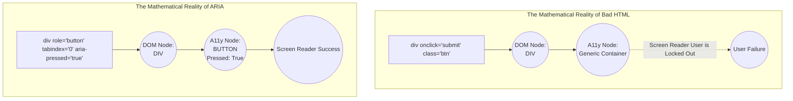

import { ConceptTemplate } from '@/features/kb/components/templates/ConceptTemplate'
import { Callout } from '@/features/kb/components/mdx/Callout'

export default function Layout({ children }) {
  return (
    <ConceptTemplate title="Semantic HTML & ARIA">
      {children}
    </ConceptTemplate>
  )
}

A `<div>` is mathematically void. It represents an empty, meaningless bounding box. If you build an entire application using nothing but `<div>` and `<span>` tags, it may look visually flawless through CSS, but it is mathematically invisible and incomprehensible to machines.

**Semantic HTML** is the practice of using mathematically explicit tags (`<nav>`, `<main>`, `<article>`) to declare the *purpose* of the content. When Semantic HTML reaches its mathematical limits (for highly complex, custom interactive UI components like Tabs or Accordions), engineers must manually inject **ARIA (Accessible Rich Internet Applications)** attributes to bridge the gap to the OS Accessibility Tree.

## 1. Deep Dive & Mechanics

When the browser parses HTML, it constructs the **DOM Tree** and the **Accessibility Tree**.

If the parser encounters `<button>Submit</button>`:
1. The C++ engine recognizes the native semantic tag.
2. It mathematically maps this node in the Accessibility Tree with `Role: Button`.
3. It wires up the `Space` and `Enter` keys to trigger the click event.

If the parser encounters `<div class="btn" onclick="submit()">Submit</div>`:
1. The C++ engine sees a `<div>`.
2. It mathematically maps this node with `Role: Generic Container`.
3. It does absolutely nothing with the keyboard.
4. A Screen Reader reads the text "Submit", but the blind user has no idea it is clickable, and mathematically cannot click it without a mouse.

## 2. Mathematical / Theoretical Foundation

When Semantic HTML fails, ARIA provides the mathematical overrides. ARIA consists of three structural components:

1. **Roles (`role="tab"`):** Mathematically overrides the intrinsic nature of the HTML tag. You can force a `<div>` to mathematically act as a Button, a Tab, or a Checkbox in the OS Accessibility Tree.
2. **Properties (`aria-label="Close"`):** Static mathematical metadata. A classic example is a button containing only an 'X' icon. Visually, it means "Close". To a Screen Reader, it reads "X". You must inject `aria-label="Close dialog"` to override the text.
3. **States (`aria-expanded="true"`):** Dynamic mathematical values that change in real-time. If you click an accordion, your React state must mathematically toggle the `aria-expanded` attribute from `false` to `true` to notify the Screen Reader that the UI geometry has changed.

## 3. Real-World Implementation

Here is how you mathematically engineer a custom React Tab Component using strict ARIA roles, because HTML5 does not have a native `<tab>` tag.

```jsx
import { useState } from 'react';

export function AccessibleTabs() {
  const [activeTab, setActiveTab] = useState(0);

  // Keyboard Navigation Math:
  // According to the W3C ARIA Spec, pressing Left/Right arrow keys
  // mathematically MUST switch the active tab.
  const handleKeyDown = (e, index) => {
    if (e.key === 'ArrowRight') {
      setActiveTab((prev) => (prev + 1) % 3);
    } else if (e.key === 'ArrowLeft') {
      setActiveTab((prev) => (prev === 0 ? 2 : prev - 1));
    }
  };

  return (
    <div className="tabs-container">
      {/* 1. The Tablist Container */}
      <div 
        role="tablist" 
        aria-label="Account Settings"
        className="tab-headers"
      >
        {['Profile', 'Security', 'Billing'].map((tab, idx) => (
          <button
            key={idx}
            // 2. Mathematically declare this button as a Tab
            role="tab"
            // 3. Mathematical State: Is this tab currently active?
            aria-selected={activeTab === idx}
            // 4. Link the Tab to the Panel it controls
            aria-controls={`panel-${idx}`}
            id={`tab-${idx}`}
            // 5. Roving TabIndex Math: Only the active tab is in the standard Tab flow
            tabIndex={activeTab === idx ? 0 : -1}
            onClick={() => setActiveTab(idx)}
            onKeyDown={(e) => handleKeyDown(e, idx)}
          >
            {tab}
          </button>
        ))}
      </div>

      {/* 6. The Tab Panels */}
      {['Profile Content', 'Security Content', 'Billing Content'].map((content, idx) => (
        <div
          key={idx}
          // 7. Mathematically declare this div as a TabPanel
          role="tabpanel"
          id={`panel-${idx}`}
          // 8. Link the Panel back to its controlling Tab
          aria-labelledby={`tab-${idx}`}
          // Mathematically hide inactive panels from both the DOM flow and Screen Readers
          hidden={activeTab !== idx}
        >
          {content}
        </div>
      ))}
    </div>
  );
}
```

## 4. Visualizations



## 5. Interview Prep

**Q: What does `tabindex="-1"` mathematically do?**
**A:** By default, native inputs and buttons have a mathematical `tabindex="0"`, meaning they are part of the browser's sequential Tab key navigation flow. Setting `tabindex="-1"` mathematically removes the element from the Tab flow. A user cannot physically reach it by pressing the Tab key. However, it explicitly allows JavaScript to programmatically set focus to it via `element.focus()`. This is heavily used in accessible Modal architectures to force focus into the modal window.

**Q: What is `aria-hidden="true"`?**
**A:** It is a mathematical command to completely severe a DOM node from the Accessibility Tree, rendering it completely invisible to Screen Readers. It is heavily used for decorative SVG icons. If you have a button with a trash can icon and the word "Delete", you must put `aria-hidden="true"` on the SVG; otherwise, the Screen Reader will try to read the raw SVG XML coordinates to the user.

## 6. Production Use Cases

- **Custom Select Dropdowns:** The native HTML `<select>` tag is notoriously impossible to style with CSS. Therefore, engineering teams always build custom Dropdowns using `<div>` and `<ul>` tags to make them look beautiful. To make them legally accessible, teams must implement a massive matrix of ARIA attributes: The container needs `role="combobox"`, the toggle needs `aria-expanded`, the list needs `role="listbox"`, and every item needs `role="option"`, perfectly mimicking the mathematical behavior of the native `<select>`.
- **Live Regions (`aria-live`):** In a React SPA, navigating from the Home page to the Dashboard does not reload the page; it simply swaps out components in the DOM. A sighted user sees the screen change instantly. A blind user mathematically does not know the route changed because their Screen Reader is completely silent. Production SPAs inject `<div aria-live="assertive" class="sr-only">Navigated to Dashboard</div>` to mathematically force the Screen Reader to announce client-side routing events.

<Callout icon="danger" title="The First Rule of ARIA">
"No ARIA is better than bad ARIA." If you arbitrarily slap `role="menu"` and `role="menuitem"` onto your navigation links because you think it sounds semantically correct, you will mathematically destroy the Screen Reader's ability to navigate your site. ARIA roles carry strict, mathematical keyboard-navigation expectations defined by the W3C. If you use a role, you are legally and technically obligated to write the JavaScript to support the expected keyboard interactions. When in doubt, use native HTML elements.
</Callout>
