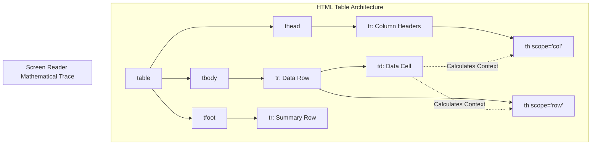

import { ConceptTemplate } from '@/features/kb/components/templates/ConceptTemplate'
import { Callout } from '@/features/kb/components/mdx/Callout'

export default function Layout({ children }) {
  return (
    <ConceptTemplate title="HTML Tables">
      {children}
    </ConceptTemplate>
  )
}

In the late 1990s, before CSS possessed sophisticated layout engines like Flexbox or Grid, software engineers committed a catastrophic mathematical sin: they used HTML `<table`> tags to build the entire layout structure of websites. 

Today, utilizing a `<table>` for layout is an absolute anti-pattern. HTML Tables are mathematically reserved for one specific purpose: **Displaying rigid, two-dimensional matrices of relational data** (e.g., Financial spreadsheets, statistical reports, pricing tiers).

When architected properly, the semantic table structure allows the browser's C++ engine to perform complex cell-spanning calculations and allows Screen Readers to mathematically narrate the X/Y coordinate relationships of data points to blind users.

## 1. Deep Dive & Mechanics

A modern HTML table is not just rows (`<tr>`) and cells (`<td>`). It is mathematically segmented into three distinct architectural zones:
- `<thead>`: The mathematical y-axis headers.
- `<tbody>`: The core data matrix.
- `<tfoot>`: The summary calculations (e.g., Totals), mathematically pinned to the bottom.

Furthermore, a table distinguishes between **Data Cells (`<td>`)** and **Header Cells (`<th>`)**.

## 2. Mathematical / Theoretical Foundation

The true mathematical complexity of an HTML Table lies in its Accessibility geometry.

If a blind user is traversing a 100x100 financial data table using a Screen Reader, and they reach Cell X:45, Y:12 (which just contains the number "$450.00"), they mathematically have no idea what that number represents. 

To solve this, the `<th>` (Table Header) element introduces the `scope` attribute (`scope="col"` or `scope="row"`). When the Screen Reader user focuses on "$450.00", the OS Accessibility API mathematically traces the grid lines up to the Column Header and across to the Row Header, and announces: *"March Revenue, Server Costs, $450.00"*, instantly giving the raw number its mathematical context.

## 3. Real-World Implementation

Here is a mathematically perfect, fully accessible semantic HTML table, demonstrating Row/Col spanning and accessibility scopes.

```html
<table class="financial-matrix">
  <!-- 1. The Caption (Mandatory for strict Accessibility) -->
  <!-- Provides the mathematical context of the entire matrix before the user enters it. -->
  <caption>Q3 2024 Server Infrastructure Costs</caption>

  <!-- 2. The Header Zone -->
  <thead>
    <tr>
      <!-- Empty top-left corner cell -->
      <td></td> 
      <!-- scope="col" mathematically binds this header to everything in its vertical column -->
      <th scope="col">July</th>
      <th scope="col">August</th>
      <th scope="col">September</th>
    </tr>
  </thead>

  <!-- 3. The Core Data Matrix -->
  <tbody>
    <tr>
      <!-- scope="row" mathematically binds this header to everything in its horizontal row -->
      <th scope="row">AWS EC2</th>
      <td>$1,200</td>
      <td>$1,250</td>
      <td>$1,300</td>
    </tr>
    <tr>
      <th scope="row">AWS S3</th>
      <!-- colspan="2" merges two mathematical grid cells horizontally -->
      <!-- Used when data is identical across multiple columns -->
      <td colspan="2" class="text-center">Flat Rate: $400</td>
      <td>$450</td>
    </tr>
    <tr>
      <th scope="row">Cloudflare</th>
      <td>$200</td>
      <!-- rowspan="2" merges mathematical grid cells vertically -->
      <td rowspan="2">Outage ($0)</td>
      <td>$200</td>
    </tr>
    <tr>
      <th scope="row">Datadog</th>
      <td>$800</td>
      <!-- August is mathematically consumed by the rowspan above -->
      <td>$850</td>
    </tr>
  </tbody>

  <!-- 4. The Footer Zone -->
  <!-- Even if placed here in the DOM, browsers and printers mathematically anchor it to the bottom of the table -->
  <tfoot>
    <tr>
      <th scope="row">Total</th>
      <td>$2,600</td>
      <td>$1,650</td>
      <td>$2,800</td>
    </tr>
  </tfoot>
</table>
```

## 4. Visualizations



## 5. Interview Prep

**Q: What happens mathematically if you don't use `<tbody>`?**
**A:** If you lazily write `<table><tr><td></td></tr></table>`, the browser's HTML5 parsing algorithm intercepts the mathematical error. The C++ engine silently mutates the DOM in RAM, automatically generating a `<tbody>` tag and wrapping it around your `<tr>` tags before rendering. It is always better to explicitly write it to prevent parsing overhead and ensure React Hydration algorithms don't fail.

**Q: How do you make a table responsive on mobile devices?**
**A:** Tables are mathematically rigid. If a table has 10 columns, it will violently overflow the width of an iPhone screen, breaking the layout. The standard engineering solution is to wrap the `<table>` in a `<div style="overflow-x: auto;">`. This locks the table's geometry but allows the user to horizontally swipe to scroll through the data matrix, preserving the integrity of the surrounding page layout.

## 6. Production Use Cases

- **Data Grids (Ag-Grid / TanStack Table):** Enterprise dashboards dealing with millions of rows of data mathematically cannot render a 1,000,000-row `<table>` into the DOM. The browser will instantly run out of RAM and crash. Production engineering teams use libraries like TanStack Table to implement **Virtualization**. They render a standard HTML `<table>`, but mathematically only inject the 30 `<tr>` rows that are currently physically visible on the user's screen. As the user scrolls, the JS mathematically swaps the data inside those 30 rows in nanoseconds, creating the illusion of an infinite table.
- **HTML Email Templates:** In a terrifying inversion of modern web standards, if you are writing HTML to be sent via Email (to be opened in Microsoft Outlook or Apple Mail), you mathematically MUST use `<table>` tags for layout. Email rendering engines are notoriously primitive, often using engines from the early 2000s (Outlook literally uses the Microsoft Word rendering engine). Flexbox and Grid will fail catastrophically; nested `<table>` layouts are the only mathematical guarantee that your email will render correctly.

<Callout icon="warning" title="The CSS Display Override">
Because Tables have incredibly complex intrinsic layout mathematics, attempting to apply `display: flex` or `display: grid` to a `<table>`, `<tr>`, or `<td>` will mathematically destroy the browser's table rendering algorithm, collapsing the grid entirely. The CSS specification provides dedicated `display: table`, `display: table-row`, and `display: table-cell` values, but you should generally avoid altering the display property of native table elements.
</Callout>
