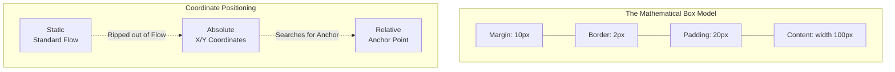

import { ConceptTemplate } from '@/features/kb/components/templates/ConceptTemplate'
import { Callout } from '@/features/kb/components/mdx/Callout'

export default function Layout({ children }) {
  return (
    <ConceptTemplate title="Box Model & Positioning">
      {children}
    </ConceptTemplate>
  )
}

To the browser's C++ rendering engine, there are no circles, triangles, or irregular shapes. Every single HTML element on the page—from a tiny `<span>` to the massive `<body>`—is mathematically calculated and rendered as a strict, rigid **Rectangle**.

This concept is the **CSS Box Model**. If you do not intimately understand the mathematical equation that calculates the total physical width of these rectangular boxes, you will be utterly incapable of engineering precise web layouts.

## 1. Deep Dive & Mechanics

The Box Model dictates that every element is composed of four mathematical layers, radiating outward from the center:

1. **Content:** The actual text, image, or child elements (The inner mathematical core).
2. **Padding:** The transparent negative space *inside* the element, pushing the border away from the content.
3. **Border:** The physical, visible line encapsulating the Padding and Content.
4. **Margin:** The transparent negative space *outside* the element, physically pushing neighboring elements away.

By default, the CSS specification uses the `content-box` mathematical algorithm. 
If you write: `.card { width: 100px; padding: 20px; border: 5px solid black; }`
You might assume the card is 100 pixels wide. Mathematically, it is **150 pixels wide**.
(100px Content + 20px Left Padding + 20px Right Padding + 5px Left Border + 5px Right Border = 150px).

## 2. Mathematical / Theoretical Foundation

The `content-box` algorithm caused decades of layout destruction because adding padding mathematically caused elements to explode out of their containers.

Modern engineering mathematically overrides this default by declaring **`box-sizing: border-box`**.

When using `border-box`, if you set `width: 100px`, the browser mathematically forces the *total visible element* (Content + Padding + Border) to strictly equal 100px. If you add 20px of padding, the browser engine automatically executes subtraction on the inner Content layer, shrinking it to 50px to ensure the total width remains mathematically locked at 100px.

## 3. Real-World Implementation

The Box Model dictates the size of the rectangle; **Positioning** dictates exactly where that rectangle is mathematically plotted on the screen's X/Y coordinate graph.

```css
/* 1. The Universal Reset (Mandatory Mathematical Baseline) */
/* Every modern application starts with this to fix the Box Model globally */
*, *::before, *::after {
  box-sizing: border-box;
  margin: 0;
  padding: 0;
}

/* 2. Static (The Default Flow) */
.box-static {
  /* Elements stack mathematically top-to-bottom, left-to-right */
  position: static; 
  /* top, right, bottom, left coordinates are mathematically IGNORED */
}

/* 3. Relative (The Coordinate Anchor) */
.box-relative {
  /* Remains in the normal document flow */
  position: relative; 
  /* BUT, we can mathematically offset its visual rendering */
  top: 10px; /* Visually shifts it down 10px, leaving a 10px ghost space where it used to be */
  
  /* MOST CRITICALLY: It establishes a mathematical coordinate anchor (Context) for Absolute children */
}

/* 4. Absolute (The Z-Axis Hijack) */
.box-absolute {
  /* Mathematically ripped entirely out of the normal document flow */
  /* Sibling elements will collapse and ignore it entirely */
  position: absolute;
  
  /* The engine searches up the DOM tree for the first parent with position: relative */
  /* It then mathematically plots these coordinates relative to that parent's borders */
  top: 0;
  right: 0; /* Pins perfectly to the top-right corner of the relative parent */
  
  z-index: 10; /* Raises the element on the 3D Z-Axis */
}

/* 5. Fixed (The Viewport Anchor) */
.navbar-fixed {
  position: fixed;
  /* Mathematically anchored to the physical screen/browser window, NOT the document */
  /* If the user scrolls down 10,000 pixels, this element remains mathematically frozen at Y:0 */
  top: 0;
  width: 100%;
}
```

## 4. Visualizations



## 5. Interview Prep

**Q: What is Margin Collapse?**
**A:** A notorious mathematical quirk in the CSS specification. If two Block elements are stacked vertically, and Element A has a `margin-bottom: 30px`, and Element B has a `margin-top: 20px`, they do not mathematically combine to create 50px of space. The browser's C++ engine "collapses" them, taking only the largest mathematical value. The space between them will be exactly 30px.

**Q: What happens if an `absolute` element cannot find a `relative` parent?**
**A:** When calculating the X/Y coordinates of an `absolute` element (e.g., `top: 50px`), the C++ engine traverses mathematically up the DOM tree looking for an explicitly declared Positioning Context (`relative`, `absolute`, or `fixed`). If it reaches the very top of the DOM without finding one, it mathematically anchors the coordinates to the `<html>` root node itself.

## 6. Production Use Cases

- **Modals and Overlays (`position: fixed`):** When building a React Modal component, it must mathematically sit on top of the entire application. Engineers apply `position: fixed; top: 0; left: 0; width: 100vw; height: 100vh;` and a massive `z-index`. This mathematically locks the modal to the exact dimensions of the user's physical screen, completely regardless of where the React component was physically mounted in the DOM tree.
- **Tooltip Architecture (`position: absolute`):** If you hover over a button and a Tooltip appears, the Tooltip is rendered as a child of the Button. The Button is explicitly set to `position: relative`, establishing the coordinate anchor. The Tooltip is set to `position: absolute; bottom: 100%;`. The mathematical `bottom: 100%` calculates the total physical height of the relative Button, pushing the Tooltip exactly to the top pixel edge of the button.

<Callout icon="danger" title="The z-index Stacking Context Trap">
A junior engineer often assumes `z-index: 9999` will force an element to the top of the entire screen. This is mathematically false. `z-index` does not operate globally; it operates within **Stacking Contexts**. If a parent `<div>` has `position: relative; z-index: 1;`, it creates an impenetrable mathematical isolation chamber. A child inside that div could have `z-index: 9999999`, but it will mathematically *always* render beneath a completely separate sibling div that has `z-index: 2`. You must architect your DOM tree carefully to manage the Z-Axis safely.
</Callout>
