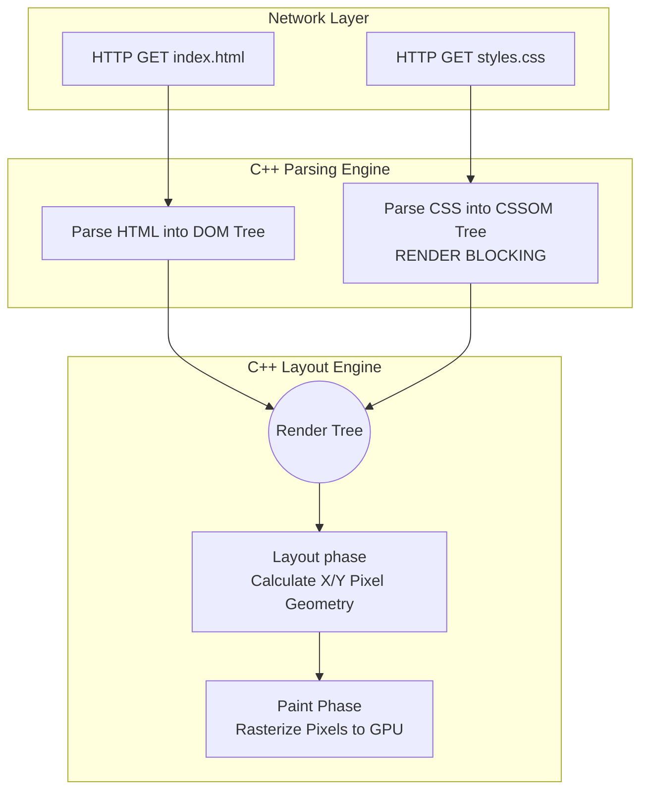

import { ConceptTemplate } from '@/features/kb/components/templates/ConceptTemplate'
import { Callout } from '@/features/kb/components/mdx/Callout'

export default function Layout({ children }) {
  return (
    <ConceptTemplate title="CSS Object Model (CSSOM)">
      {children}
    </ConceptTemplate>
  )
}

Every frontend engineer understands the DOM (Document Object Model). When the browser downloads an HTML string, it mathematically parses the string into a massive C++ Tree Structure (the DOM) representing every node (`<div>`, `<p>`) on the page.

However, the DOM contains absolutely zero visual data. It does not know what color a node is, or how wide it is.

When the browser downloads a CSS file, it executes a second, parallel mathematical parsing algorithm. It parses the raw CSS strings and constructs a second massive C++ Tree Structure: **The CSS Object Model (CSSOM)**. 

Only when the browser mathematically merges the DOM and the CSSOM does it create the **Render Tree**, which finally calculates the exact pixel geometry required to paint the pixels to the user's GPU.

## 1. Deep Dive & Mechanics

The construction of the CSSOM is mathematically **Render-Blocking**.

Because of the CSS Cascade (where a rule on line 5000 can mathematically overwrite a rule on line 2), the browser's C++ engine physically cannot begin painting the screen until it has downloaded and parsed **100% of the CSS**. If it painted the screen when it was 50% done, the screen might paint white, and then violently flash black a millisecond later when line 5000 was parsed. 

This is why a massive 2MB CSS file will mathematically trap the user on a blank white screen (White Screen of Death) until the file finishes downloading over their 3G connection.

## 2. Mathematical / Theoretical Foundation

The CSSOM is a strict, mathematical tree because CSS rules inherit downwards.

If your CSS dictates:
```css
body { font-size: 16px; color: black; }
p { font-weight: bold; }
p span { color: red; }
```

The C++ engine builds a mathematical graph:
1. `body` Node (font: 16, color: black)
2. `p` Node (inherits font: 16, inherits color: black, adds font: bold)
3. `span` Node (inherits font: 16, inherits bold, mathematically overrides color to red).

When evaluating CSS selectors, the browser mathematically parses them **Right-to-Left**, not Left-to-Right.
If it reads `div ul li a`, it doesn't find all `div`s. It finds every single `<a>` tag in the entire document, then traverses mathematically *up* the DOM tree to see if it has an `li` parent, then a `ul` parent. This is why deep CSS nesting is mathematically destructive to CPU rendering performance.

## 3. Real-World Implementation

The CSSOM isn't just an internal C++ structure; it exposes a massive JavaScript API (`document.styleSheets`), allowing engineers to mathematically read, mutate, and inject CSS rules directly into the engine's memory in real-time, bypassing the DOM entirely.

```javascript
// 1. Reading the computed mathematical reality of a node
const element = document.getElementById('my-card');

// element.style ONLY reads inline styles (e.g., <div style="color: red">)
// It is mathematically ignorant of the CSSOM.
console.log(element.style.color); // Often returns "" (empty string)

// To get the absolute mathematical truth after the C++ engine has calculated 
// the cascade, specificity, and inheritance, you MUST query the CSSOM:
const computedStyles = window.getComputedStyle(element);
console.log(computedStyles.backgroundColor); // "rgb(255, 0, 0)"
console.log(computedStyles.width); // "250.5px" (Calculated physical pixel geometry)

// 2. Mutating the CSSOM directly via JavaScript
// This is how modern CSS-in-JS libraries (like Styled Components) work.
// They don't write <style> tags to the DOM; they mathematically inject 
// rules directly into the CSSOM memory graph.

// Get the first stylesheet loaded in the engine
const sheet = document.styleSheets[0]; 

// Mathematically inject a new rule into the CSSOM at index 0
sheet.insertRule('.dynamic-class { color: hotpink; font-size: 2rem; }', 0);
```

## 4. Visualizations



## 5. Interview Prep

**Q: How do you mathematically prevent CSS from render-blocking the initial page load?**
**A:** This is a core SEO and Performance engineering task (Critical Rendering Path optimization). You mathematically extract the "Critical CSS" (the exact lines of CSS required to style the header and the "above the fold" content the user sees immediately). You inject this Critical CSS directly into a `<style>` tag in the HTML `<head>`. You then load the massive 2MB `styles.css` file asynchronously by manipulating the media attribute: `<link rel="stylesheet" href="styles.css" media="print" onload="this.media='all'">`. This mathematically tricks the browser into downloading the CSS in a background thread without blocking the paint engine.

**Q: Why are CSS-in-JS libraries (like Styled Components) slower than raw CSS?**
**A:** When you use raw CSS, the browser's highly optimized C++ engine parses the file and builds the CSSOM instantly in a background thread. When you use CSS-in-JS, the browser downloads the JavaScript bundle, executes the V8 engine, boots up React, renders the components, generates the CSS strings mathematically in JavaScript, and *then* forces the browser to dynamically mutate the CSSOM at runtime. This introduces massive mathematical CPU overhead during the initial mount phase.

## 6. Production Use Cases

- **Design System Tokens (CSS Variables):** Modern CSS Custom Properties (`--primary-color: blue`) are deeply integrated into the mathematical CSSOM. Unlike Sass variables (which are compiled away into raw strings before hitting the browser), CSS Variables exist in the C++ memory graph. If you execute `document.documentElement.style.setProperty('--primary-color', 'red')` in JavaScript, the CSSOM instantly cascades that mathematical change down the entire tree, instantly recoloring the entire application in 1 millisecond. This is how Dark Mode toggle buttons are implemented in production.
- **Scroll-Linked Animations:** To build highly complex Apple-style landing pages where 3D elements rotate precisely based on scroll position, engineers use JavaScript to read `window.scrollY`. They cannot use React State to update inline styles 60 times a second, as the React VDOM reconciliation algorithm is mathematically too slow and will drop frames. Instead, they bypass React and mathematically pipe the scroll integers directly into the CSSOM using CSS Variables (`setProperty('--scroll-y', scrollY)`), ensuring smooth 60fps GPU-accelerated rendering.

<Callout icon="warning" title="The Layout Thrashing Catastrophe">
If you use a `for` loop in JavaScript to read `window.getComputedStyle(el).height` and then instantly write `el.style.height = '200px'`, you trigger **Layout Thrashing**. The browser's C++ engine is mathematically forced to pause JavaScript execution, completely recalculate the CSSOM, rebuild the Render Tree, and recalculate the pixel geometry of the entire screen *on every single iteration of the loop*. This will instantly lock the CPU to 100% and freeze the browser. You must always mathematically batch all your Reads together, followed by all your Writes, using `requestAnimationFrame`.
</Callout>
