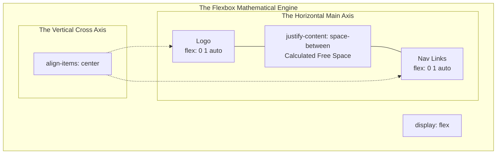

import { ConceptTemplate } from '@/features/kb/components/templates/ConceptTemplate'
import { Callout } from '@/features/kb/components/mdx/Callout'

export default function Layout({ children }) {
  return (
    <ConceptTemplate title="Flexbox (Flexible Box Layout)">
      {children}
    </ConceptTemplate>
  )
}

Before 2015, CSS mathematically lacked a sane mechanism for aligning elements. Vertically centering a `<div>` inside another `<div>` required catastrophic mathematical hacks involving absolute positioning, negative margins, and matrix transforms (`translate(-50%, -50%)`).

**Flexbox (Flexible Box Layout)** was introduced to mathematically solve alignment and space distribution. 

While CSS Grid is a rigid, 2-dimensional architectural matrix (handling X and Y axes simultaneously), Flexbox is a fluid, **1-dimensional** engine. It mathematically calculates the total available pixel space on a single axis (either a Row OR a Column) and dynamically distributes the remaining free space among its children based on algorithmic ratios.

## 1. Deep Dive & Mechanics

When you apply `display: flex` to a container, you immediately activate the mathematical flex engine. The children of this container are now **Flex Items**.

The mathematical engine operates on two axes:
1. **The Main Axis:** Defined by `flex-direction`. If `row` (default), the Main Axis is horizontal.
2. **The Cross Axis:** Mathematically perpendicular to the Main Axis. If the Main Axis is horizontal, the Cross Axis is vertical.

The engine uses two primary properties to distribute space across these axes:
- `justify-content`: Mathematically calculates and distributes the free pixel space along the **Main Axis**.
- `align-items`: Mathematically aligns the elements along the **Cross Axis**.

## 2. Mathematical / Theoretical Foundation

The true mathematical power of Flexbox resides in the `flex` shorthand property applied to the *children*. It dictates exactly how the browser's C++ engine should resolve pixel conflicts.

The `flex` property is a matrix of three values: `flex: [flex-grow] [flex-shrink] [flex-basis]`

1. **`flex-basis` (The Ideal Size):** Before any math is done, the engine looks at this value. "I mathematically want to be 200px wide."
2. **`flex-grow` (The Expansion Ratio):** If the container is 1000px, and there are two 200px children, there is 600px of free space. If Child A has `flex-grow: 1` and Child B has `flex-grow: 2`, the engine mathematically divides the free space into 3 chunks. Child A gets 200px of free space (Total width: 400px). Child B gets 400px of free space (Total width: 600px).
3. **`flex-shrink` (The Contraction Ratio):** If the container is 300px, but the two children demand 400px total, there is a mathematical overflow of -100px. The `flex-shrink` ratio dictates how brutally the C++ engine will crush the children to force them to fit inside the 300px box.

## 3. Real-World Implementation

Here is how you mathematically engineer the perfect responsive Navigation Bar using Flexbox.

```html
<nav class="navbar">
  <div class="logo">AcmeCorp</div>
  
  <ul class="nav-links">
    <li><a href="#">Products</a></li>
    <li><a href="#">Pricing</a></li>
    <li><a href="#">Docs</a></li>
  </ul>
  
  <div class="auth-buttons">
    <button>Login</button>
  </div>
</nav>
```

```css
/* 1. Establish the Mathematical Engine */
.navbar {
  display: flex;
  
  /* The Main Axis is Horizontal */
  flex-direction: row; 
  
  /* 
    Cross-Axis Math (Vertical):
    'center' perfectly calculates the physical pixel height of the tallest item, 
    and mathematically centers all other items vertically against it.
  */
  align-items: center;
  
  /* 
    Main-Axis Math (Horizontal): 
    Calculates total free space, and injects exactly equal mathematical 
    pixel spacing BETWEEN the 3 child elements, pinning the Logo to the 
    far left, and Auth buttons to the far right.
  */
  justify-content: space-between;
  
  padding: 0 20px;
  height: 80px;
}

/* 2. Nested Flexbox Engine */
.nav-links {
  /* Flexbox can be nested infinitely. A Flex Item can ALSO be a Flex Container. */
  display: flex;
  
  /* gap mathematically injects physical space between children without margin hacks */
  gap: 32px; 
  
  list-style: none; /* Strip native HTML dots */
}

/* 3. The Math Override */
.logo {
  /* 
    flex: 0 1 auto; (The default)
    Mathematically dictates: "Do not grow to take up free space. 
    You are allowed to shrink if the mobile screen gets too tight. 
    Your base width is exactly the physical width of the text 'AcmeCorp'."
  */
  font-weight: bold;
}
```

## 4. Visualizations



## 5. Interview Prep

**Q: How do you perfectly center a div both horizontally and vertically?**
**A:** This is the most famous CSS interview question, solved perfectly by Flexbox math.
```css
.container {
  display: flex;
  justify-content: center; /* Mathematical center on Main Axis (Horizontal) */
  align-items: center; /* Mathematical center on Cross Axis (Vertical) */
  height: 100vh; /* Must mathematically declare height, or Cross Axis math fails */
}
```

**Q: What is `flex-wrap`?**
**A:** By default, Flexbox mathematically refuses to wrap items. If you put 100 boxes in a row, the engine will brutally execute `flex-shrink`, crushing them into microscopic slivers to force them to fit on one line. If you add `flex-wrap: wrap`, the engine calculates the container width. The moment the items mathematically cannot fit at their baseline size, the engine dynamically breaks the Main Axis into a second physical line.

## 6. Production Use Cases

- **Dynamic Search Bars:** In an enterprise header, you have a Logo (fixed), a Search Bar, and a User Profile (fixed). If you apply `flex-grow: 1` exclusively to the Search Bar, the browser's C++ engine will mathematically consume 100% of the dead pixel space in the center of the header and apply it to the Search input. As the user resizes the browser window, the Search Bar mathematically stretches and shrinks in real-time, acting as a dynamic layout shock-absorber while the Logo and Profile remain completely rigid.
- **Equal Height Columns (Cards):** Before Flexbox, if you had a row of 3 pricing cards, and Card 2 had 10 bullet points while Cards 1 and 3 had 2 bullet points, the layout looked jagged and terrible. The `display: flex` engine fixes this mathematically by default. Because the default value for `align-items` is `stretch`, the C++ engine calculates the maximum pixel height of the tallest card in the row, and mathematically forces the physical boundaries of all other cards to perfectly match that height, creating a flawless visual grid.

<Callout icon="warning" title="The Flexbox vs Grid Fallacy">
Junior engineers often learn Flexbox and attempt to use it to build massive, two-dimensional application layouts by nesting 15 Flex containers inside each other. This is mathematically catastrophic for DOM depth and CPU rendering performance. Use **Flexbox** for 1D micro-layouts (aligning an icon next to text inside a button). Use **CSS Grid** for 2D macro-layouts (structuring the Sidebar, Header, and Main Content areas of the application).
</Callout>
