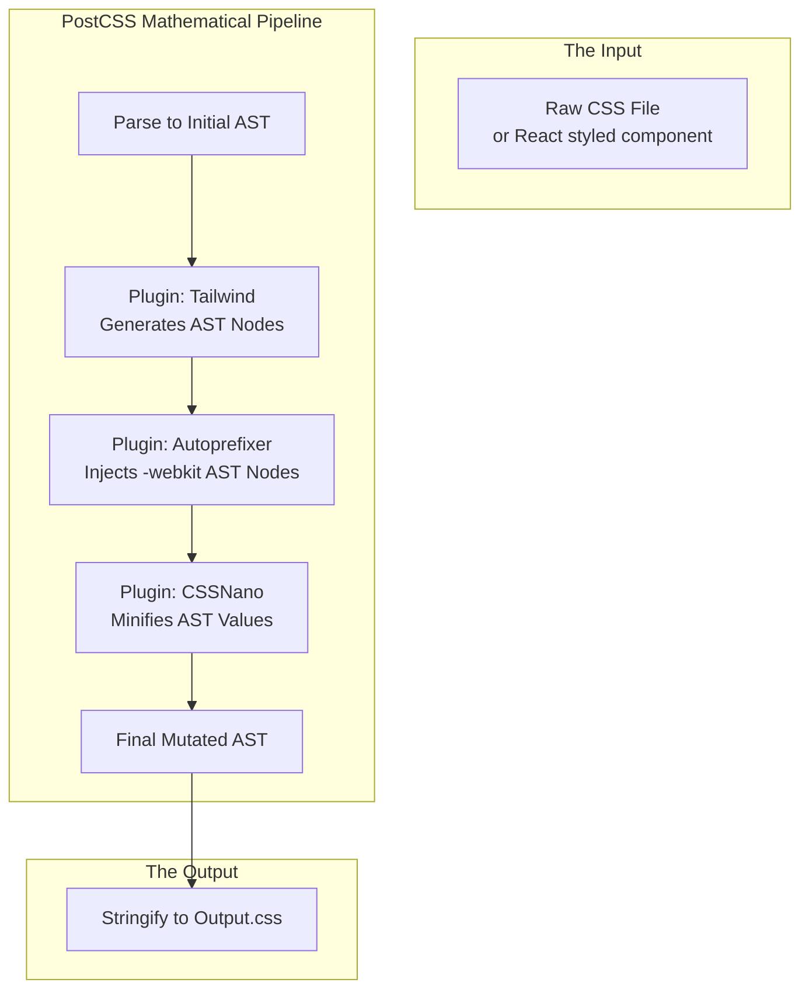

import { ConceptTemplate } from '@/features/kb/components/templates/ConceptTemplate'
import { Callout } from '@/features/kb/components/mdx/Callout'

export default function Layout({ children }) {
  return (
    <ConceptTemplate title="PostCSS">
      {children}
    </ConceptTemplate>
  )
}

Sass and LESS are monolithic, black-box compilers. They invented a completely proprietary, non-standard syntax (`.scss`), parsed it through a massive internal C++ or Ruby engine, and output `.css`. If you wanted a new feature that the Sass compiler didn't support, you were mathematically out of luck.

**PostCSS** destroyed this paradigm by turning CSS compilation into a modular, mathematical pipeline. 

PostCSS itself does absolutely nothing to your CSS. It is simply a hyper-optimized JavaScript parser that reads your CSS string and converts it into a mathematical **Abstract Syntax Tree (AST)**. It then passes this AST through a pipeline of independent JavaScript plugins. Each plugin mathematically mutates the AST, and finally, PostCSS stringifies the AST back into a `.css` file.

## 1. Deep Dive & Mechanics

The PostCSS architecture is identical to how Babel mathematically transforms modern JavaScript (ES6) into legacy JavaScript (ES5).

Because PostCSS plugins are just JavaScript functions that mutate a JSON-like AST object, anyone can write a plugin in 20 lines of code. This resulted in an explosion of mathematical capabilities that Sass could never match:
- **Autoprefixer:** Mathematically analyzes global browser usage stats to inject vendor prefixes.
- **CSSNano:** Executes violent mathematical minification algorithms to strip bytes.
- **Tailwind CSS:** The most famous PostCSS plugin in existence. It mathematically generates utility classes on demand.

## 2. Mathematical / Theoretical Foundation

To understand PostCSS, you must understand the **Abstract Syntax Tree (AST)**.

If you write this CSS:
```css
.card { display: flex; }
```

The PostCSS parser executes Lexical Analysis and mathematically converts it into a JavaScript object graph:
```json
{
  "type": "root",
  "nodes": [
    {
      "type": "rule",
      "selector": ".card",
      "nodes": [
        {
          "type": "decl",
          "prop": "display",
          "value": "flex"
        }
      ]
    }
  ]
}
```

A plugin like **Autoprefixer** intercepts this AST. It loops through the `nodes`. It sees `prop: "display", value: "flex"`. It executes a mathematical query against the CanIUse database. It discovers that Safari 8 requires `-webkit-box`. It mathematically splices a brand new `decl` node into the AST array. PostCSS then converts the mutated AST back into a string.

## 3. Real-World Implementation

Here is how you engineer a production-ready PostCSS compilation pipeline (typically executed via Webpack, Vite, or the PostCSS CLI).

```javascript
// postcss.config.js
// The mathematical instruction manual for the compilation pipeline.
// Order of execution is mathematically critical. Plugins run top-to-bottom.

module.exports = {
  plugins: [
    // 1. CSS Imports (Mathematical Concatenation)
    // Resolves @import "components/button.css" and mathematically 
    // inlines the file contents into the AST, preventing multiple HTTP requests.
    require('postcss-import'),
    
    // 2. Future CSS (The Polyfill Engine)
    // Allows you to write CSS specs that won't be supported by browsers until 2028.
    // PostCSS mathematically downgrades them into CSS that works today.
    require('postcss-preset-env')({
      stage: 1, // Enable highly experimental W3C CSS features
      features: {
        'nesting-rules': true // Polyfill native CSS nesting
      }
    }),
    
    // 3. The Utility Engine
    // Mathematically scans your React .tsx files and generates utility classes.
    require('tailwindcss'),
    
    // 4. The Vendor Prefix Engine
    // Mathematically cross-references your CSS against global browser usage > 1%
    require('autoprefixer'),
    
    // 5. The Minification Engine (Only run in Production)
    // Executes aggressive mathematical compression (stripping whitespace, optimizing colors)
    process.env.NODE_ENV === 'production' ? require('cssnano')({
      preset: 'default',
    }) : null
  ]
};
```

## 4. Visualizations



## 5. Interview Prep

**Q: Is PostCSS a replacement for Sass?**
**A:** Architecturally, yes. While you can technically run Sass and *then* run PostCSS, it is mathematically redundant. PostCSS plugins like `postcss-nested` and `postcss-simple-vars` can perfectly replicate the nesting and variable capabilities of Sass. Furthermore, PostCSS operates on standard, W3C-compliant CSS syntax, meaning you are writing standard CSS that is simply being polyfilled, whereas Sass requires you to write a proprietary language.

**Q: How does `postcss-preset-env` determine what to polyfill?**
**A:** It mathematically integrates with **Browserslist**. Browserslist is a configuration file (`.browserslistrc`) in your project root where you mathematically define your target audience (e.g., `> 1%, last 2 versions, not dead`). `postcss-preset-env` reads this config, queries the CanIUse database, and mathematically calculates exactly which CSS features your specific target audience lacks, generating polyfills *only* for those features to save bandwidth.

## 6. Production Use Cases

- **Tailwind CSS Architecture:** Tailwind CSS is mathematically not a CSS framework; it is a PostCSS plugin. When you run `npm run build`, the Tailwind PostCSS plugin executes a massive Regex scan across your entire codebase, extracts every string that looks like a Tailwind class, and mathematically generates the AST nodes for those exact classes, injecting them into the CSS pipeline.
- **CSS Modules (Local Scoping):** When you use CSS Modules in Next.js or Vite (`button.module.css`), the compiler mathematically guarantees that your class names will not collide globally. This is achieved via PostCSS. A PostCSS plugin intercepts your AST, finds the `.btn` selector, mathematically generates a cryptographic hash (e.g., `.btn_X9f2A`), mutates the AST selector, and exports a JSON map to your JavaScript so React knows which hash to attach to the DOM node.

<Callout icon="danger" title="The AST Performance Bottleneck">
While PostCSS is incredibly fast (written in optimized Node.js), parsing a massive 1MB CSS file into an AST, traversing millions of nodes, and stringifying it back takes mathematically significant CPU time. As applications scale, this build step can add seconds to the Webpack/Vite Hot Module Replacement (HMR) cycle. This is why modern build tools (like Vite and LightningCSS) are mathematically migrating away from Node.js PostCSS and rewriting these parsing engines in **Rust** or **Go**, achieving 100x mathematical performance increases.
</Callout>
