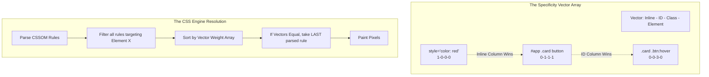

import { ConceptTemplate } from '@/features/kb/components/templates/ConceptTemplate'
import { Callout } from '@/features/kb/components/mdx/Callout'

export default function Layout({ children }) {
  return (
    <ConceptTemplate title="Selectors & Specificity">
      {children}
    </ConceptTemplate>
  )
}

Because of the CSS Cascade, a single `<button>` element might receive conflicting color instructions from five different places in the CSSOM. It might inherit blue from the `<body>`, receive red from a `.btn` class, and receive green from an `#id`.

The browser cannot randomly guess which color to paint the pixels. It executes a rigid, deterministic mathematical equation known as the **Specificity Algorithm**.

Understanding this algorithm is the difference between writing clean, scalable architecture and spending hours hacking `!important` onto every rule just to force a button to change color.

## 1. Deep Dive & Mechanics

Specificity is calculated as a 4-dimensional vector array: `(Inline, ID, Class/Pseudo-class/Attribute, Element/Pseudo-element)`. 
For simplicity, most engineers read this as a 4-digit integer (e.g., `0-1-2-1`), though mathematically, it does not function in base-10 (11 classes do not equal 1 ID).

When two CSS rules target the exact same element, the C++ engine compares their specificity vectors from left to right. The vector with the highest number wins. If the vectors are mathematically identical, the engine uses the **Cascade Rule**: whichever rule was parsed *last* in the CSS file wins.

## 2. Mathematical / Theoretical Foundation

Here is the exact mathematical weighting table used by the CSS engine:

1. **Inline Styles (`style="color: red"`):** Specificity `1-0-0-0`. Mathematically overrides almost everything in the external CSS file.
2. **IDs (`#header`):** Specificity `0-1-0-0`. Incredibly heavy. Should almost never be used for styling in modern architectures.
3. **Classes, Attributes, and Pseudo-classes (`.btn`, `[type="text"]`, `:hover`):** Specificity `0-0-1-0`. The standard architectural building block.
4. **Elements and Pseudo-elements (`div`, `h1`, `::before`):** Specificity `0-0-0-1`. Extremely weak.
5. **The Universal Selector (`*`):** Specificity `0-0-0-0`. Holds zero mathematical weight.

## 3. Real-World Implementation

Let us mathematically analyze a complex CSS conflict to determine exactly what color the browser will paint the button.

```html
<div id="app-wrapper">
  <button class="btn primary-action" type="submit">Submit</button>
</div>
```

```css
/* Rule A: Element + Class */
/* Specificity: 0-0-1-1 */
button.btn {
  color: red;
}

/* Rule B: Two Classes + Attribute Selector */
/* Specificity: 0-0-3-0 */
.btn.primary-action[type="submit"] {
  color: blue;
}

/* Rule C: ID + Element */
/* Specificity: 0-1-0-1 */
#app-wrapper button {
  color: green;
}
```

**Mathematical Resolution:**
- Rule A: `0-0-1-1`
- Rule B: `0-0-3-0`
- Rule C: `0-1-0-1`

The C++ engine compares the left-most columns. Rule C possesses a `1` in the ID column. Rules A and B have `0`. 
**Rule C mathematically obliterates the other rules.** The button will be painted Green.

*Notice the architectural failure:* The developer of Rule B wrote an incredibly specific string of classes (`.btn.primary-action[type="submit"]`) trying to turn the button blue. But because a completely unrelated developer wrapped the app in an `#id` (Rule C), Rule B's math is totally overridden. This is why IDs are architecturally banned in BEM and OOCSS methodologies.

## 4. Visualizations



## 5. Interview Prep

**Q: Mathematically, what happens if I chain 15 classes together? (`.a.b.c.d.e.f.g.h.i.j.k.l.m.n.o`)**
**A:** In the early days of CSS, specificities were calculated in base-10 byte arrays, meaning if you chained 11 classes together (0-0-11-0), the memory would roll over into the ID column (0-1-1-0), allowing 11 classes to mathematically override 1 ID. This was considered a severe bug. Modern browsers use mathematically infinite arrays for each slot. A million classes (`0-0-1000000-0`) will **never** override a single ID (`0-1-0-0`), because the engine compares the vectors left-to-right, and `1` in the ID slot instantly defeats `0` in the ID slot, ending the calculation immediately.

**Q: How does `!important` interact with the math?**
**A:** `!important` is the nuclear option. It is not part of the standard specificity vector. It mathematically moves the declaration into an entirely separate C++ processing queue. An element selector with `!important` (`div { color: red !important; }`) will obliterate an ID selector (`#header { color: blue; }`). The only way to override an `!important` is with an even higher-specificity `!important` (e.g., `#header { color: green !important; }`). Its usage should be strictly limited to utility classes (like `.hidden { display: none !important; }`).

## 6. Production Use Cases

- **Advanced Attribute Selectors for QA/E2E Testing:** In React, dynamically generated class names (`.sc-bcXHwe`) make it impossible to write Cypress or Playwright end-to-end tests, because the class name changes on every deployment. Engineers use attribute selectors (`[data-testid="submit-btn"]`) to write their tests. Attribute selectors have the exact same mathematical specificity weight as a standard class (`0-0-1-0`), making them perfect hooks that don't pollute the visual CSS math.
- **The `:where()` and `:is()` Pseudo-classes:** Modern CSS introduced functional pseudo-classes that mathematically manipulate specificity. 
  - `:is(h1, h2, h3) .title` takes the mathematical specificity of its *heaviest* argument.
  - `:where(h1, h2, h3) .title` mathematically strips the specificity of its arguments to exactly **Zero** (`0-0-0-0`). This is an architectural miracle for building Design System base stylesheets. You can write complex selectors to provide default styling without adding any mathematical weight, allowing the consumer application to effortlessly override the styles with a simple `.title` class.

<Callout icon="info" title="The Pseudo-Element Exception">
Do not confuse Pseudo-classes (`:hover`, `:first-child`) with Pseudo-elements (`::before`, `::after`). Pseudo-classes mathematically evaluate to `0-0-1-0` (the same as a class). Pseudo-elements actually mathematically inject virtual DOM nodes into the Render Tree, and they evaluate to `0-0-0-1` (the same as a standard HTML element tag). Note the modern double-colon `::` syntax used to explicitly differentiate them.
</Callout>
