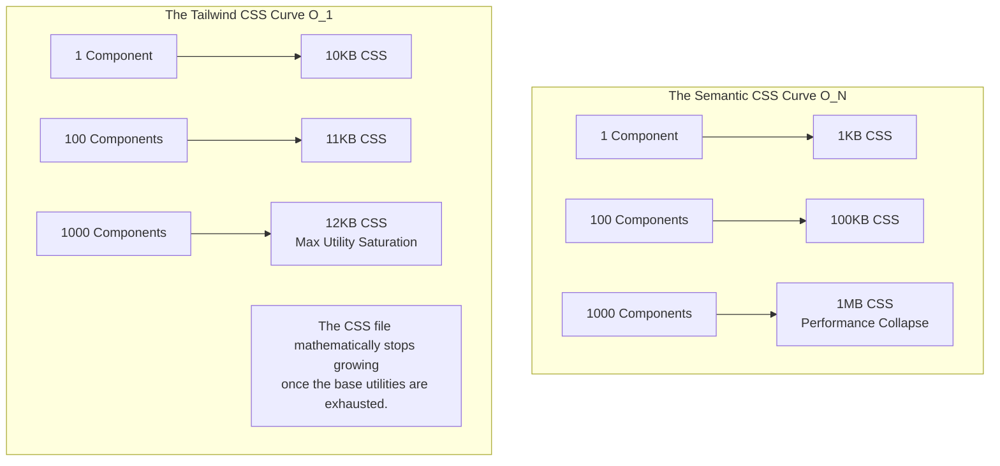

import { ConceptTemplate } from '@/features/kb/components/templates/ConceptTemplate'
import { Callout } from '@/features/kb/components/mdx/Callout'

export default function Layout({ children }) {
  return (
    <ConceptTemplate title="Tailwind CSS">
      {children}
    </ConceptTemplate>
  )
}

For two decades, web architecture dictated "Semantic CSS." You write a semantic HTML tag (`<button class="author-card">`), and you jump into a separate `.css` file to abstractly define the physical geometry of that card.

**Tailwind CSS** violently rejected this philosophy. It argues that Semantic CSS is mathematically doomed to scale infinitely (the stylesheet grows larger with every new component) and guarantees specificity collisions. 

Tailwind introduced the **Utility-First** architecture. You do not write CSS. You write raw, atomic, single-purpose classes directly in your HTML/JSX (`<div class="flex items-center justify-between p-4 bg-white rounded-lg shadow-md">`). 

This approach feels viscerally wrong to traditional engineers, but mathematically, it solves the two hardest problems in CSS architecture: Global specificty, and unbounded file size growth.

## 1. Deep Dive & Mechanics

Tailwind is **not** a CSS stylesheet you download. It is a **Node.js Just-In-Time (JIT) Compiler** (built on top of PostCSS).

If you write `class="mt-4 text-blue-500"`, Tailwind's JIT compiler scans your React files, executes a Regex extraction, and dynamically generates exactly two CSS blocks:
```css
.mt-4 { margin-top: 1rem; }
.text-blue-500 { color: #3b82f6; }
```

Because every utility class does exactly one thing, the specificity is mathematically locked at exactly **0-0-1-0** across the entire application. CSS cascading bugs are mathematically eradicated.

## 2. Mathematical / Theoretical Foundation

The true mathematical brilliance of Tailwind is **O(1) Stylesheet Scaling**.

In a Semantic CSS architecture (Bootstrap/BEM), if you build 1,000 different components, you must write 1,000 different blocks of CSS. The CSS file size grows linearly (O(n)) with the size of your application. An enterprise app will eventually ship a 1MB CSS file to the browser, bottlenecking rendering performance.

In Tailwind, there are mathematically only a finite number of utility classes you can combine (e.g., you can only use `p-1`, `p-2`, `p-3`, `p-4`). Once you have used `p-4` once, you can reuse it on 1,000 different components, and the final CSS file size **does not increase by a single byte**. An enterprise application built with Tailwind will top out at roughly a 10KB-15KB CSS file, completely regardless of whether the app has 10 components or 10,000 components.

## 3. Real-World Implementation

Here is how you engineer a fully responsive, dark-mode-compatible, interactive card using strict Utility-First syntax.

```jsx
// React Component Architecture
export function PricingCard() {
  return (
    <div className="
      max-w-sm p-6 mx-auto bg-white rounded-xl shadow-lg
      dark:bg-slate-800 dark:border-slate-700
      hover:-translate-y-2 hover:shadow-2xl transition-all duration-300
    ">
      
      {/* 
        Responsive Math:
        By default (mobile), text is large.
        md: (min-width: 768px) -> text scales up to 2xl.
        lg: (min-width: 1024px) -> text scales up to 3xl.
      */}
      <h2 className="text-xl md:text-2xl lg:text-3xl font-bold text-slate-900 dark:text-white">
        Enterprise Plan
      </h2>
      
      <p className="mt-2 text-slate-500 dark:text-slate-400">
        Unlimited scaling for global teams.
      </p>
      
      <div className="flex items-center justify-between mt-6">
        <span className="text-3xl font-extrabold text-indigo-600 dark:text-indigo-400">
          $199
        </span>
        
        {/* State Variants: hover, focus, and active are built in */}
        <button className="
          px-4 py-2 font-semibold text-white bg-indigo-600 rounded-lg
          hover:bg-indigo-700 
          focus:ring-4 focus:ring-indigo-300 focus:outline-none
          active:scale-95
        ">
          Subscribe
        </button>
      </div>
      
    </div>
  );
}
```

## 4. Visualizations



## 5. Interview Prep

**Q: What is arbitrary value injection in Tailwind?**
**A:** Tailwind provides a strict design system (spacing scale of 4, 8, 12, 16px). However, sometimes you mathematically need exactly 17px to match a designer's Figma file. Instead of writing custom CSS, Tailwind's JIT compiler allows arbitrary brackets: `top-[17px]` or `bg-[#bada55]`. The compiler intercepts the brackets, executes the Regex, and mathematically generates `.top-\[17px\] { top: 17px; }` on the fly. This mathematically eliminates the need to ever write an inline `style={{}}` object in React.

**Q: Doesn't Tailwind make your HTML bloated and unreadable?**
**A:** Visually, yes. Architecturally, no. In 2010, HTML bloat was bad because you copy-pasted raw HTML across 50 files. If you wanted to change the button color, you had to find and replace 50 HTML files. 
Today, we use **Component Frameworks** (React/Vue/Svelte). You only write the massive Tailwind string *once* inside `Button.jsx`. If you want to change the color, you change it in exactly one file. The "bloat" is encapsulated entirely within the mathematical boundaries of the React component.

## 6. Production Use Cases

- **Design System Tokenization (`tailwind.config.js`):** Tailwind forces massive engineering teams to adhere to a strict mathematical design system. By editing the config file, the Lead Architect can define exactly 4 brand colors and 5 font sizes. If a junior engineer attempts to write `text-red-500` but `red` is not in the config file, the compiler mathematically refuses to generate the CSS class, and the text renders black. This enforces strict UI consistency at the compiler level.
- **Server Components (Next.js App Router):** When React Server Components (RSC) launched, traditional CSS-in-JS libraries (Styled Components, Emotion) mathematically failed because they rely on React Context and runtime JavaScript injection, which do not exist on the server. Tailwind CSS generates static `.css` files via Node.js at build time. It requires zero runtime JavaScript, making it mathematically perfect for SSR and React Server Components, triggering a massive industry migration towards it.

<Callout icon="danger" title="The String Concatenation Failure">
You mathematically CANNOT use string concatenation to dynamically generate Tailwind classes in JavaScript. 
If you write: `const color = 'blue'; return <div className={\`bg-\${color}-500\`} />`
**This will mathematically fail in production.** The Tailwind JIT compiler does not execute JavaScript. It scans source files using Regex looking for unbroken strings. It will see `bg-${color}-500`, fail to recognize it, and purge the `bg-blue-500` class from the final CSS file. You must always map state to complete, unbroken class strings (e.g., `color === 'blue' ? 'bg-blue-500' : 'bg-red-500'`).
</Callout>
