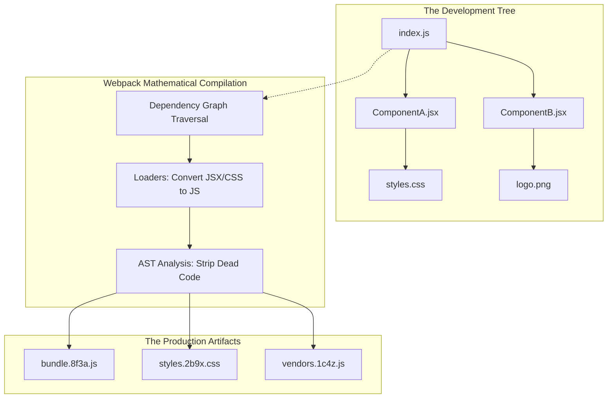

import { ConceptTemplate } from '@/features/kb/components/templates/ConceptTemplate'
import { Callout } from '@/features/kb/components/mdx/Callout'

export default function Layout({ children }) {
  return (
    <ConceptTemplate title="Legacy Bundlers (Webpack, Rollup)">
      {children}
    </ConceptTemplate>
  )
}

In 2012, web architecture faced a mathematical catastrophe. Browsers did not natively support JavaScript `import` statements (ES Modules). If you wrote a React application split across 500 different files, you mathematically could not load them into the browser without writing 500 `<script>` tags in exact, manual dependency order. 

**Bundlers** (specifically Webpack) were engineered to solve this. They execute a highly complex mathematical graph traversal. They start at a single entry point (`index.js`), read the `import` statements, crawl through the entire file system to build a **Dependency Graph**, and mathematically concatenate all 500 files into a single, massive `bundle.js` file that the browser can execute.

While Vite and Turbopack (written in Rust/Go) represent the modern era, understanding Webpack (written in Node.js) is mathematically critical because 90% of legacy enterprise applications still rely on its architecture.

## 1. Deep Dive & Mechanics

Webpack treats everything as a mathematical module. In a traditional architecture, you can only import JavaScript. Webpack fundamentally altered this by allowing you to `import './styles.css'` or `import logo from './logo.png'` directly inside JavaScript.

To achieve this, Webpack requires two core architectural pipelines:
1. **Loaders:** Mathematical translators. Webpack only understands raw JavaScript. If it encounters a `.css` or `.tsx` file, it crashes. A Loader (like `babel-loader` or `css-loader`) mathematically transforms the file into valid JavaScript *before* it enters the dependency graph.
2. **Plugins:** Global mathematical manipulators. While Loaders operate on a per-file basis, Plugins operate on the finalized bundle. (e.g., `TerserPlugin` violently minifies the final JS string, stripping all whitespace and comments to save kilobytes).

## 2. Mathematical / Theoretical Foundation

The deepest mathematical operation Webpack performs is **Tree Shaking**.

If your application imports the massive `lodash` library (`import { debounce } from 'lodash'`), but you only actually execute the `debounce` function, it is mathematically catastrophic to ship the other 300 unused Lodash functions to the user's browser.

During compilation, Webpack analyzes the Abstract Syntax Tree (AST) of your code. It calculates a mathematical **Dead Code Graph**. It realizes that `cloneDeep()` is never referenced. During the Plugin phase (Minification), it mathematically excises the dead functions from the final output string, shrinking the bundle size from 500KB to 20KB.

## 3. Real-World Implementation

Here is how you engineer a mathematically robust `webpack.config.js` file for a production-grade React/TypeScript application.

```javascript
const path = require('path');
const HtmlWebpackPlugin = require('html-webpack-plugin');
const MiniCssExtractPlugin = require('mini-css-extract-plugin');

module.exports = {
  // 1. The Mathematical Entry Point
  entry: './src/index.tsx',

  // 2. The Output Pipeline
  output: {
    path: path.resolve(__dirname, 'dist'),
    // Mathematical Caching: Inject a cryptographic hash into the filename.
    // If the code changes, the hash changes (bundle.8f3a2b.js), mathematically 
    // forcing the browser to bypass its cache and download the new file.
    filename: '[name].[contenthash].js',
    clean: true, // Erase the dist folder before building
  },

  // 3. Module Resolution
  resolve: {
    extensions: ['.tsx', '.ts', '.js'], // Tell Webpack how to resolve imports missing file extensions
  },

  // 4. The Loader Matrix (Translators)
  module: {
    rules: [
      {
        // If the file ends in .ts or .tsx, execute the Babel Loader to translate it
        test: /\.(ts|tsx)$/,
        exclude: /node_modules/,
        use: 'babel-loader',
      },
      {
        // If the file is CSS, execute two loaders in reverse mathematical order (Right-to-Left)
        test: /\.css$/,
        use: [
          MiniCssExtractPlugin.loader, // 2. Extracts the JS string back into a physical .css file
          'css-loader',                // 1. Translates raw CSS into a JS string
        ],
      },
      {
        // If the file is an image, mathematically encode it as a Base64 string if it's < 8kb
        test: /\.(png|jpg|jpeg|gif)$/i,
        type: 'asset',
      },
    ],
  },

  // 5. The Plugin Matrix (Global Optimizers)
  plugins: [
    // Mathematically injects the <script src="bundle.[hash].js"> tag into the HTML file
    new HtmlWebpackPlugin({
      template: './public/index.html',
    }),
    new MiniCssExtractPlugin({
      filename: '[name].[contenthash].css',
    }),
  ],

  // 6. Optimization Architecture
  optimization: {
    // Code Splitting Math:
    // Do not ship one massive 5MB bundle. Split 'react' and 'react-dom' into a separate 
    // 'vendors.js' file. Because React rarely changes, the browser will cache vendors.js for months.
    splitChunks: {
      chunks: 'all',
    },
  },
};
```

## 4. Visualizations



## 5. Interview Prep

**Q: What is the architectural difference between Webpack and Rollup?**
**A:** Webpack was engineered to bundle massive *Applications* (React/Angular). It uses complex CommonJS wrapper functions to isolate modules, which is powerful but introduces slight mathematical overhead in the browser. 
Rollup was engineered to bundle *Libraries* (React itself, Vue, Lodash). Rollup uses **Scope Hoisting**, mathematically flattening the entire dependency graph into a single, massive function scope. This creates significantly smaller, faster-executing code, but it historically struggled with Code Splitting and complex CSS loading, which is why Webpack won the Application domain.

**Q: Why is Webpack mathematically considered a "Legacy" technology today?**
**A:** Webpack is written entirely in JavaScript (Node.js). In a massive 10,000-file enterprise application, executing the AST dependency graph calculation in a single-threaded V8 engine takes 3 to 10 minutes. 
Modern bundlers like **esbuild** (written in Go) and **SWC** (written in Rust) execute these exact same mathematical AST transformations in heavily parallelized, compiled machine code, achieving compile times of 50 milliseconds—a 100x mathematical performance increase. Webpack physically cannot compete with multi-threaded Rust.

## 6. Production Use Cases

- **Code Splitting & Lazy Loading (`React.lazy()`):** In a massive enterprise dashboard, shipping the complex "Billing Chart" component on the initial page load is mathematically inefficient. The user might never click the Billing tab. Webpack enables Lazy Loading via dynamic imports (`const Chart = import('./Chart')`). When Webpack mathematically parses this during compilation, it physically splits `Chart.js` into a completely separate file (`chunk-589.js`). The browser only downloads this file over the network at the exact microsecond the user clicks the Billing tab.
- **Module Federation (Micro-Frontends):** In 2020, Webpack 5 introduced a mathematical miracle called Module Federation. It allows two completely separate React applications, hosted on different servers, to mathematically share code at runtime. App A can dynamically request `<Header />` from App B over the network. If both apps use `react@18`, Webpack mathematically negotiates the dependency, ensuring React is only downloaded once. This revolutionized massive enterprise architectures.

<Callout icon="danger" title="The Loader Ordering Fallacy">
A critical mathematical error junior engineers make is defining Webpack Loaders in Left-To-Right reading order. Webpack processes arrays mathematically in reverse: **Right-To-Left** (or Bottom-To-Top).
If you write `use: ['css-loader', 'sass-loader']`, the code mathematically hits `sass-loader` first (which translates SCSS to CSS), and then hits `css-loader` (which translates CSS to JS). If you accidentally write `['sass-loader', 'css-loader']`, the compiler will violently crash because `css-loader` mathematically cannot understand raw Sass strings.
</Callout>
