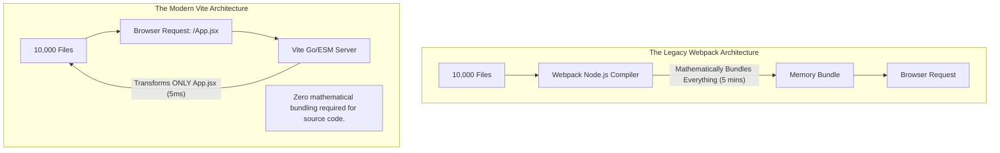

import { ConceptTemplate } from '@/features/kb/components/templates/ConceptTemplate'
import { Callout } from '@/features/kb/components/mdx/Callout'

export default function Layout({ children }) {
  return (
    <ConceptTemplate title="Modern Build Tools">
      {children}
    </ConceptTemplate>
  )
}

For nearly a decade, Webpack dominated the JavaScript ecosystem. However, it possessed a catastrophic architectural flaw: it was written in Node.js (JavaScript). Node.js is an interpreted, single-threaded language. When enterprise applications grew to 10,000 files, the Webpack development server took 5 minutes just to boot up, and changing a single line of code caused a 30-second Hot Module Replacement (HMR) delay.

The modern era of Build Tools (led by **Vite**, **esbuild**, and **Turbopack**) mathematically solved this performance crisis through two radical architectural shifts:
1. **Language Migration:** Rewriting the heavy AST (Abstract Syntax Tree) parsing engines in **Go** and **Rust** (compiled, multi-threaded languages), achieving 100x performance increases.
2. **Native ES Modules (ESM):** Fundamentally changing how code is served during local development, completely eliminating the need to bundle the application before serving it.

## 1. Deep Dive & Mechanics

### The Webpack Paradigm (Bundle-Based)
When you start a Webpack dev server, it mathematically crawls your entire dependency graph, processes every single file, and bundles them all into a massive 5MB string in memory *before* the server starts. If you change one file, the entire graph must be mathematically recalculated.

### The Vite Paradigm (ESM-Based)
When you start a Vite dev server, it does not bundle your source code. It boots up instantly (in ~200 milliseconds).
Vite relies on the modern browser's native ability to understand `import` statements. 
When the browser requests `http://localhost:5173/App.jsx`, Vite intercepts the network request. It instantly translates that *single* React file into plain JavaScript using **esbuild** (written in Go) in ~5 milliseconds, and sends it to the browser. The browser then requests the dependencies. 
Because Vite only processes the exact files the browser is currently looking at, the application scales infinitely without slowing down the development server.

## 2. Mathematical / Theoretical Foundation

The most complex mathematical operation in modern build tools is **Dependency Pre-Bundling**.

While Vite serves your source code as raw ESM files, it mathematically cannot do this for your `node_modules` (like `lodash` or `react`). Many npm packages still use legacy CommonJS (`require()`), which browsers cannot execute. Furthermore, an import like `lodash-es` contains 600 separate tiny files; if the browser tried to request all 600 via HTTP, the network tab would mathematically collapse under the overhead, freezing the browser.

When you start Vite, it executes an aggressive mathematical scan:
1. It uses **esbuild** to scan your source code for all `node_modules` imports.
2. It mathematically bundles all those 3rd-party dependencies into massive, highly optimized chunks (e.g., combining all of `react` and `react-dom` into a single file).
3. It converts them to valid ESM.
4. It caches them aggressively on your hard drive.

## 3. Real-World Implementation

Here is how you architect a modern `vite.config.ts` for an enterprise React application. 
*Notice how drastically simpler it is compared to Webpack.*

```typescript
import { defineConfig, splitVendorChunkPlugin } from 'vite';
import react from '@vitejs/plugin-react';
import path from 'path';

// Vite is mathematically driven by Rollup under the hood for production builds
export default defineConfig({
  // 1. The Plugin Architecture
  plugins: [
    // Automatically handles React JSX transformation and Fast Refresh (HMR)
    react(), 
    
    // Mathematically splits node_modules into a separate vendor chunk for caching
    splitVendorChunkPlugin() 
  ],

  // 2. Absolute Path Resolution
  resolve: {
    alias: {
      // Maps the '@' symbol mathematically to the /src directory
      // Eradicates "import Button from '../../../../components/Button'"
      '@': path.resolve(__dirname, './src'),
    },
  },

  // 3. The Development Server
  server: {
    port: 3000,
    // Mathematical Proxy: Bypasses CORS errors during local development
    // Requests to /api/users are secretly routed to the backend Java server
    proxy: {
      '/api': {
        target: 'http://localhost:8080',
        changeOrigin: true,
      },
    },
  },

  // 4. Production Build Architecture (Powered by Rollup)
  build: {
    outDir: 'dist',
    sourcemap: true,
    
    // esbuild executes the CSS and JS minification in milliseconds
    minify: 'esbuild', 
    
    rollupOptions: {
      output: {
        // Mathematical Chunk Splitting
        // Automatically isolates heavy libraries (like Chart.js) into their own network files
        manualChunks: (id) => {
          if (id.includes('node_modules/chart.js')) {
            return 'chart-vendor';
          }
        }
      }
    }
  }
});
```

## 4. Visualizations



## 5. Interview Prep

**Q: Why doesn't Vite use esbuild for production builds?**
**A:** This is a crucial architectural nuance. Vite uses **esbuild** (written in Go) for local development and minification because it is insanely fast. However, esbuild mathematically lacks advanced capabilities like complex Code Splitting and mature CSS handling. Therefore, when you run `vite build` for production, Vite switches engines and uses **Rollup** (written in JS/Rust via SWC) to mathematically guarantee the most optimized, safely chunked production artifacts possible.

**Q: What is Turbopack?**
**A:** Turbopack is the "spiritual successor" to Webpack, written entirely in **Rust** by the original creator of Webpack. It powers Next.js 13+. While Vite relies on the browser's native ESM, Turbopack actually *does* bundle the code, but it uses a mathematical architecture called an **Incremental Computation Engine**. It caches the exact mathematical output of every single function it runs. If a file changes, it doesn't recalculate the graph; it mathematically diffs the cache in Rust, achieving HMR updates in nanoseconds, proving that bundling isn't dead—it just needed to be written in Rust.

## 6. Production Use Cases

- **Hot Module Replacement (HMR) at Scale:** In a React application, if you are filling out a complex 5-step form and you edit the CSS of the submit button in your editor, a legacy bundler would refresh the entire browser page. You would lose all your form state and have to start over. Modern tools like Vite mathematically inject the updated CSS (or React component logic) directly into the browser's active memory graph via WebSockets, updating the button in 100 milliseconds while perfectly preserving the React State of the 5-step form.
- **Monorepo Compilation (Turborepo):** In a massive monorepo containing 50 different frontend applications, running `npm run build` mathematically takes hours. Tools like Turborepo integrate with modern bundlers to execute **Remote Caching**. When you run the build, it mathematically hashes your source files. It checks a cloud server. If another engineer in your company already built those exact files yesterday, Turborepo mathematically skips the compilation entirely and downloads the finished build artifacts from the cloud in 2 seconds.

<Callout icon="danger" title="The CommonJS Extinction Event">
Modern build tools mathematically punish legacy code. If your enterprise app relies heavily on older npm packages that use Node's `require()` syntax instead of `import` (ESM), Vite will be forced to execute massive pre-bundling steps to mathematically convert them to ESM so the browser can understand them. The entire JavaScript ecosystem is currently undergoing a painful, multi-year migration to mathematically force all packages to ship as pure ES Modules, eradicating CommonJS forever.
</Callout>
