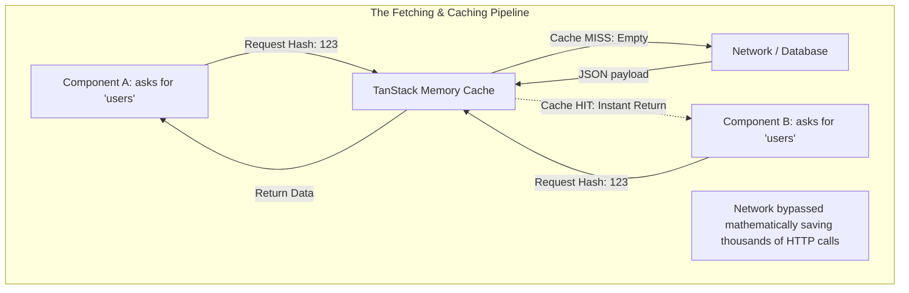

import { ConceptTemplate } from '@/features/kb/components/templates/ConceptTemplate'
import { Callout } from '@/features/kb/components/mdx/Callout'
import { ComparisonTable } from '@/features/kb/components/mdx/ComparisonTable'

export default function Layout({ children }) {
  return (
    <ConceptTemplate title="Data Fetching & Routing">
      {children}
    </ConceptTemplate>
  )
}

In the legacy era of Single Page Applications (SPAs), developers mathematically implemented Data Fetching and Routing manually. They used `fetch()` inside a `useEffect` to load data, stored it in a global Redux store, and wrote massive `if/else` switch statements to conditionally render components based on the URL.

This architecture collapsed at scale. It resulted in catastrophic mathematical flaws: "Waterfall" network requests (Request B waits for Request A to finish), infinite loading spinners, stale data synchronization errors, and broken browser "Back" buttons.

Modern architectures solve this by mathematically fusing Routing and Data Fetching into highly intelligent, cache-driven engines (like **TanStack Query** and **React Router v6+**), completely bypassing Redux for server-state management.

## 1. Deep Dive & Mechanics

### Data Fetching (TanStack Query / SWR)
TanStack Query is not a fetching library; it is a **Mathematical Asynchronous State Manager**. 
When you request `/api/users`, it doesn't just execute the network call. It calculates a cryptographic hash of the query (`['users']`), stores the JSON payload in a global memory cache, and immediately returns it. If a second component requests `['users']` 10 milliseconds later, TanStack intercepts the request and instantly returns the cached JSON, mathematically preventing duplicate network traffic. 

### Client-Side Routing (React Router)
React Router mathematically hijacks the browser's native History API (`window.history.pushState`). When a user clicks a `<Link to="/dashboard">`, it violently prevents the browser from executing a full-page HTTP refresh. Instead, it mathematically swaps the URL string, unmounts the current React component, and mounts the `<Dashboard />` component in milliseconds, creating the illusion of instantaneous navigation.

## 2. Mathematical / Theoretical Foundation

The most complex mathematical operation in Data Fetching is **Cache Invalidation (Stale-While-Revalidate)**.

If you have a dashboard showing a user's Bank Balance (`$500`), and the user clicks a "Transfer $100" button, you must execute a POST mutation. 
In legacy architectures, you would have to manually update Redux (`balance = 400`). If the network fails, your Redux state is mathematically desynchronized from the true Database state.

TanStack Query solves this using **Cache Invalidation Graph Traversal**. 
When the POST mutation succeeds, you command TanStack to `invalidateQueries(['balance'])`. The engine mathematically scans the entire React component tree. Any component currently rendering the `['balance']` query is instantly commanded to re-fetch the data in the background. Meanwhile, it keeps the stale `$500` visible until the new data arrives, preventing flashing loading spinners.

## 3. Real-World Implementation

Here is an architectural demonstration of modern Data Fetching and Routing working in tandem.

### The Router Architecture
```tsx
import { createBrowserRouter, RouterProvider } from 'react-router-dom';

// Modern routing uses a declarative, mathematical tree structure.
// This allows the Router to calculate exact layout nesting and error boundaries.
const router = createBrowserRouter([
  {
    path: '/',
    element: <RootLayout />,
    // If anything mathematically crashes inside the children, this boundary catches it,
    // preventing the entire application from going white (White Screen of Death).
    errorElement: <GlobalErrorCrashPage />, 
    children: [
      { path: 'dashboard', element: <Dashboard /> },
      // Mathematical URL Parameter extraction
      { path: 'user/:userId', element: <UserProfile /> },
    ],
  },
]);

export const App = () => <RouterProvider router={router} />;
```

### The Data Fetching Architecture (TanStack Query)
```tsx
import { useQuery, useMutation, useQueryClient } from '@tanstack/react-query';
import { useParams } from 'react-router-dom';

export const UserProfile = () => {
  // 1. Router mathematically extracts the ID from the URL (/user/42 -> userId: "42")
  const { userId } = useParams();
  const queryClient = useQueryClient();

  // 2. The Query Engine
  const { data, isLoading, isError } = useQuery({
    // The mathematical Cache Key. If userId changes, TanStack instantly fires a new request.
    queryKey: ['user', userId], 
    queryFn: async () => {
      const res = await fetch(`/api/users/${userId}`);
      if (!res.ok) throw new Error('Network response was not ok');
      return res.json();
    },
    // Mathematical Stale Time: The data is considered "fresh" for 5 minutes.
    // No duplicate network requests will fire for 5 minutes.
    staleTime: 1000 * 60 * 5, 
  });

  // 3. The Mutation Engine
  const mutation = useMutation({
    mutationFn: (newName: string) => fetch(`/api/users/${userId}`, { method: 'POST', body: newName }),
    onSuccess: () => {
      // Mathematically destroys the cache, forcing the useQuery above to instantly re-fetch
      queryClient.invalidateQueries({ queryKey: ['user', userId] });
    },
  });

  if (isLoading) return <Spinner />;
  if (isError) return <div>Catastrophic Failure</div>;

  return (
    <div>
      <h1>{data.name}</h1>
      <button onClick={() => mutation.mutate('Alice')}>Change Name</button>
    </div>
  );
};
```

## 4. Visualizations



## 5. Interview Prep

**Q: Why shouldn't you store API Data in Redux anymore?**
**A:** This is a fundamental architectural shift. The industry realized there are two mathematically distinct types of state:
1. **Client State (UI):** Is the sidebar open? What is the user typing in the input? (Store this in React Context/Zustand/Redux).
2. **Server State (API):** The list of users from the database.
Server State does not belong to your application; you are merely "borrowing" a snapshot of it from the backend. Redux mathematically has no concept of caching, background refetching, or stale-time. Using Redux for Server State forces the developer to manually write thousands of lines of asynchronous logic that TanStack Query handles automatically in 3 lines of code.

**Q: What is a "Network Waterfall" and how do modern routers solve it?**
**A:** A Waterfall occurs when `<App>` fetches User Data, and only *after* it finishes, it renders `<Dashboard>`, which then fetches Analytics Data. The requests happen sequentially (A -> B), doubling the loading time. Modern architectures (like Remix or React Router v6 Data API) mathematically hoist the `loader` functions out of the components and attach them directly to the Route definition. When you click the URL, the Router mathematically analyzes the URL structure, realizes both `<App>` and `<Dashboard>` will render, and executes both HTTP requests instantly in parallel.

## 6. Production Use Cases

- **Optimistic UI Updates (TanStack Mutation):** When you "Like" a tweet on Twitter, the heart instantly turns red. It does not wait for the network request to hit the server in California and return 200 OK. TanStack Query uses Optimistic Updates to mathematically inject the new state directly into the cache locally. If the network request fails 2 seconds later, TanStack's engine mathematically calculates the rollback, reverting the heart back to grey and showing a toast error, creating the illusion of zero-latency internet.
- **Prefetching Data on Hover:** In an enterprise ecommerce app, when the user's mouse hovers over a product link, they will likely click it in the next 300 milliseconds. Using TanStack and the Router, you bind an event listener to the `onMouseEnter` event. It mathematically fires the HTTP request instantly in the background. By the time the user actually clicks the link, the data is already sitting in the cache, resulting in a perfectly instantaneous page load.

<Callout icon="danger" title="The Infinite Fetch Loop">
When writing manual data fetching inside a React `useEffect`, passing an Object or Array into the Dependency Array `[queryData]` is a mathematical death trap. In JavaScript, `[] === []` is `false` (Referential Equality). On every render, React mathematically evaluates the array as a "brand new" object, re-triggering the `useEffect`, re-fetching the data, which triggers a new render, instantly creating an infinite loop that will DDoS your backend database in seconds. Always use strict primitives (`userId`), or better yet, abandon `useEffect` entirely for TanStack Query.
</Callout>
