import { ConceptTemplate } from '@/features/kb/components/templates/ConceptTemplate'
import { Callout } from '@/features/kb/components/mdx/Callout'

export default function Layout({ children }) {
  return (
    <ConceptTemplate title="Data Architecture (Lakes vs Warehouses)">
      {children}
    </ConceptTemplate>
  )
}

Data Engineering is the mathematical discipline of designing, building, and maintaining the infrastructure required to process petabytes of data. At the core of this discipline lies the fundamental architecture of where and how data is physically stored and queried. Over the last 30 years, this architecture has evolved through three distinct eras: The Warehouse, The Lake, and The Lakehouse.

## 1. Deep Dive & Mechanics

### The Data Warehouse (The Legacy Standard)
Historically, the **Data Warehouse** was the absolute standard for enterprise analytics. It is a central, highly-structured relational database optimized exclusively for **OLAP** (Online Analytical Processing) queries, rather than OLTP (Online Transaction Processing).

In a Data Warehouse, data is stored in a highly normalized or star-schema format. 
- **Schema-on-Write**: Data must be strictly cleaned, transformed, and normalized *before* it is written into the warehouse. If an upstream service alters the schema (e.g., adding a new JSON field), the ETL (Extract, Transform, Load) pipeline immediately breaks, forcing engineers to manually intervene and run DDL (`ALTER TABLE`) commands.
- **Compute and Storage Coupling**: In legacy systems (like on-premise Teradata or Oracle Exadata), compute and storage were physically coupled on the same hardware racks. Scaling storage required buying more compute, leading to massive financial waste.
- **The Cloud Warehouse Revolution**: Platforms like **Snowflake** and **Google BigQuery** revolutionized this by mathematically decoupling Compute from Storage. They store petabytes of data in proprietary columnar formats on distributed object storage (like AWS S3 underneath), and dynamically spin up ephemeral Compute clusters (Virtual Warehouses) only when an SQL query is executed.

### The Data Lake (The Unstructured Dump)
As companies began collecting massive amounts of unstructured data (images, massive raw JSON logs, IoT sensor telemetry), the rigid Schema-on-Write architecture became a catastrophic bottleneck. The **Data Lake** was born.

- **Schema-on-Read**: A Data Lake (like Amazon S3, Azure Data Lake Storage, or HDFS) is simply a massive, infinitely scalable, incredibly cheap object storage system. You dump raw data into it exactly as it arrives. The schema is applied later, only when a Spark job or a Data Scientist attempts to read and parse the data.
- **Swamp Risk**: Because there is zero strict governance on write, Data Lakes often devolve into "Data Swamps"—unsearchable, undocumented terabytes of useless data. They also fundamentally lack ACID transactions. If a job fails halfway through writing to a Data Lake, it leaves corrupted, partial files that downstream consumers will accidentally read.

### The Data Lakehouse (The Modern Revolution)
The industry realized that maintaining two entirely separate systems—a Data Lake for Machine Learning and a Data Warehouse for Business Intelligence (BI)—was phenomenally expensive and required horrific dual-write pipelines. The **Data Lakehouse** was invented to mathematically merge the two.

Pioneered by **Databricks**, a Lakehouse utilizes open-source **Table Formats** (like **Apache Iceberg**, **Delta Lake**, or **Apache Hudi**) sitting directly on top of cheap Data Lake storage (S3). These formats add a transactional metadata layer (a transaction log, usually in JSON or Parquet) that mathematically provides:
- **ACID Guarantees**: Concurrent reads and writes without corruption.
- **Time-Travel (Versioning)**: Querying the exact state of the table 3 days ago.
- **Schema Evolution**: Automatically handling schema drift without breaking pipelines.

## 2. Mathematical / Theoretical Foundation

### Storage Economics and Query Latency
The primary mathematical driver behind Data Architecture is the trade-off between Storage Cost ($C_s$) and Compute Query Latency ($T_q$).

Let $S$ be the dataset size (e.g., 10 PB).
- **Data Warehouse**: $C_s$ is very high (often \$23/TB/month) because the data is highly indexed, strongly typed, and stored in SSD-backed compute clusters (or proprietary cloud formats). However, $T_q$ is in milliseconds because the data is pre-optimized for analytical scans.
- **Data Lake**: $C_s$ is virtually zero (standard S3 is \$23/TB/month, but Archive tiers are \$0.99/TB/month). However, $T_q$ approaches infinity for direct SQL queries, requiring you to spin up a massive Apache Spark cluster, read the raw JSON bytes, parse them, and aggregate them, taking hours.
- **Lakehouse**: Achieves the mathematical minimum of both. $C_s$ is identical to the Data Lake (cheap object storage). Because of the Iceberg/Delta Lake metadata layer, $T_q$ approaches Data Warehouse speeds. The query engine reads the metadata log first in $O(1)$ time, identifies exactly which underlying Parquet files contain the required data via Min/Max statistics, and prunes 99% of the S3 files before ever touching the network, dropping time complexity from $O(N)$ full-scans to $O(\log N)$ or better.

## 3. Real-World Implementation

Here is an architectural definition of a modern **Delta Lake** (Lakehouse) implementation using PySpark. It demonstrates writing raw data into a Delta table with strict schema enforcement and ACID guarantees directly on S3.

```python
# PySpark Delta Lake (Lakehouse) Implementation
from pyspark.sql import SparkSession
from delta.tables import DeltaTable

# 1. Initialize Spark with Delta Lake extensions
spark = SparkSession.builder \
    .appName("LakehouseETL") \
    .config("spark.sql.extensions", "io.delta.sql.DeltaSparkSessionExtension") \
    .config("spark.sql.catalog.spark_catalog", "org.apache.spark.sql.delta.catalog.DeltaCatalog") \
    .getOrCreate()

# 2. Read raw JSON logs from the Data Lake
raw_df = spark.read.json("s3://raw-data-lake/telemetry/2024/10/25/")

# 3. Write to a Delta Table (Lakehouse) with ACID guarantees
# If this fails halfway, the Delta Transaction Log ensures no partial data is exposed.
raw_df.write.format("delta") \
    .mode("append") \
    .partitionBy("event_date") \
    .save("s3://lakehouse-gold/telemetry_table/")

# 4. Time Travel: Read the exact state of the table as of version 5
historical_df = spark.read.format("delta").option("versionAsOf", 5).load("s3://lakehouse-gold/telemetry_table/")

# 5. Schema Evolution (MergeSchema)
# If tomorrow's JSON logs have a new column, the Delta table automatically updates its schema.
new_day_df = spark.read.json("s3://raw-data-lake/telemetry/2024/10/26/")
new_day_df.write.format("delta") \
    .option("mergeSchema", "true") \
    .mode("append") \
    .save("s3://lakehouse-gold/telemetry_table/")
```

## 4. Visualizations

```mermaid
graph TD
    subgraph Data Lakehouse Architecture
        A[Raw IoT Sensors] -->|JSON Streams| B(Raw S3 Data Lake)
        C[Transactional Databases] -->|CDC / Debezium| B
        
        B -->|Spark / Flink ETL| D[(Delta Lake / Apache Iceberg Layer)]
        
        D -->|Presto / Trino| E[BI Dashboards / Tableau]
        D -->|TensorFlow / PyTorch| F[Machine Learning Training]
        
        subgraph The Metadata Magic
            D -.->|Transaction Log| G[JSON Commit Logs]
            D -.->|Physical Data| H[Parquet Files on S3]
        end
    end
    
    style D fill:#1e1e1e,stroke:#00a676,stroke-width:2px
    style G fill:#2d2d2d,stroke:#fff
    style H fill:#2d2d2d,stroke:#fff
```



<Callout icon="info" title="The Metadata Layer">
  The true innovation of Iceberg and Delta Lake is the **Metadata Layer**. A Lakehouse is physically just Parquet files sitting in an S3 bucket. However, the system maintains a strict JSON transaction log sitting alongside them. When a user queries the table, the engine reads the JSON log *first* to determine exactly which Parquet files represent the current valid state, ignoring any obsolete or corrupted files.
</Callout>

## 5. Interview Prep

**Q: Explain the primary architectural difference between Snowflake and a traditional on-premise Data Warehouse.**
**Answer:** The primary difference is the mathematical decoupling of Compute and Storage. In a traditional warehouse, they are physically bound together; you must buy a larger server rack to increase storage, even if you don't need more CPU. Snowflake stores data in a proprietary format on cheap cloud storage (S3) and spins up transient, stateless Compute clusters (Virtual Warehouses) across multiple availability zones solely when a query is executed, allowing for independent, infinite scaling of both layers.

**Q: What is "Schema-on-Read" vs "Schema-on-Write"?**
**Answer:** Schema-on-Write is used by Data Warehouses; data must be perfectly formatted, cleaned, and matched to a strict relational schema *before* it is written to disk. If it fails validation, the write aborts. Schema-on-Read is used by Data Lakes; raw data (like JSON or CSV) is dumped to disk immediately without validation. The schema (types, columns) is only inferred and applied dynamically at the exact moment a developer attempts to read the data using a tool like Spark.

**Q: Why were Table Formats like Apache Iceberg created?**
**Answer:** They were created to solve the "Data Swamp" problem of Data Lakes. Before Iceberg, a Data Lake was just a directory of millions of loose Parquet files. If a Spark job crashed halfway through writing, corrupted partial files were left in the directory, and downstream BI queries would silently read incorrect data. Iceberg adds a transaction log that provides ACID guarantees; readers only see files that were successfully committed via the log, mathematically preventing dirty reads.

## 6. Production Use Cases

- **Netflix (Apache Iceberg Creators):** Netflix invented Apache Iceberg because their AWS S3 Data Lake grew to exabytes in size. Standard AWS API calls (`s3:ListObjects`) simply to list the millions of files in a directory began taking hours, causing their Spark jobs to timeout before processing even began. Iceberg mathematically maps the files using a metadata tree, completely bypassing the need to list S3 directories.
- **Uber (Apache Hudi Creators):** Uber requires massive real-time analytics for surge pricing and driver routing. They created Apache Hudi to allow for **Upserts** (Updates and Inserts) on Data Lakes. Previously, updating a single user's record in a 10TB Data Lake required rewriting the entire 10TB file. Hudi mathematically handles record-level mutations in object storage.
