import { ConceptTemplate } from '@/features/kb/components/templates/ConceptTemplate'
import { Callout } from '@/features/kb/components/mdx/Callout'

export default function Layout({ children }) {
  return (
    <ConceptTemplate title="Data Storage Formats (Parquet & Iceberg)">
      {children}
    </ConceptTemplate>
  )
}

In massive distributed systems, storing data as standard JSON or CSV files is mathematically catastrophic. CSV files are uncompressed, notoriously slow to parse, fundamentally lack schema metadata, and enforce sequential reading. To process petabytes of data efficiently, the Data Engineering industry relies entirely on mathematically optimized binary file formats combined with transactional table metadata.

## 1. Deep Dive & Mechanics

### Row-Oriented vs. Column-Oriented Storage
Traditional relational databases (PostgreSQL, MySQL, Oracle) store data in **Row-Oriented** formats. On the physical hard drive, all data for Row 1 is stored contiguously, followed by all data for Row 2.
- **OLTP Advantage**: If a user logs into a website and the backend needs their specific profile (`SELECT * FROM users WHERE id = 5`), the disk reads a single contiguous block. This is incredibly fast for transactional queries (OLTP).
- **OLAP Catastrophe**: In Data Engineering (OLAP), queries typically aggregate massive amounts of data across a few specific columns: *"Calculate the average Age of all 10 Billion users"*. In a Row-Oriented database, the system must physically read the entire hard drive (fetching Names, Addresses, Emails, Passwords) just to extract the Age column. This destroys disk I/O and saturates the network bandwidth.

### The Columnar Revolution: Apache Parquet
**Apache Parquet** is an open-source, **Column-Oriented** binary format. It physically stores all the Names together on disk, then all the Addresses together, then all the Ages together. 

When you query the average Age, the SQL engine (like Presto or Spark) mathematically targets *only* the specific disk blocks containing the Ages, ignoring 95% of the file's total byte weight. This technique, called **Column Projection**, mathematically reduces disk I/O by orders of magnitude.

Furthermore, Parquet files store rich schema metadata in their footers. They track the **Min/Max statistics** for every column within a block (a Row Group). If a query says `WHERE Age > 50`, and the Parquet footer states the max Age in this block is 45, the engine skips reading the block entirely (**Predicate Pushdown**).

### Compression and Encoding
Because a column in Parquet contains strictly identical data types (e.g., a massive array of integers or repeated string categories), it enables aggressive mathematical compression that is physically impossible in row-based CSVs:
- **Dictionary Encoding**: Instead of storing the string "United States" 10 million times, Parquet creates a dictionary mapping `0 -> "United States"` and stores the 1-bit integer `0` 10 million times.
- **Run-Length Encoding (RLE)**: If an integer repeats sequentially (`0, 0, 0, 0, 0`), Parquet mathematically stores it as `(0, 5 times)`.

These algorithms routinely shrink 1TB of CSV data down to 100GB of Parquet data, slashing AWS S3 storage bills by 90%.

## 2. Mathematical / Theoretical Foundation

### The Metadata Problem (The Need for Table Formats)
While Parquet solves the physical storage of bytes, it does not solve *Database State*. A massive Data Lake might contain 500,000 Parquet files representing a single table. 
If a Spark job attempts to insert 10,000 new Parquet files but the cluster crashes halfway through (leaving 5,000 files in S3), the Data Lake is mathematically corrupted with dirty, partial data. The next reader will silently read corrupted analytics.

To solve this, the industry invented **Table Formats** (the architecture powering the Data Lakehouse). The dominant standards are **Apache Iceberg**, **Delta Lake**, and **Apache Hudi**.

### Iceberg's Mathematical Tree Structure
Apache Iceberg solves the metadata bottleneck by structuring table state as a mathematical Directed Acyclic Graph (DAG) of metadata files.
1. **Metadata JSON**: The root file pointing to the current Snapshot of the table.
2. **Snapshot / Manifest List**: An Avro file pointing to multiple Manifest files, tracking overall table statistics.
3. **Manifest Files**: Avro files that list the exact physical S3 paths of the raw Parquet data files, alongside partition ranges.

Because of this strict metadata layer, Iceberg provides **ACID Transactions**. When writing data, new Parquet files are written to S3 hidden from the user. Only when the root Metadata JSON pointer is atomically swapped (the Commit) does the data instantaneously become visible. If a job fails, the hidden Parquet files are simply ignored and garbage collected.

## 3. Real-World Implementation

Here is how you interact with Apache Iceberg natively using PySpark. This code demonstrates creating a partitioned table, inserting data with ACID guarantees, and executing a Time Travel query to retrieve a historical state.

```python
# PySpark with Apache Iceberg
from pyspark.sql import SparkSession

# Initialize Spark with Iceberg SQL extensions and an AWS Glue Catalog
spark = SparkSession.builder \
    .appName("IcebergDeepDive") \
    .config("spark.sql.extensions", "org.apache.iceberg.spark.extensions.IcebergSparkSessionExtensions") \
    .config("spark.sql.catalog.my_catalog", "org.apache.iceberg.spark.SparkCatalog") \
    .config("spark.sql.catalog.my_catalog.type", "glue") \
    .getOrCreate()

# 1. Create a partitioned Iceberg Table
# The engine will create the metadata tree underneath
spark.sql("""
    CREATE TABLE IF NOT EXISTS my_catalog.db.financial_transactions (
        transaction_id BIGINT,
        user_id BIGINT,
        amount DECIMAL(10,2),
        transaction_date DATE
    )
    USING iceberg
    PARTITIONED BY (months(transaction_date))
""")

# 2. Insert data transactionally (ACID compliant)
spark.sql("""
    INSERT INTO my_catalog.db.financial_transactions
    VALUES (1, 100, 45.50, '2024-10-25')
""")

# 3. Schema Evolution (O(1) operation)
# Adding a column in Iceberg is mathematically instantaneous; it merely updates the JSON metadata 
# without rewriting any existing Parquet files.
spark.sql("ALTER TABLE my_catalog.db.financial_transactions ADD COLUMN currency STRING")

# 4. Time Travel Query
# Mathematically query the exact state of the table exactly 24 hours ago
historical_df = spark.read \
    .option("as-of-timestamp", int(time.time() * 1000) - 86400000) \
    .format("iceberg") \
    .load("my_catalog.db.financial_transactions")
```

## 4. Visualizations

```mermaid
graph TD
    subgraph Apache Iceberg Metadata Tree
        A[v2.metadata.json <br/> Root Pointer] --> B[Snapshot 2 <br/> Manifest List]
        
        B --> C[Manifest File A <br/> Partition: 2024-10]
        B --> D[Manifest File B <br/> Partition: 2024-11]
        
        C -->|S3 Path| E(Data_file_1.parquet)
        C -->|S3 Path| F(Data_file_2.parquet)
        
        D -->|S3 Path| G(Data_file_3.parquet)
    end
    
    subgraph Time Travel
        Z[v1.metadata.json <br/> Old Root] -.->|Points to previous| Y[Snapshot 1]
        Y -.-> C
    end
    
    style A fill:#00a676,stroke:#fff,stroke-width:2px
    style Z fill:#772953,stroke:#fff,stroke-width:1px,stroke-dasharray: 5 5
    style E fill:#1e1e1e,stroke:#fff
    style F fill:#1e1e1e,stroke:#fff
    style G fill:#1e1e1e,stroke:#fff
```



<Callout icon="info" title="The Metadata Swap">
  When an Iceberg transaction completes, the engine writes a brand new `v3.metadata.json` file. The database catalog (like AWS Glue or Hive Metastore) uses an atomic Compare-and-Swap (CAS) operation to mathematically change the master pointer from `v2` to `v3`. This atomic swap is what guarantees ACID consistency at petabyte scale.
</Callout>

## 5. Interview Prep

**Q: Explain how Predicate Pushdown works with Parquet files and why it's important.**
**Answer:** Predicate Pushdown is an optimization where the query engine pushes the filtering logic (`WHERE age > 50`) down to the storage layer before reading the actual data. Parquet files store statistical metadata in their footers, including the min and max values for every column chunk. The query engine reads this tiny footer first. If the max age in that chunk is 45, the engine mathematically proves that no data inside the chunk matches the query, and it completely skips reading those megabytes/gigabytes of data from disk, drastically reducing I/O.

**Q: What is the "Small Files Problem" in Data Lakes and how do Table Formats solve it?**
**Answer:** If you stream real-time data into S3, you end up creating millions of tiny 10KB Parquet files. When Spark tries to query this, the overhead of opening millions of network connections to S3 crushes the cluster; `s3:ListObjects` alone can take hours. Table Formats (like Iceberg) solve this by tracking exactly which files exist in their own metadata tree, completely bypassing the need to ask S3 to list directories. Additionally, they provide maintenance operations (like `OPTIMIZE` in Delta or `rewriteDataFiles` in Iceberg) that mathematically compact the millions of 10KB files into mathematically optimal 128MB files in the background without blocking concurrent readers.

**Q: How does Time Travel work in Delta Lake or Iceberg?**
**Answer:** Table formats never mutate or delete existing Parquet files when an `UPDATE` or `DELETE` occurs. They write new data files and generate a new Snapshot in the metadata transaction log. The old Parquet files remain exactly as they were, pointed to by historical Snapshots in the log. Time Travel simply tells the query engine to read the metadata manifest from a specific historical timestamp, which will route the engine to read the older, unmodified Parquet files.

## 6. Production Use Cases

- **Apple:** Uses Apache Iceberg to manage multi-petabyte datasets for Siri and Apple Services. Their S3 buckets became so massive that standard directory listings timed out. Iceberg's metadata tree allowed them to bypass S3 limits and achieve sub-second query planning times on tables with tens of millions of files.
- **Databricks Customers (Delta Lake):** Companies operating under strict GDPR and CCPA regulations use Delta Lake because it mathematically supports the `DELETE` SQL command on raw Data Lakes. When a user requests to be forgotten, the engine identifies exactly which Parquet files contain that user's data, rewrites those specific files without the user's row, and atomically swaps the Delta transaction log, achieving compliance without rewriting the entire petabyte lake.
