import { ConceptTemplate } from '@/features/kb/components/templates/ConceptTemplate'
import { Callout } from '@/features/kb/components/mdx/Callout'

export default function Layout({ children }) {
  return (
    <ConceptTemplate title="Stream Processing (Kafka & Flink)">
      {children}
    </ConceptTemplate>
  )
}

Batch processing runs on a schedule (e.g., every midnight on a finite dataset). However, modern systems (Uber tracking cars, Robinhood executing trades, Netflix tracking user clicks) require **Stream Processing**: executing complex mathematical transformations on unbounded, infinite streams of data in real-time with sub-millisecond latency. 

The architecture for streaming requires two distinct layers: the **Storage/Transport Layer** (Kafka) and the **Processing/Compute Layer** (Flink).

## 1. Deep Dive & Mechanics

### The Transport Layer: Apache Kafka
Created at LinkedIn, **Apache Kafka** is not a database, nor is it a traditional message queue (like RabbitMQ or ActiveMQ). It is a highly-distributed, mathematically robust **Distributed Commit Log**.

In a traditional message queue, when a consumer reads a message, the queue deletes it. This is fatal for Data Engineering because you often need 10 different microservices (Fraud Detection, Analytics, Database Sync) to read the exact same message.
In Kafka, a Topic is simply an **append-only text file on disk**. When a Producer sends an event, it is appended to the absolute end of the log. Kafka mathematically retains the message for a configured retention period (e.g., 7 days) regardless of who reads it.

To achieve horizontal scale, a Topic is mathematically split into **Partitions**. 
If a Topic has 10 partitions, you can launch a **Consumer Group** containing 10 separate servers. Kafka will assign exactly one partition to each server, allowing you to process 1,000,000 messages per second in parallel. Kafka tracks exactly which message each consumer has read using an **Offset** (a 64-bit integer index).

### The Compute Layer: Apache Flink
Kafka is brilliant at *storing and moving* the stream, but it is dumb; it cannot execute SQL or math. You often need to perform complex aggregations on the stream (e.g., "Calculate the average Uber surge price in Manhattan over a rolling 5-minute window").

**Apache Flink** is the absolute state-of-the-art framework for stateful stream processing. Flink consumes the raw stream from Kafka, holds a mathematically rigorous internal State in memory (or RocksDB), performs the aggregations in real-time, and outputs a clean stream back to Kafka or a database.

## 2. Mathematical / Theoretical Foundation

### Event Time vs. Processing Time
The most difficult mathematical problem in stream processing is "Out of Order Data".
If a user clicks a button on their phone while driving through an internet dead-zone, the event might arrive at your servers 10 minutes late.

- **Processing Time**: The timestamp when the server actually received the event. Using this is highly inaccurate for analytics, as the 10-minute delayed event will be grouped into the wrong time window.
- **Event Time**: The timestamp generated by the phone when the button was physically clicked.

### The Mathematics of Watermarks
To calculate a 5-minute tumbling window using Event Time, Flink must mathematically know when it is safe to "close" the window and emit the result. How long does it wait for late data?
Flink uses **Watermarks**. A Watermark is a special hidden timestamp injected into the stream declaring: *"I mathematically guarantee that I will not send you any more events older than time T."*

If the Watermark is set to $T = 10:05 AM$, Flink instantly closes the 10:00-10:05 window, calculates the aggregation, and emits it. If a late event arrives with a timestamp of $10:04 AM$, Flink handles it via configured **Late Data Rules** (e.g., dropping it, or emitting an updated correction row).

### Exactly-Once Semantics (The Chandy-Lamport Algorithm)
If a Flink node crashes while processing financial transactions, how do you prevent double-charging a user when the node reboots?
Flink implements the **Chandy-Lamport Distributed Snapshot Algorithm**. Flink periodically injects a "Checkpoint Barrier" into the stream. As this barrier flows through the operators, each operator mathematically halts, saves its exact internal State to S3, and passes the barrier forward. Upon recovery, Flink rewinds the Kafka offsets to the exact moment of the last barrier and reloads the State from S3, mathematically guaranteeing **Exactly-Once Semantics** with zero data loss or duplication.

## 3. Real-World Implementation

Here is a modern PyFlink implementation that consumes a raw Kafka stream of financial transactions, defines a 5-minute tumbling window based on Event Time and Watermarks, calculates the total revenue per user, and writes the output back to Kafka.

```python
# PyFlink Stream Processing Implementation
from pyflink.datastream import StreamExecutionEnvironment, TimeCharacteristic
from pyflink.datastream.window import TumblingEventTimeWindows
from pyflink.common.time import Time
from pyflink.datastream.connectors.kafka import FlinkKafkaConsumer, FlinkKafkaProducer

# 1. Initialize the Flink Streaming Environment
env = StreamExecutionEnvironment.get_execution_environment()
# Force strict Event Time processing
env.set_stream_time_characteristic(TimeCharacteristic.EventTime)
# Enable Checkpointing every 10 seconds for Exactly-Once guarantees
env.enable_checkpointing(10000)

# 2. Define the Kafka Consumer Source
kafka_consumer = FlinkKafkaConsumer(
    topics='raw_financial_transactions',
    deserialization_schema=JsonRowDeserializationSchema(...),
    properties={'bootstrap.servers': 'kafka-cluster:9092', 'group.id': 'flink_aggregator'}
)

# 3. Assign Watermarks (Allowing up to 5 seconds of late data)
watermarked_stream = env.add_source(kafka_consumer) \
    .assign_timestamps_and_watermarks(
        WatermarkStrategy.for_bounded_out_of_orderness(Duration.ofSeconds(5))
        .with_timestamp_assigner(lambda event: event.timestamp_ms)
    )

# 4. The Mathematical Transformation and Windowing
aggregated_stream = watermarked_stream \
    .key_by(lambda event: event.user_id) \
    .window(TumblingEventTimeWindows.of(Time.minutes(5))) \
    .reduce(lambda a, b: TransactionEvent(
        user_id=a.user_id, 
        amount=a.amount + b.amount, # Aggregate the sum
        timestamp_ms=max(a.timestamp_ms, b.timestamp_ms)
    ))

# 5. Define the Kafka Producer Sink
kafka_producer = FlinkKafkaProducer(
    topic='aggregated_5min_revenue',
    serialization_schema=JsonRowSerializationSchema(...),
    producer_config={'bootstrap.servers': 'kafka-cluster:9092'}
)

aggregated_stream.add_sink(kafka_producer)

# 6. Execute the continuous infinite stream
env.execute("RealTime_Revenue_Aggregator")
```

## 4. Visualizations

```mermaid
graph TD
    subgraph The Streaming Architecture
        A[Mobile App] -->|Event: Click| B(Apache Kafka)
        A2[Web App] -->|Event: Purchase| B
        
        subgraph Flink Stateful Compute
            B -->|Read Offsets| C[Flink Source Operator]
            
            C -->|Assign Watermarks| D[Windowing Operator]
            
            D -.->|Chandy-Lamport Barrier| E[(RocksDB / S3 Checkpoints)]
            
            D -->|Emit Aggregation| F[Flink Sink Operator]
        end
        
        F -->|Write Results| G(Kafka Output Topic)
        F -->|Write Results| H[(PostgreSQL / Redis)]
    end
    
    style B fill:#1e1e1e,stroke:#fff,stroke-width:2px
    style E fill:#2d2d2d,stroke:#fff
    style G fill:#1e1e1e,stroke:#fff
```



<Callout icon="info" title="Kafka vs Traditional Queues">
  In RabbitMQ (a traditional message queue), messages are physically deleted the millisecond a consumer ACKs them. Kafka treats the queue as a strict, immutable log on disk. A message stays on the disk for 7 days. This allows Consumer A (Fraud Detection) and Consumer B (Data Warehouse Sync) to read the exact same message independently, each maintaining their own personal integer pointer (Offset) representing their position in the log.
</Callout>

## 5. Interview Prep

**Q: In Kafka, what happens if you have a Topic with 3 Partitions, but you spin up a Consumer Group with 4 instances?**
**Answer:** Kafka maps Partitions to Consumers mathematically. One instance can read from multiple partitions, but a single partition can only be read by ONE instance within a specific Consumer Group (to guarantee strict ordering). Therefore, 3 instances will each get exactly 1 partition, and the 4th instance will sit completely idle, doing nothing, waiting for one of the other 3 instances to crash so it can take over.

**Q: Explain the difference between Tumbling, Sliding, and Session Windows in Flink.**
**Answer:** 
- **Tumbling**: Fixed, non-overlapping windows (e.g., 00:00-05:00, 05:00-10:00). An event belongs to exactly one window.
- **Sliding**: Overlapping windows (e.g., a 10-minute window that slides every 1 minute). An event belongs to mathematically multiple windows.
- **Session**: Dynamically sized windows based on user activity. A window closes only when a specific timeout of inactivity occurs (e.g., 30 minutes of no clicks from a user).

**Q: How does Kafka guarantee high availability and fault tolerance?**
**Answer:** Kafka uses mathematically replicated partitions. Every partition has 1 "Leader" broker and multiple "Follower" brokers (usually a Replication Factor of 3). All read/write traffic hits the Leader. The Followers silently sync the data. If the Leader physically burns to the ground, ZooKeeper (or KRaft) immediately holds an election and promotes one of the fully-synced Followers to become the new Leader in milliseconds, preventing any downtime.

## 6. Production Use Cases

- **Uber (Surge Pricing):** Uber's core pricing engine relies entirely on Flink and Kafka. They stream millions of driver locations and rider app-opens into Kafka. Flink calculates a real-time sliding window to mathematically determine the exact ratio of supply vs. demand in specific geohashed hex grids, instantly updating the dynamic surge price multiplier for that grid.
- **Netflix (Keystone Pipeline):** Netflix processes over 3 Trillion events per day through Kafka. Every pause, rewind, or skip on your TV is streamed directly into Kafka, processed in real-time by Flink to monitor global viewing quality metrics, and ultimately lands in Apache Iceberg on S3 for batch ML training.
