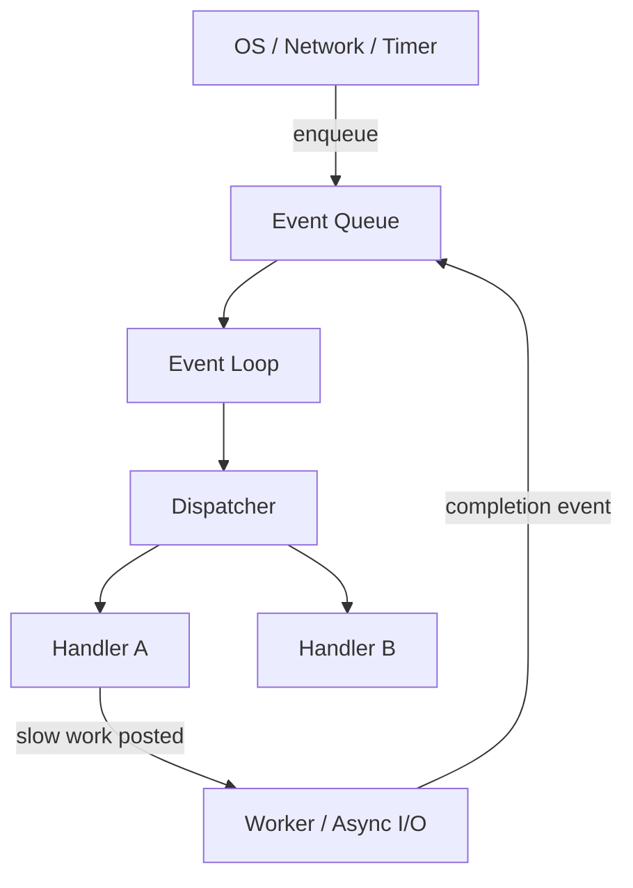

import { ConceptTemplate } from '@/features/kb/components/templates/ConceptTemplate'
import { Callout } from '@/features/kb/components/mdx/Callout'
import { ComparisonTable } from '@/features/kb/components/mdx/ComparisonTable'

export default function Layout({ children }) {
  return (
    <ConceptTemplate title="Event-Driven Programming">
      {children}
    </ConceptTemplate>
  )
}

A command-line script runs top to bottom and exits. A UI, a game loop, or a web server cannot do that. It must sit in a state of suspended animation and wake only when the outside world happens: a mouse click, a TCP packet, a timer, a file-system notification.

**Event-driven programming** inverts the usual question. Instead of "what do I do next?", the program asks "what just happened, and who subscribed to it?"

<Callout icon="tip" title="The Hollywood Principle">
Do not call us, we will call you. You register a handler. The framework owns the loop. Your function runs only when the matching event is dequeued.
</Callout>

## 1. Deep Dive and Mechanics

The architecture has four moving parts.

1. **Event object.** The operating system or runtime packages a fact: "left button down at (412, 88)" or "socket 7 received 1024 bytes." That fact is an immutable message.
2. **Event queue.** Events are pushed onto a FIFO queue. Producers (kernel, network card, UI toolkit) never call your business logic directly.
3. **Event loop.** A single privileged loop dequeues one event, looks up the registered handlers, runs them to completion, then takes the next event. In browsers this is the JavaScript event loop. In Node.js it is libuv. In GUI toolkits it is the message pump.
4. **Dispatcher / emitter.** A registry maps event names (or types) to callback lists. `button.on("click", save)` is just inserting a function pointer into that map.

Because handlers run to completion on the loop thread, a 200 ms handler freezes the UI. That is why event-driven systems push slow work onto worker threads or async I/O and post a *completion* event back onto the queue.

## 2. Mathematical / Theoretical Foundation

Event-driven systems are **inversion of control**. Your code is no longer the caller of the runtime; the runtime is the caller of your code.

Formally, an event loop is a state machine: while running, dequeue an event, then invoke every handler registered for that event type.

Correctness depends on two properties:

- **Serialisation on the loop thread.** Two handlers never run at the same time on the same loop. You get a free mutex for all loop-owned state.
- **Happens-before via the queue.** If event A is enqueued before event B, A is dispatched before B. Cross-thread posts become a memory-ordering fence.

The dangerous dual is **re-entrancy**. If a handler itself pumps the loop (common in old Win32 dialogs), a second event can run *inside* the first handler and corrupt half-updated state.

<ComparisonTable
  headers={['Model', 'Who owns the loop', 'Typical failure']}
  rows={[
    ['Batch / CLI script', 'Your main()', 'Process exits too early'],
    ['Event-driven', 'Runtime / OS', 'Handler blocks the loop'],
    ['Threaded server', 'Each thread', 'Races and lock contention'],
  ]}
/>

## 3. Real-World Implementation

Node.js is the textbook event-driven runtime. A TCP server never `read()`s in a loop. It registers interest and yields.

```javascript
import { createServer } from 'node:net'

const server = createServer((socket) => {
  socket.on('data', (chunk) => {
    socket.write(chunk) // echo; returns immediately
  })
  socket.on('end', () => {
    console.log('client hung up')
  })
})

server.listen(3000)
```

The process stays alive because the event loop still has open handles (the listening socket). When the last handle closes, Node exits. That is the opposite of a script that exits when `main` returns.

In the browser the same shape appears as DOM events and `addEventListener`. React and Vue sit one layer above: they turn native events into a virtual event system, then into state updates that schedule a later render.

## 4. Visualizations



## 5. Interview Prep

**Q: Why can a single slow handler freeze an entire Node.js process?**
**A:** Node's JavaScript runs on one event-loop thread. `fs.readFileSync` or a tight CPU loop occupies that thread, so the queue cannot drain. Network accepts, timers, and other callbacks wait. The fix is non-blocking I/O or `worker_threads` for CPU work.

**Q: What is the difference between an event emitter and a promise?**
**A:** A promise represents *one* future value (success or failure). An emitter represents a *stream* of named messages over time (`data`, `error`, `end`). You can miss emitter events if you subscribe late; a promise caches its settlement.

**Q: How does this relate to the Observer pattern?**
**A:** Event emitters *are* Observer: subject holds a list of observers and notifies them. The event loop is the scheduling machinery that decides *when* those notifications run.

## 6. Production Use Cases

- **Nginx / Node / Nginx-unit style servers:** one loop, many connections, epoll/kqueue readiness events instead of one thread per socket.
- **Desktop and mobile GUIs:** Win32 message pump, Cocoa run loop, Android Looper. Every pixel change is a message.
- **Game engines:** input, physics tick, and render are events on a frame timeline.
- **Message buses (Kafka consumers, GUI toolkits, browser extensions):** decouple producers from consumers so a new listener does not require editing the producer.

<Callout icon="warning" title="Do not block the loop">
If a handler needs 50 ms of CPU or a disk read, post the work elsewhere and handle the completion event. A blocked loop looks like a frozen app or a server that accepts connections but never replies.
</Callout>
