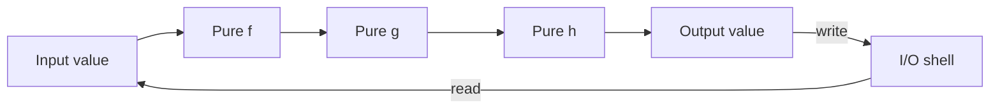

import { ConceptTemplate } from '@/features/kb/components/templates/ConceptTemplate'
import { Callout } from '@/features/kb/components/mdx/Callout'
import { ComparisonTable } from '@/features/kb/components/mdx/ComparisonTable'

export default function Layout({ children }) {
  return (
    <ConceptTemplate title="Functional Programming">
      {children}
    </ConceptTemplate>
  )
}

**Functional programming (FP)** treats a program as a composition of mathematical functions. You do not "step through" memory and overwrite cells. You describe a pipeline: values go in, new values come out, and the old values remain.

Haskell, Lisp, Clojure, and Elixir lean hard into this. JavaScript, Python, Scala, Rust, and Kotlin steal the useful parts (map, filter, reduce, immutability, first-class functions) while still allowing mutation when it is cheaper.

<Callout icon="tip" title="The antidote to shared mutable state">
Most concurrency bugs are two threads writing the same memory. If a value cannot change after it is created, those bugs have nowhere to live. FP does not make parallelism free, but it removes an entire class of races.
</Callout>

## 1. Deep Dive and Mechanics

Three rules do most of the work.

**Pure functions.** Same inputs always produce the same output. No hidden reads of globals, clocks, or random generators. No hidden writes to logs, databases, or objects you did not return. A pure function is a theorem you can test with a table of examples.

**Immutability.** "Updating" a record means allocating a new record. Structural sharing (persistent data structures) keeps this cheap: a new list spine can reuse unchanged tails.

**First-class and higher-order functions.** Functions are values. You pass them into `map`, return them from factories, and compose them (`compose(f, g)(x) = f(g(x))`).

Side effects still exist in real software. FP isolates them at the edges: I/O, UI, and persistence sit in a thin impure shell. The core stays a pure function from previous state plus input to next state. Elm and Redux make that shell explicit. Haskell encodes it in the type of `IO a`.

## 2. Mathematical / Theoretical Foundation

FP is lambda calculus with a runtime.

- **Referential transparency:** any expression can be replaced by its value without changing the program. That is why equational reasoning and compiler inlining work so well.
- **Algebraic data types and pattern matching:** a value is a tagged union. Exhaustive matches are a proof that every case is handled.
- **Functors, applicatives, monads:** interfaces for "values in a context" (optional, list, async, I/O). `map` lifts a pure function. `flatMap` / `bind` sequences computations that themselves produce a context.

Time complexity does not vanish. Naive immutable updates of huge arrays are `O(n)`. Persistent trees and hammers like Clojure's HAMT or Immutable.js bring updates closer to `O(log n)`. Lazy evaluation (Haskell) can avoid work, or accidentally leak thunks and blow memory.

<ComparisonTable
  headers={['Idea', 'Functional', 'Imperative']}
  rows={[
    ['State', 'New values', 'In-place mutation'],
    ['Control flow', 'Composition and recursion', 'Loops and goto-like breaks'],
    ['Testing', 'Input/output tables', 'Mocks for hidden deps'],
    ['Concurrency', 'Share values freely', 'Locks around mutation'],
  ]}
/>

## 3. Real-World Implementation

Updating a user without mutating the original:

```javascript
const user = { name: 'Ada', age: 36 }

// Impure: mutates the only copy
user.age = 37

// Pure: previous snapshot still exists
const older = { ...user, age: 37 }

const adults = [user, older]
  .filter((u) => u.age >= 18)
  .map((u) => u.name)
```

In Haskell the same idea is the default, and effects are typed:

```haskell
greet :: String -> String
greet name = "hello, " ++ name

-- IO is a value describing an effect, not the effect itself
main :: IO ()
main = putStrLn (greet "Ada")
```

Reducers in React/Redux are functional cores: `(state, action) => nextState`. Time-travel debugging works because each state is a value, not a bag of overwritten fields.

## 4. Visualizations



## 5. Interview Prep

**Q: Is JavaScript a functional language?**
**A:** It is multi-paradigm. Closures, first-class functions, and array methods are FP. `let`, classes, and mutating objects are not. Teams usually write "functional-ish" JS: prefer `const`, avoid mutating arguments, keep reducers pure.

**Q: Why can immutability be faster than mutation?**
**A:** Sharing. If 10,000 users sit in a persistent tree and you change one field, you allocate a path of new nodes and reuse the rest. Threads can read the old root with no lock. Mutation needs copies or locks for the same snapshot isolation.

**Q: What is a side effect, exactly?**
**A:** Anything a function does besides returning a value: writing memory others can see, I/O, throwing after a partial update, depending on the clock. Logging is a side effect. So is reading `Date.now()`.

## 6. Production Use Cases

- **Spark / Flax / React Query pipelines:** transform datasets as maps over immutable batches.
- **Compilers and linters:** AST in, new AST out. Easy to snapshot and parallelise passes.
- **Financial ledgers and event sourcing:** append facts; derive current balance as a fold.
- **UI state (Redux, Elm, Recoil):** one-way data flow makes "why did this render?" answerable.

<Callout icon="warning" title="Purity is a boundary, not a religion">
A web handler that never talks to a database is useless. Push effects to the rim. Keep the domain math pure so you can test it without standing up Kafka.
</Callout>
