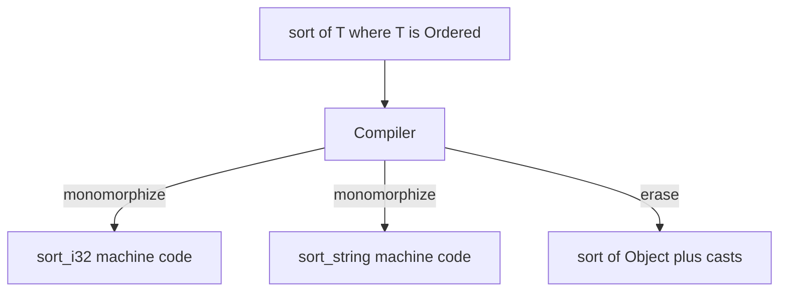

import { ConceptTemplate } from '@/features/kb/components/templates/ConceptTemplate'
import { Callout } from '@/features/kb/components/mdx/Callout'
import { ComparisonTable } from '@/features/kb/components/mdx/ComparisonTable'

export default function Layout({ children }) {
  return (
    <ConceptTemplate title="Generic Programming">
      {children}
    </ConceptTemplate>
  )
}

If you write `sort` for integers and then need `sort` for strings, copy-pasting the algorithm is a bug factory. **Generic programming** abstracts the *type* the same way a function abstracts a *value*. You write `sort(data: List of T)` and tell the compiler what `T` must be able to do (compare, copy, hash).

C++ templates, Java/C# generics, Rust traits, Swift protocols, and Haskell type classes are all this idea with different compilation strategies.

## 1. Deep Dive and Mechanics

A generic is a function or type *parameterised* by other types (and sometimes integers or lifetimes).

```typescript
function first<T>(items: T[]): T | undefined {
  return items[0]
}

first([10, 20])        // T inferred as number
first(['a', 'b'])      // T inferred as string
```

Constraints keep the abstraction honest. `sort` cannot accept an arbitrary `T`. It needs an ordering:

```rust
fn max_of<T: Ord + Copy>(a: T, b: T) -> T {
    if a >= b { a } else { b }
}
```

If `T` does not implement `Ord`, the program does not compile. That is the whole point: one algorithm, many types, **static** proof that each type is legal.

## 2. Mathematical / Theoretical Foundation

Generics are parametric polymorphism: a single term works uniformly for every type in a family.

Two compilation models dominate:

**Monomorphization (C++, Rust, monomorphised Swift).** The compiler stamps out a specialised copy per concrete type. `max_of` for `i32` and `max_of` for `String` become two machine-code functions. Calls are direct; the optimizer sees real types. Cost: binary size (code bloat) and longer compiles.

**Type erasure (Java, and C# for reference types).** The compiler checks `T` at compile time, then erases it to `Object` (or a bound). One method exists at runtime. You pay casts and lose primitive specialisation unless the VM boxes. Java cannot create `new T()` easily because `T` is gone after javac.

C# sits in between: reference types erase-ish via a shared representation; value types get specialised instantiations.

<ComparisonTable
  headers={['Strategy', 'Who uses it', 'Runtime cost', 'Binary cost']}
  rows={[
    ['Monomorphization', 'C++, Rust', 'None (static calls)', 'One copy per type'],
    ['Type erasure', 'Java', 'Casts and boxing', 'Single shared method'],
    ['Dictionary passing', 'Haskell, Swift witnesses', 'Vtable / class dict', 'Shared code plus dict'],
  ]}
/>

Haskell type classes pass a hidden dictionary of function pointers (the class methods) rather than copying the whole function. That is parametric code plus a witness of the constraint.

<Callout icon="info" title="Parametricity">
A function of type `List of T to Int` that never inspects `T` can only depend on the *shape* of the list (length, for example). Theorems for free: the type itself rules out a huge set of implementations.
</Callout>

## 3. Real-World Implementation

C++20 concepts make template errors readable:

```cpp
#include <concepts>
#include <vector>
#include <algorithm>

template <std::totally_ordered T>
T clamp_max(T value, T limit) {
    return value > limit ? limit : value;
}

int main() {
    std::vector<int> xs{3, 1, 2};
    std::sort(xs.begin(), xs.end()); // iterator + comparable value
    return clamp_max(xs.back(), 10);
}
```

STL is the historical proof that generic programming scales: `std::sort`, `std::vector`, and iterators let one algorithm walk arrays, deques, and custom buffers.

## 4. Visualizations



## 5. Interview Prep

**Q: Generics vs macros?**
**A:** Macros rewrite syntax and can invent new language forms. Generics stay inside the type system: they cannot change parsing, and they are type-checked at the definition or instantiation site. Prefer generics when a type parameter is enough.

**Q: Why does Java ban `new T[]`?**
**A:** Arrays reify their component type at runtime. After erasure, `T` is not a real class, so the VM cannot allocate `T[]`. Use `List of T` or pass a `Class` token.

**Q: What is a higher-kinded type?**
**A:** A type parameter that is itself a type constructor, like `F` in `F of A` (Promise, List, Option). Haskell and Scala have them. Java does not, which is why its Functor libraries feel awkward.

## 6. Production Use Cases

- **Collections and algorithms:** every modern standard library.
- **ORMs and serializers:** `Repository of T`, `Codec of T`.
- **Numeric libraries:** one BLAS wrapper over `f32` and `f64`.
- **API clients:** `Response of User` instead of a new class per endpoint.

<Callout icon="warning" title="Constraint design is the hard part">
A generic with no bounds is either useless or unsafe. Over-constrained generics reject valid callers. Under-constrained generics compile and then blow up inside. Write the smallest interface the algorithm actually needs.
</Callout>
