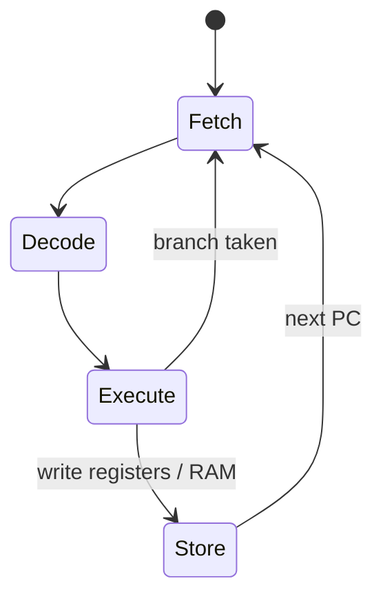

import { ConceptTemplate } from '@/features/kb/components/templates/ConceptTemplate'
import { Callout } from '@/features/kb/components/mdx/Callout'
import { ComparisonTable } from '@/features/kb/components/mdx/ComparisonTable'

export default function Layout({ children }) {
  return (
    <ConceptTemplate title="Imperative Programming">
      {children}
    </ConceptTemplate>
  )
}

**Imperative programming** is the native language of the von Neumann machine. The CPU fetches an instruction, updates registers and RAM, then fetches the next. An imperative program is a human-readable version of that story: assign, branch, loop, store.

You tell the machine *how*. Declarative styles (SQL, HTML, Prolog, much of FP) tell it *what* and leave the how to an engine.

<Callout icon="info" title="The recipe analogy">
1. Take a bowl.
2. Crack two eggs into it.
3. While the mix is lumpy, whisk.
4. Pour into the pan.

Order matters. Each step changes the bowl. That is imperative thought.
</Callout>

## 1. Deep Dive and Mechanics

Three primitives cover almost every imperative language.

**Assignment.** `x = x + 1` is not an equation. It is a command: read the cell named `x`, add one, write the cell back. After this statement the world is different.

**Control flow.** `if`, `else`, `switch`, `for`, `while`, and historically `goto` decide which assignment runs next. The program counter is an implicit piece of state.

**Mutable data structures.** Arrays, structs, and objects are memory you overwrite. An in-place quicksort is an imperative algorithm: it swaps slots until the array *is* sorted.

Assembly, C, Fortran, Pascal, and early BASIC are imperative to the bone. Python and Java let you write imperative loops *or* more declarative pipelines. The paradigm is a style, not a passport stamp.

## 2. Mathematical / Theoretical Foundation

Operational semantics for imperative languages is a transition relation on machine states:

`(statement, store) --> (next statement, store-prime)`

Hoare logic (axiomatic semantics) reasons about those transitions with triples: if precondition P holds, statement S establishes postcondition Q. A loop needs an invariant because the number of iterations is not known statically.

This is why imperative programs are hard to parallelise. Two statements that both write `x` do not commute. Data-race freedom is a theorem about which writes may overlap.

<ComparisonTable
  headers={['Question', 'Imperative', 'Declarative']}
  rows={[
    ['Primary artifact', 'Sequence of commands', 'Specification of a result'],
    ['State', 'Explicit mutation', 'Hidden or immutable'],
    ['Example', 'C for-loop over an array', 'SQL SELECT'],
    ['Maps to hardware', 'Directly', 'Through an optimizer / planner'],
  ]}
/>

## 3. Real-World Implementation

Filtering evens by mutating an accumulator:

```javascript
const numbers = [1, 2, 3, 4]
const evens = []

for (let i = 0; i < numbers.length; i++) {
  if (numbers[i] % 2 === 0) {
    evens.push(numbers[i])
  }
}
```

The same intent as `numbers.filter(n => n % 2 === 0)`, but you own the index, the branch, and the growing array. C looks identical, with pointers instead of `push`.

In-place algorithms stay imperative on purpose. You do not want a new 4 GB buffer every time you partition a dataset.

## 4. Visualizations



## 5. Interview Prep

**Q: Is OOP imperative?**
**A:** Classic OOP *uses* imperative mutation (`this.balance -= amount`). You can write "functional objects" that return new instances, but Smalltalk/Java/C# culture is imperative objects plus late binding.

**Q: Why do kernels and game engines stay imperative?**
**A:** They chase cache lines and frame budgets. In-place updates, explicit lifetimes, and predictable control flow beat allocating a new world each tick.

**Q: What did structured programming change?**
**A:** It banned spaghetti `goto` in favor of sequence, selection, and iteration. Still imperative — just with a stack of well-nested blocks instead of a jump table from hell.

## 6. Production Use Cases

- **Operating systems and embedded firmware:** C, interrupts, memory-mapped I/O.
- **High-frequency trading and games:** mutate hot structs, avoid GC.
- **Device drivers and protocol parsers:** byte-by-byte state machines.
- **Most "scripts":** glue code is still a list of steps even when the library calls are fancy.

<Callout icon="warning" title="State explosion">
A 200-variable function with four flags is an implicit state machine nobody drew. If you cannot name the states, you will race yourself. Extract functions, or make the machine explicit.
</Callout>
