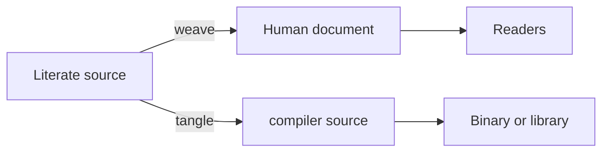

import { ConceptTemplate } from '@/features/kb/components/templates/ConceptTemplate'
import { Callout } from '@/features/kb/components/mdx/Callout'
import { ComparisonTable } from '@/features/kb/components/mdx/ComparisonTable'

export default function Layout({ children }) {
  return (
    <ConceptTemplate title="Literate Programming">
      {children}
    </ConceptTemplate>
  )
}

Traditional source is written for the compiler. Comments are optional decoration. **Literate programming** flips the priority: you write a narrative that explains the design, and you embed named code chunks inside that narrative. A tool then does two jobs — produce a typeset document for people, and assemble a legal program for the machine.

Donald Knuth invented the style while writing TeX. His `WEB` system (later CWEB) treated the program as a book.

## 1. Deep Dive and Mechanics

A literate source is not in compiler order. You introduce a hash table when the *story* needs it, even if the C file must declare it 400 lines earlier.

Two complementary extracts:

- **Weave.** Pull prose, section numbers, indexes, and pretty-printed code into TeX/LaTeX/HTML. Humans get a paper with cross-references.
- **Tangle.** Collect code chunks by name, expand `<<build the table>>` inclusions, and emit a `.c` or `.hs` file the real compiler understands.

Chunk names are the module system. `<<parse a command>>` can be defined in pieces (`+=`) as the essay revisits the topic. Tangle concatenates those pieces in definition order, not essay order.

That is different from "lots of comments." Comments do not reorder the compilation unit. Literate tools do.

<Callout icon="info" title="Not the same as documentation generators">
Javadoc and rustdoc attach essays *to* code that already has a file-system shape. Literate programming *is* the essay; the file-system shape is a build artifact.
</Callout>

## 2. Mathematical / Theoretical Foundation

Tangle is a graph expansion. Chunks are nodes. A reference `<<foo>>` is an edge. Expansion is a topological walk (with concatenation for multiple definitions of the same name). Cycles are an error unless the language itself allows mutual recursion at that point.

Weaving is a pretty-printer plus a cross-reference indexer: every identifier can point back to the section that introduced it. Knuth treated this as part of the *proof* that a reader can audit the program.

The intellectual bet: if you can explain it linearly to a skilled human, the design is more likely to be correct than if you only satisfied the type checker.

<ComparisonTable
  headers={['Artifact', 'Audience', 'Order']}
  rows={[
    ['Tangled source', 'Compiler / CI', 'Language grammar order'],
    ['Woven document', 'Reviewers, future you', 'Pedagogical order'],
    ['Notebook cells', 'Both, interactively', 'Execution order you chose'],
  ]}
/>

## 3. Real-World Implementation

A tiny literate fragment in the spirit of noweb / CWEB:

```text
@ Building a counter.

We keep a single integer and bump it on each event.

<<counter state>>=
static int hits = 0;
@

<<on event>>=
hits += 1;
<<log the hit>>
@
```

Tangle emits the C statements in the order the chunks are *referenced* from the root chunk, not the order they appear in the essay.

The cultural descendant most people actually use is the **Jupyter / R Markdown / Quarto notebook**: Markdown narrative interleaved with executable cells. It is literate-adjacent. It usually does *not* reorder code; cell order *is* execution order. Knuth wanted the opposite freedom.

`nbdev`, `leanink`, and some Coq/Isabelle documents get closer: the paper and the checked artifact share a source.

## 4. Visualizations



## 5. Interview Prep

**Q: Why did literate programming lose to directories of files?**
**A:** Diffs, code review, IDEs, and incremental compiles all assume files and line numbers. Tangled output is generated; reviewers want to comment on the *source of truth*. Teams also ship features faster than they ship books.

**Q: Are notebooks literate programming?**
**A:** Spirit yes, mechanics no. Notebooks interleave prose and code but rarely tangle out of order, and hidden mutable cell state can make the "essay" unreproducible.

**Q: When is it still the right tool?**
**A:** Algorithms you will publish, compilers, crypto primitives, scientific kernels — anything where the explanation *is* the product and the binary is a corollary.

## 6. Production Use Cases

- **TeX itself and The Art of Computer Programming style programs.**
- **Scientific papers** that must ship the exact figure-generating code (Quarto, Sweave).
- **Internal design docs** that stay executable (nbdev for Python libraries).
- **Formal methods write-ups** where the proof script and the paper share sections.

<Callout icon="warning" title="Reproducibility trap">
A woven PDF that does not rebuild from CI is marketing, not literate programming. Tangle and weave belong in the same pipeline as the compiler.
</Callout>
