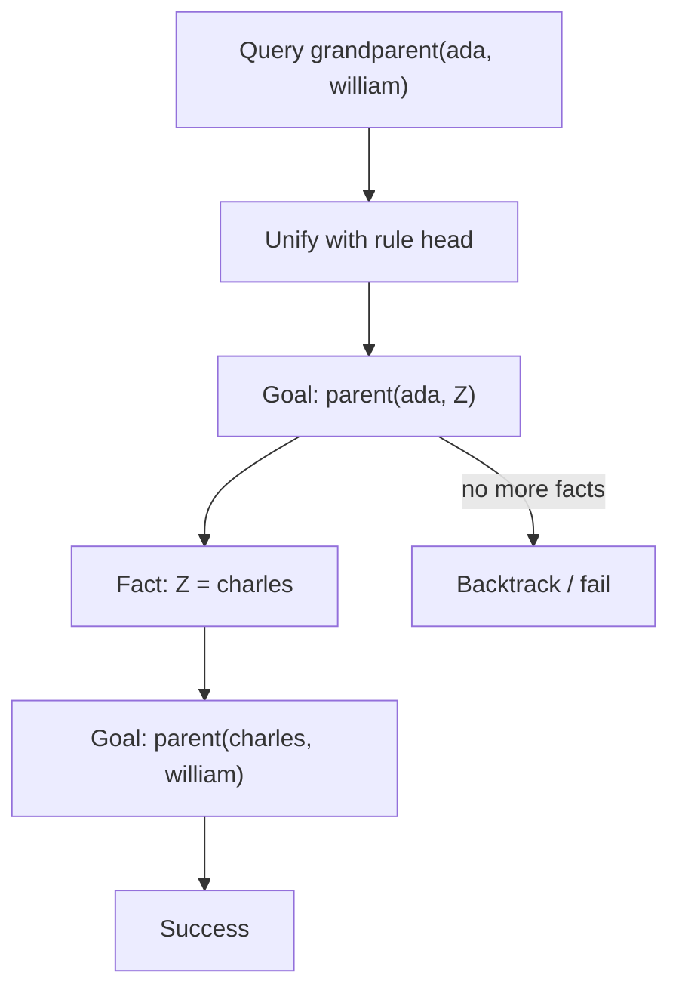

import { ConceptTemplate } from '@/features/kb/components/templates/ConceptTemplate'
import { Callout } from '@/features/kb/components/mdx/Callout'
import { ComparisonTable } from '@/features/kb/components/mdx/ComparisonTable'

export default function Layout({ children }) {
  return (
    <ConceptTemplate title="Logic Programming">
      {children}
    </ConceptTemplate>
  )
}

In Prolog you do not write a loop that walks a family tree. You write **facts** ("John is a parent of Mary") and **rules** ("a grandparent is a parent of a parent"). Then you ask a question. The engine tries to **prove** the question from the axioms.

That is **logic programming**: computation as controlled proof search. Prolog is the flagship. Datalog, Answer Set Programming (ASP), and parts of SQL and constraint solvers sit in the same family.

## 1. Deep Dive and Mechanics

A Prolog program is a list of **Horn clauses**.

```prolog
parent(ada, charles).
parent(charles, william).

grandparent(X, Y) :-
    parent(X, Z),
    parent(Z, Y).
```

A query `?- grandparent(ada, william).` starts a depth-first search:

1. **Unification.** Match the query against a clause head. Bind variables (`X=ada`, `Y=william`).
2. **Resolution.** Replace the goal with the clause body: now prove `parent(ada, Z)` and `parent(Z, william)`.
3. **Backtracking.** If a branch fails (no fact matches), undo the latest bindings and try the next clause.

The cut (`!`) and extra-logical predicates (`assertz`, I/O) punch holes in the pure story. Production Prolog is a search engine plus an escape hatch to the host machine.

Datalog restricts Prolog (no function symbols, or stratified negation) so evaluation can be bottom-up and terminate. That is why Datalog shows up in program analysis and access-control engines.

## 2. Mathematical / Theoretical Foundation

The declarative reading of a clause `H :- B1, B2` is "H is true if B1 and B2 are true." The procedural reading is "to prove H, prove B1 then B2."

Herbrand models give the set of ground atoms that follow from the program. SLD resolution is the operational algorithm. Soundness: if Prolog says yes, the query is a logical consequence (for pure programs). Completeness fails in practice because the search is depth-first and can recurse forever down an infinite branch even when a finite proof exists.

Unification is the workhorse: the most general substitution that makes two terms identical, computed by Martelli–Montanari style rewriting. Occurs-check (does `X` appear inside the term we bind to `X`?) is often skipped for speed, which can create unsound cyclic terms.

<ComparisonTable
  headers={['Style', 'You write', 'Engine does']}
  rows={[
    ['Imperative', 'Search loops', 'Exactly those steps'],
    ['Functional', 'Recursive functions', 'Evaluate expressions'],
    ['Logic', 'Relations and queries', 'Unification + backtracking'],
  ]}
/>

## 3. Real-World Implementation

```prolog
% ?- grandparent(ada, Who).
% Who = william.

ancestor(X, Y) :- parent(X, Y).
ancestor(X, Y) :-
    parent(X, Z),
    ancestor(Z, Y).
```

Left recursion (`ancestor` calling itself first) can infinite-loop. Clause order and goal order are operational, not just aesthetic.

Constraint logic programming (CLP) adds domains: `X in 1..9` for Sudoku. The engine prunes before it guesses. SAT/SMT solvers are cousins: you state constraints, they search.

## 4. Visualizations



## 5. Interview Prep

**Q: How is this different from SQL?**
**A:** SQL is also relational and declarative, but evaluation is set-oriented and planned by an optimizer. Prolog is tuple-at-a-time, depth-first, and Turing-complete (you can write a meta-interpreter). Datalog is the overlap: recursive queries with guaranteed termination under restrictions.

**Q: What is unification vs assignment?**
**A:** Assignment overwrites a cell. Unification *solves* an equation between two terms. `X = f(Y)` and `X = f(1)` together yield `Y = 1`. Either side may contain variables.

**Q: Where did expert systems go?**
**A:** The 1980s hype died; the techniques did not. Type checkers, linters, Kubernetes policy engines, and some compilers still run Datalog-style rules (Souffle, Datomic, Casbin-adjacent stacks).

## 6. Production Use Cases

- **Program analysis:** points-to and taint rules as Datalog (Souffle, CodeQL's model).
- **Business rules and config:** "a user may read a doc if they own it or an ancestor folder."
- **Scheduling and puzzles:** ASP and CLP for rostering, packing, and verification.
- **Natural-language and knowledge bases:** early AI; today often mixed with statistical models.

<Callout icon="warning" title="Search order is still your problem">
A logically correct program can fail to return. You must understand the search tree: clause order, goal order, and cuts. Logic programming is not a wish compiler.
</Callout>
