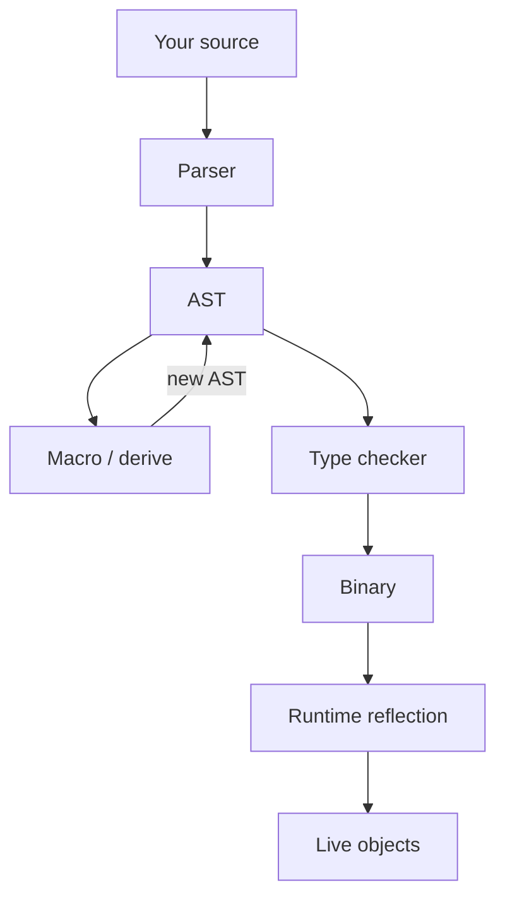

import { ConceptTemplate } from '@/features/kb/components/templates/ConceptTemplate'
import { Callout } from '@/features/kb/components/mdx/Callout'
import { ComparisonTable } from '@/features/kb/components/mdx/ComparisonTable'

export default function Layout({ children }) {
  return (
    <ConceptTemplate title="Metaprogramming">
      {children}
    </ConceptTemplate>
  )
}

Ordinary programs manipulate numbers and strings. **Metaprograms** manipulate *programs*: they read an abstract syntax tree, emit new functions, rewrite calls, or ask a running object what methods it has.

Two clocks matter.

- **Compile-time** metaprogramming (macros, templates, `constexpr`, procedural macros) runs inside the compiler and disappears from the shipped binary except as generated code.
- **Runtime** metaprogramming (reflection, `eval`, monkey patching, JVM agents) runs while the process is live.

Lisp made the distinction almost invisible because code *is* a list. Most other languages bolt the power on later and then spend decades regretting `eval`.

## 1. Deep Dive and Mechanics

**Hygienic macros (Scheme, Rust `macro_rules!`).** Pattern-match syntax, splice in new syntax, and keep introduced names from accidentally capturing the caller's variables.

**Procedural macros (Rust `derive`, Scala macros).** A compiler plugin receives tokens or an AST and returns new tokens. `#[derive(Debug)]` writes a `fmt` impl you would have typed by hand.

**Templates and const eval (C++).** Turing-complete compile-time computation. You can generate types and functions before `main`. Error messages historically read like a stack dump from hell; concepts improved that.

**Reflection.** Java's `Class.getMethod`, Python's `getattr`, Go's `reflect`. The program asks the runtime for structure that the compiler already knew and then threw away — or, in Java, kept in class files.

**eval.** Parse a string and execute it. Maximum power, minimum structure. Every XSS and injection lecture starts here.

<Callout icon="warning" title="eval is a loaded gun">
If any part of that string came from a user, you just gave them your process. Prefer a parser for a tiny DSL, or a compiled template, over concatenating source.
</Callout>

## 2. Mathematical / Theoretical Foundation

The theoretical home is **homoiconicity** and **multi-stage programming**.

A language is homoiconic when the AST is a value in the language (Lisp cons cells, Julia `Expr`). Quotation and splicing (`quote` / `unquote`) are the operators.

Staging (MetaOCaml, Zig comptime, Terra) assigns each expression a *stage*: generate now, run later. Types can track that a value is "code of T" rather than "T", so you do not accidentally run generator code at runtime.

Macros that are not hygienic implement capture-by-name, which is equivalent to dynamic scope for the introduced identifiers. That is why C macros remain a source of `max(x++, y)` bugs: the argument expression is pasted, not evaluated once.

<ComparisonTable
  headers={['Technique', 'When it runs', 'Safety']}
  rows={[
    ['Hygienic macros', 'Compile time', 'Names will not collide'],
    ['C preprocessor', 'Before parse, textually', 'No types, easy footguns'],
    ['Reflection', 'Runtime', 'Breaks some optimizations'],
    ['eval of a string', 'Runtime', 'Untrusted input is RCE'],
  ]}
/>

## 3. Real-World Implementation

Rust derive-style thinking in user space (the compiler does the real work):

```rust
// You write:
#[derive(Clone, Debug)]
struct Point { x: i32, y: i32 }

// The derive macro writes the impls you would have typed.
```

Python reflection used by every test runner and ORM:

```python
class User:
    def save(self):
        ...

method = getattr(User, 'save')
print(method.__name__)  # 'save'
```

Spring, Django, and Rails are giant metaprograms: they scan annotations or naming conventions and *generate* controllers, proxies, and schema mappings.

## 4. Visualizations



## 5. Interview Prep

**Q: Macros vs generics?**
**A:** Generics abstract over types with a type checker. Macros abstract over *syntax*. If you need a new keyword or to inspect identifier names, you want a macro. If you need `Vec of T`, you want a generic.

**Q: Why is reflection slow?**
**A:** You leave the world of static calls. The VM looks up metadata, boxes arguments, and often disables inlining. Hot paths should call generated or handwritten methods; use reflection to *find* those methods once at startup.

**Q: What is a JIT if not metaprogramming?**
**A:** A JIT *is* runtime code generation. It is metaprogramming performed by the VM, guided by type profiles, not by your AST macros.

## 6. Production Use Cases

- **ORMs and serializers:** generate mappers from schema or types.
- **RPC stubs (gRPC, protobuf):** generate clients from an IDL.
- **UI frameworks:** React's compiler and Vue SFCs rewrite templates to render functions.
- **Logging and tracing:** bytecode agents inject spans without editing every method.

<Callout icon="tip" title="Generate once, commit or cache">
If the generated code is human-relevant (protobuf stubs), check it in or cache it in CI. Invisible generation that only exists on one developer laptop is a build-reproducibility bug.
</Callout>
